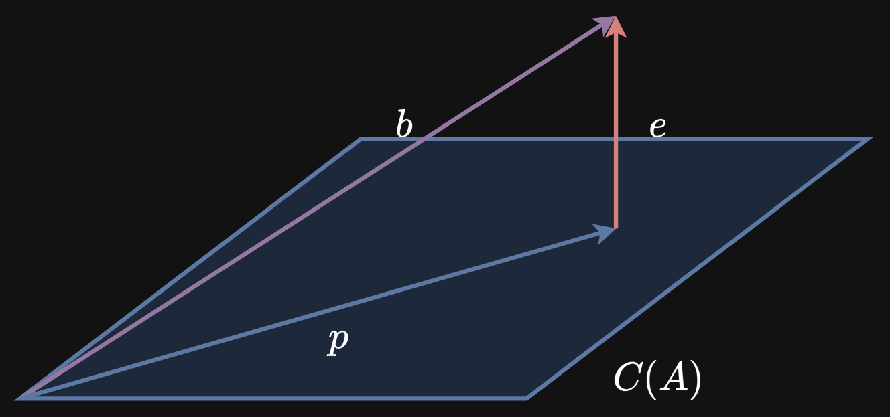
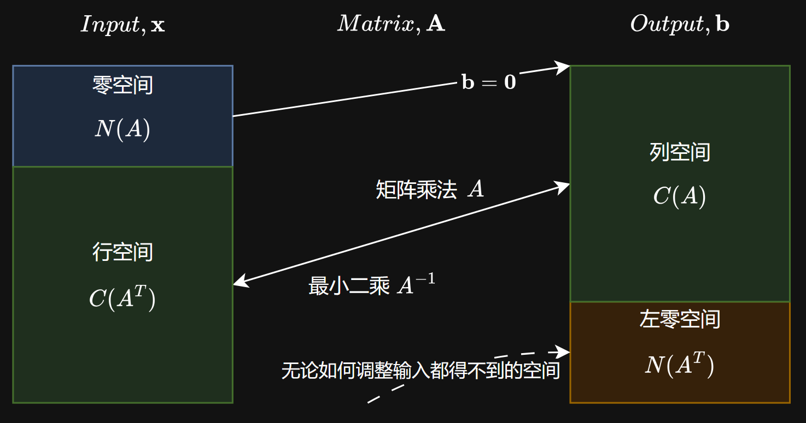
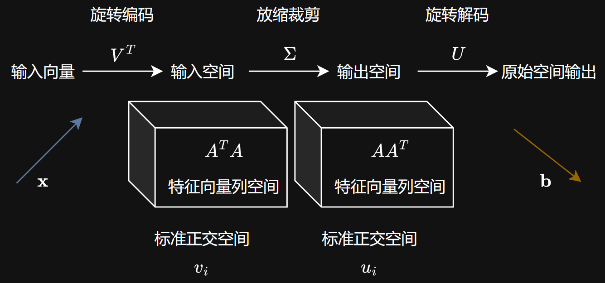
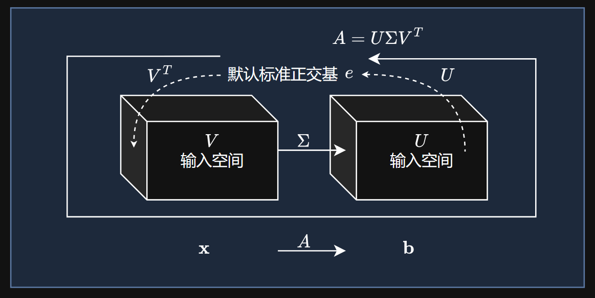
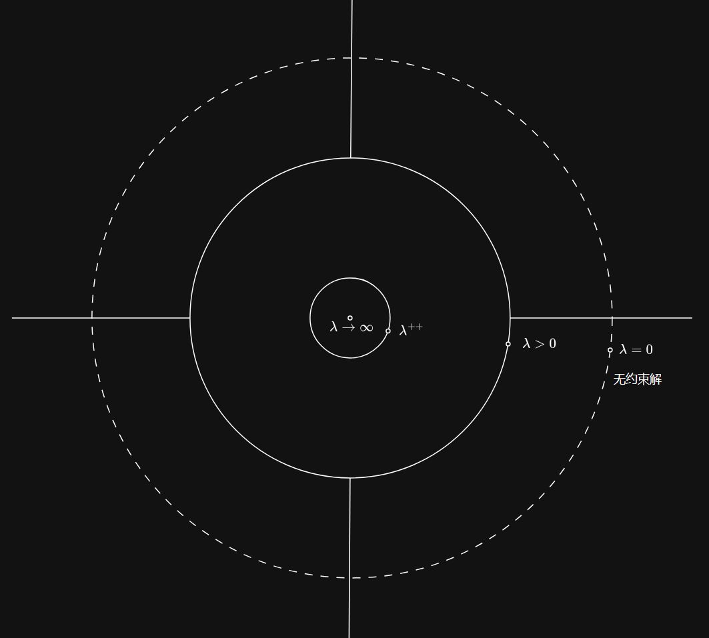

## 第 0 章：卷首语——你不是在推公式，你是在为数据“降维”

*—承认一个事实：你打开这本书，不是想成为数学家，而是想解决一个具体的工程或数据问题。*

你可能已经感觉到了。

几年前，你第一次接触 `numpy`。那时候，一段能成功创建数组并计算出逆矩阵的代码，就能让你觉得自己“掌握了线性代数”。你的工作流简单直接：`import numpy as np`，把数据塞进矩阵，然后祈祷 `np.linalg.solve` 不要报错。你觉得自己“搞定”了线性代数。

但最近，事情开始不一样了。

你开始意识到，自己不再满足于“代码能跑”。你开始被老板、导师或者合作者追问：

- “你的模型报错 `LinAlgError: Matrix is singular.`，这是什么意思？为什么同样的数据用 Excel 就能算出结果？”
- “你说这两个变量高度相关，你怎么证明？你的回归系数为什么一会有意义，一会又完全变了个方向？”
- “你用 PCA 降维了，但降维后的这些‘主成分’到底代表什么？我怎么跟老板解释？”

你隐隐觉得，自己的“武器库”里缺了点什么。你缺的不是更多代码，而是一套**空间想象力**——一种能让你在矩阵的海洋中，看到“几何形状”和“变换方向”的能力。

**请听我说：你不是学不会线性代数，你只是没遇到对的老师。**

过去，你被灌输的线性代数，是写在黑板上的矩阵求逆和行列式展开。那些知识是为了让你能“手推公式”而设计的，而不是为了让你能“用 Python 解决实际问题”而设计的。不是你的问题，是教学方法的错。

这就像你买了一台性能强大的相机（NumPy），但你只把它当傻瓜相机用，从来没打开过手动模式。而这本书，就是帮你理解光圈（特征值）和快门（奇异向量）的关系，让你真正拍出专业的照片。

**2026年的数据科学家，核心能力不是“背诵公式”，而是“用矩阵的几何直觉理解数据”。**

你可能会担心：“天啊，我要学那么多概念：线性相关、秩、零空间、奇异值……我哪有时间？而且听起来好难。”

这个担心很正常。但请换个角度想：**你不必成为一个能用笔算 5x5 矩阵逆的数学奇才。你只需要学会“用代码验证直觉”的工程思维。**

什么是“用代码验证直觉”？

- **你不必背下秩-零度定理的证明**，但你要知道：当 `np.linalg.matrix_rank(A)` 小于你的特征数时，说明你的数据里有“冗余特征”，它们在“内卷”，你需要用 PCA 或正则化来处理。
- **你不必记住奇异值分解的推导**，但你要知道：当你用 `np.linalg.svd` 得到的奇异值从大到小排列时，前几个大的奇异值对应的模式，就是你的数据里最重要的“信号”，后面小的就是“噪声”。
- **你不必手算最小二乘解**，但你要知道：当 `np.linalg.solve` 报错时，`np.linalg.lstsq` 就是你最好的朋友，它用 SVD 在背后给你找一个“尽可能好”的解。

这套思维方式，一旦建立，会迁移到你遇到的任何新问题上。你以后看到一个陌生的算法（比如“矩阵分解推荐系统”），你不会再恐惧，而是会想：“哦，这是利用矩阵的什么几何性质来解决冷启动问题的？它的核心思想是投影还是分解？我该用 `scipy` 的哪个函数？”

这就是 2026 年的数据科学家与 2016 年的数据科学家真正的区别：**不是“会更多的公式”，而是“能更快地判断：这个问题是‘解方程’、‘找主成分’还是‘做近似’？我该用矩阵的哪种‘世界观’来审视它？”。**

---

*这份教材的使用建议：**不要把它当成数学课本，要把它当成“几何地图”和“代码食谱”的结合体***

这本书很长：11 个核心章节，从向量空间到奇异值分解。如果你试图在一个周末读完，你会收获满满的“感觉自己懂了”——然后下周一回到工位，对着真实的数据集，发现还是不知道怎么让代码不报错。

**正确的使用方式：遇到问题时，再来“点菜”。**

- **你的老板问：“这两个变量到底有没有关系？”** → 翻到第 1 章，建立向量直觉；再翻到第 4 章，用投影（最小二乘）来看相关性。
- **你的模型报错“矩阵是奇异的”？** → 翻到第 3 章，理解零空间和秩；你就会发现，哦，原来是有列是多余的，需要做特征选择或正则化。
- **你想对数据进行降维可视化？** → 翻到第 7 章，用 SVD 做主成分分析（PCA）。
- **你想知道一个矩阵的“稳定性”？比如迭代算法会不会发散？** → 翻到第 6 章，特征值会告诉你一切。

**把这份教材当成你的“线性代数降维词典”，而不是“抽象代数教科书”。**

---

*最后，一个心态上的准备*

你可能会在练习过程中遇到挫折：

- `np.linalg.solve` 报错 `LinAlgError: Matrix is singular.`，你花了一个小时才发现原来是数据里有重复的列。
- 你用手算验证了一个 2x2 矩阵的特征值，结果 `np.linalg.eig` 返回的特征向量符号和你想的完全相反，你以为自己错了。
- 你用 SVD 压缩了一张图片，结果图像变得模糊，你不知道该保留多少个奇异值。

这些都是正常的。每当你感到挫败时，请想起这句话：

**“我不是在做数学题，我是在为我的数据寻找‘最好的视角’。第一次找到主成分，我就已经比之前更能看懂数据了。”**

第一次成功解读 `np.linalg.svd` 返回的奇异值，你就战胜了那个“只会把数据框当成黑箱”的自己。
第一次用 `np.linalg.lstsq` 解决了一个无解方程组，你就战胜了那个“看到报错就慌”的自己。
第一次发现“哦，原来我的数据在这个基底下是稀疏的”，你就开始真正和你的数据“对话”了。

你不是在“学一堆抽象的线性代数理论”，你是在**升级你的“数据空间感知”能力**。这是一笔长期投资，收益会随着你处理的数据规模和复杂度的增长而指数级放大。

现在，翻到第 1 章，打开你的 Jupyter Notebook，导入 `numpy` 和 `matplotlib`，创建一个向量，把它画出来。这是你迈出的第一步。

---

*—— 你的同事（以及曾经和你一样恐惧线性代数，但现在能笑着用矩阵解决实际问题的朋友）*

## 第 1 章：向量与矩阵——数据的“原生语言”

*—从坐标点到数据表，一切从向量开始*

### 1.0 为什么你的数据天生就是矩阵？

**背景**：你每天面对的数据——无论是 Excel 表格、CSV 文件还是数据库中的表——本质上都是一个矩形阵列。行是样本（用户、时间点、商品），列是特征（年龄、收入、温度、评分）。这个矩形阵列，在数学上就叫**矩阵**。

**一个真实的困境**：你刚拿到一份用户数据，有 1000 行（用户）和 50 列（年龄、消费金额、登录次数……）。你的任务是预测“用户是否会购买”。你打开 Jupyter Notebook，准备建模。但你看着这 50 列数字，心里在想：“它们之间到底是什么关系？哪些列是真正有用的？哪些列其实在说同一件事？”你需要的不是盲目地建模型，而是先“看懂”这个矩阵。

**本章的目标**：从最基础的概念开始——向量和矩阵是什么，它们如何工作，以及最重要的是，**如何用几何的眼光来理解它们**。读完这一章，你将不再把矩阵看作一堆数字的格子，而是看作一个“变换器”——它能把一个向量（输入）变成另一个向量（输出），就像函数一样。

**类比**：你之前可能把矩阵当作一个“Excel 表格”。但这就像把引擎当作一个“铁块”。真正重要的是：引擎内部是怎么运转的？活塞（列向量）怎么运动？曲轴（矩阵乘法）怎么把上下运动变成旋转？理解了这些，你才能诊断问题、优化性能。

---

### 1.1 向量：不仅仅是箭头，更是“状态”

**是什么**：向量是一组数字的有序列表。它可以代表：

- **空间中的一个点**：$(x, y, z)$ 坐标。
- **一个方向**：指向东北方向。
- **一个状态**：$(年龄=25, 收入=50000, 消费次数=12)$。

向量有两个核心操作：
1.  **加法**：$\mathbf{v} + \mathbf{w}$，对应分量相加。
2.  **数乘（缩放）**：$c * \mathbf{v}$，每个分量都乘以标量 $c$。

这两个操作的组合就是**线性组合**：$c*\mathbf{v} + d*\mathbf{w}$。

**类比**：

- 一个 2 维向量就像一个城市坐标：$(纬度, 经度)$。
- 一个 3 维向量就像一个人的体检报告：$(身高, 体重, 血压)$。
- 一个 100 维向量……就是我们数据科学中最常见的“特征向量”：$(年龄, 收入, 点击率, ...)$。

**实操：把向量画出来，用几何眼光看它**

```python
import numpy as np
import matplotlib.pyplot as plt

# 定义向量
v = np.array([2, 4])  # 从原点指向 (2, 4)
w = np.array([1, 3])  # 从原点指向 (1, 3)

# 向量加法：v + w
sum_vw = v + w  # 结果为 [3, 7]

# 数乘：2 * v
scaled_v = 2 * v  # 结果为 [4, 8]

# 线性组合：3*v + 2*w
combo = 3 * v + 2 * w  # 结果为 [8, 18]

# 可视化
plt.figure(figsize=(8, 6))
# 画出 v
plt.arrow(0, 0, v[0], v[1], head_width=0.2, head_length=0.2, fc='blue', ec='blue', label='v = (2, 4)')
# 画出 w
plt.arrow(0, 0, w[0], w[1], head_width=0.2, head_length=0.2, fc='green', ec='green', label='w = (1, 3)')
# 画出 v+w
plt.arrow(0, 0, sum_vw[0], sum_vw[1], head_width=0.2, head_length=0.2, fc='red', ec='red', label='v+w = (3, 7)')
# 画出 3*v + 2*w（为了不重叠，单独展示）
plt.arrow(0, 0, combo[0], combo[1], head_width=0.2, head_length=0.2, fc='purple', ec='purple', linestyle='--', label='3v+2w = (8, 18)')

plt.xlim(-1, 10)
plt.ylim(-1, 20)
plt.axhline(y=0, color='black', linewidth=0.5)
plt.axvline(x=0, color='black', linewidth=0.5)
plt.grid(alpha=0.3)
plt.legend()
plt.title('向量的加法、数乘与线性组合')
plt.gca().set_aspect('equal')
plt.show()

# 计算向量的长度（范数）
norm_v = np.linalg.norm(v)
norm_w = np.linalg.norm(w)
print(f"向量v的长度: {norm_v:.2f}")
print(f"向量w的长度: {norm_w:.2f}")
print(f"向量v+w的长度: {np.linalg.norm(sum_vw):.2f}")
print(f"向量的内积 (点积) v·w = {np.dot(v, w)}")
```

**预期反馈**：你会看到从原点出发的几个箭头，它们生动地展示了向量的几何意义——$\mathbf{v}$ 和 $\mathbf{w}$ 是“基底”，`v+w` 是平行四边形的对角线，$3\mathbf{v}+2\mathbf{w}$ 是一个更长的组合向量。向量的长度（范数）告诉你这个“状态”的“大小”或“能量”。

**⚠️ 【概念澄清】**：向量是列向量还是行向量？在 NumPy 中，一维数组 `np.array([1, 2, 3])` 既不是行向量也不是列向量——它是一个“一维数组”。当你需要明确的行或列时，用 `reshape(-1, 1)`（列向量）或 `reshape(1, -1)`（行向量）。本书默认使用**列向量**，因为这是线性代数的标准约定。

👉 `reshape(-1, 1)` 表示行数不限，列数为一。

---

### 1.2 线性组合、张成空间与基——“积木”与“房间”

**是什么**：

- **线性组合**：$\sum_{i=1}^{n}c_i \mathbf{v}_i$。
- **张成空间 (Span)**：一组向量所有可能的线性组合构成的集合。
- **线性无关 (Linear Independence)**：如果 $\sum_{i=1}^{n}c_i\mathbf{v}_i=0$ 的唯一解是所有 $c_i = 0$，则这些向量线性无关。
- **基 (Basis)**：一组线性无关且能张成整个空间的向量。

**类比**：

- **线性组合**：你有两种果汁（$\mathbf{v}=$苹果汁，$\mathbf{w}=$橙汁），调一杯 `3份苹果汁 + 2份橙汁` 的混合饮料。
- **张成空间**：你所有的水果（$\mathbf{v}$, $\mathbf{w}$, ...）能做出多少种不同的混合饮料？所有可能的配方构成的“味道空间”。
- **基**：最少需要几种“基础味道”才能调出所有你想要的味道？如果 $\mathbf{v}$ 和 $\mathbf{w}$ 是基，那么任何饮料都能用 $$c\mathbf{v}+d\mathbf{w}$$ 调出来。

**为什么这很重要**：在数据科学中，你的特征（列）可能不是“基”——它们可能高度相关（比如“房价”和“房间数”），这就产生了**共线性**。你的模型会变得不稳定，因为你试图用一堆“重复的信息”去解释目标。

**实操：用 NumPy 探索张成空间**

```python
import numpy as np
import matplotlib.pyplot as plt

# 创建两个向量
v = np.array([2, 1])
w = np.array([1, 2])

# 检查它们是否线性无关：计算行列式
M = np.column_stack((v, w))  # 拼成一个 2x2 矩阵
det = np.linalg.det(M)
print(f"det([v, w]) = {det:.2f}")
if det != 0:
    print("✅ v 和 w 线性无关！它们是 2D 空间的一个基。")
else:
    print("❌ v 和 w 线性相关，不能张成整个 2D 空间。")

# 如果我们选一个依赖的向量
u = 2 * v  # u 是 v 的 2 倍
M_dep = np.column_stack((v, u))
det_dep = np.linalg.det(M_dep)
print(f"det([v, u]) = {det_dep:.2f} → 线性相关！")

# 生成大量线性组合，看看它们填满了什么区域
# 生成 500 个随机的 c 和 d，计算 c*v + d*w
n_points = 500
c = np.random.uniform(-3, 3, n_points)
d = np.random.uniform(-3, 3, n_points)
points = np.array([c[i] * v + d[i] * w for i in range(n_points)])

plt.figure(figsize=(8, 6))
plt.scatter(points[:, 0], points[:, 1], alpha=0.5, s=10)
# 画出 v 和 w
plt.arrow(0, 0, v[0], v[1], head_width=0.2, head_length=0.2, fc='red', ec='red', label='v')
plt.arrow(0, 0, w[0], w[1], head_width=0.2, head_length=0.2, fc='blue', ec='blue', label='w')
plt.xlim(-8, 8)
plt.ylim(-8, 8)
plt.axhline(0, color='black', linewidth=0.5)
plt.axvline(0, color='black', linewidth=0.5)
plt.grid(alpha=0.3)
plt.title('c*v + d*w 张成的空间 (整个平面)')
plt.legend()
plt.gca().set_aspect('equal')
plt.show()
```

**预期反馈**：当你用 `v` 和 `w`（线性无关）时，随机组合的点填满了整个平面。当你用 `v` 和 `u=2v`（线性相关）时，所有点都会落在一条直线上——它们只张成了一维空间（直线），而不是二维平面。

**⚠️ 【避坑】**：`np.linalg.det` 只对方阵有效。检查线性无关更通用的方法是看矩阵的**秩 (Rank)**——`np.linalg.matrix_rank(M)`。如果秩等于向量个数，则它们线性无关。

---

### 1.3 矩阵乘法的四种解读——真正的“灵魂”所在

**是什么**：`A x = b`。这不仅仅是一堆数字的乘加运算。理解了矩阵乘法的**四种视角**，你才能真正开始用几何的方式思考线性代数。

| 视角                      | 描述                                                         | 何时用它                                                     |
| :------------------------ | :----------------------------------------------------------- | :----------------------------------------------------------- |
| **1. 行视角（点积）**     | `b` 的每个元素是 `A` 的每一行与 `x` 的点积。                 | 这是计算机实际执行计算的方式。                               |
| **2. 列视角（线性组合）** | `b` 是 `A` 的列的线性组合，系数是 `x` 的分量。**换言之，x 是 A 按列组合的组合系数。** | **最重要的视角！** 理解 `Ax` 就是“用 `x` 的系数去组合 `A` 的列”。 |
| **3. 行变换视角**         | `A x` 可以看作对 `A` 的行进行线性组合。                      | 与列视角对偶，有助于理解行空间。                             |
| **4. 列-行外积视角**      | `A B` = `A` 的第1列 × `B` 的第1行 + ...                      | 理解矩阵分解（如 SVD、秩 1 矩阵分解）的基础。                |

**实操：逐行演示四种视角**

```python
import numpy as np

A = np.array([[1, 2], [3, 4]])
x = np.array([5, 6])

print("A = \n", A)
print("x =", x)

# ---- 视角1：行视角（点积）----
print("\n=== 视角1：行视角（点积）===")
b_row = np.array([
    np.dot(A[0, :], x),  # 第一行和 x 的点积
    np.dot(A[1, :], x)   # 第二行和 x 的点积
])
print(f"行视角结果: {b_row}")
print(f"A @ x 结果: {A @ x}")

# ---- 视角2：列视角（线性组合）----
print("\n=== 视角2：列视角（线性组合）===")
# b = x1 * (列1) + x2 * (列2)
col1 = A[:, 0]  # [1, 3]
col2 = A[:, 1]  # [2, 4]
b_col = x[0] * col1 + x[1] * col2
print(f"列视角结果: {b_col}")
print(f"即: {x[0]} * {col1} + {x[1]} * {col2} = {b_col}")

# ---- 视角3：行变换视角（对 A 的行做组合）----
# 这本质上与列视角相同，但换了个角度
# 见实操中的说明

# ---- 视角4：列-行外积（用于矩阵乘法 AB）----
print("\n=== 视角4：列-行外积（矩阵乘法）===")
B = np.array([[7, 8], [9, 10]])
print("B = \n", B)

# AB = (A的列1 × B的行1) + (A的列2 × B的行2)
outer1 = np.outer(A[:, 0], B[0, :])  # 列1 × 行1
outer2 = np.outer(A[:, 1], B[1, :])  # 列2 × 行2
AB_outer = outer1 + outer2
print(f"外积视角计算 AB:\n{AB_outer}")
print(f"直接用 A @ B:\n{A @ B}")
```

**预期反馈**：你会看到四种视角得到完全相同的 `A@x` 或 `A@B`。更重要的是，你会开始理解：**矩阵乘以向量，本质上是“对矩阵的列进行加权求和”。** 这个视角是理解本书后续所有内容（列空间、投影、SVD）的基石。

**动画：**

*视角一：*

<video id="video" controls="" preload="none">
   <source id="mp4" src="./media/videos/1080p60/RowPerspective.mp4" type="video/mp4">
</video>

*视角二：*

<video id="video" controls="" preload="none">
   <source id="mp4" src="./media\videos\1080p60\ColumnPerspective.mp4" type="video/mp4">
</video>

*视角三：*

<video id="video" controls="" preload="none">
   <source id="mp4" src="./media\jupyter\RowTransformationPerspective@2026-07-04@22-44-22.mp4" type="video/mp4">
</video>

*视角四：*

<video id="video" controls="" preload="none">
   <source id="mp4" src="./media\jupyter\OuterProductPerspective@2026-07-04@22-49-11.mp4" type="video/mp4">
</video>

**⚠️ 【重点】**：从现在开始，每当你看到 `A @ x`，请自动在心里把它翻译成 **“用 x 的系数去组合 A 的列”**。这会改变你的一切。

---

### 1.4 列空间：矩阵的“能力范围”

**是什么**：
- **列空间 (Column Space) `C(A)`**：矩阵 `A` 的所有列向量的所有线性组合构成的集合。
- **核心定理**：`A x = b` **有解**，当且仅当 **`b` 在 `C(A)` 中**。

***你不能做到维度之外的事***

**类比**：

- `A` 的列是你的“工具集”（榔头、螺丝刀、扳手）。
- `x` 是你要用每个工具的“次数”。
- `b` 是你最终做出来的“成品”。
- **列空间** 就是你用这套工具能造出来的**所有成品**的集合。如果 `b` 不在这个集合里，说明你的工具不够用，或者你用错了工具。

**数据科学意义**：

- 如果你的数据矩阵 `A` 的列空间不能覆盖目标 `b`，说明你的特征无法完美预测目标——这是常态。这时候你不应该求“精确解”，而应该求“最优解”（最小二乘）。
- 当 `A` 的列线性相关时，列空间的“体积”被压缩了——有些列是多余的，它们没有扩展列空间。这正是**秩 (Rank)** 和**共线性**的几何本质。

**实操：判断 `Ax=b` 是否有解**

```python
import numpy as np

# 案例1：有解的情况
A1 = np.array([[1, 2], [2, 4]])  # 列2 = 2 * 列1
b1 = np.array([3, 6])            # b1 = 3 * 列1，所以 b1 在列空间内（一条直线上）

print("案例1：")
print("A1 = \n", A1)
print("b1 =", b1)

# 计算秩
rank_A1 = np.linalg.matrix_rank(A1)
print(f"A1 的秩: {rank_A1}")  # 输出 1，说明列空间是一维的

# 检查 b1 是否在列空间内：通过解方程判断
try:
    x1 = np.linalg.solve(A1, b1)  # 尝试解方程
    print(f"✅ 有解！x = {x1}")
except np.linalg.LinAlgError:
    print("❌ 无解！")

# 案例2：无解的情况
b2 = np.array([3, 7])            # b2 不在列空间内
print("\n案例2：")
print("A1 = \n", A1)
print("b2 =", b2)

try:
    x2 = np.linalg.solve(A1, b2)
    print(f"✅ 有解！x = {x2}")
except np.linalg.LinAlgError:
    print("❌ 无解！b2 不在列空间内")

# 案例3：满秩的情况（列空间是二维的，即整个 R²）
A3 = np.array([[1, 2], [3, 4]])  # 两列线性无关，秩 = 2
b3 = np.array([5, 11])
print("\n案例3：")
print("A3 = \n", A3)
print("b3 =", b3)
print(f"A3 的秩: {np.linalg.matrix_rank(A3)}")  # 输出 2，列空间是整个平面

x3 = np.linalg.solve(A3, b3)
print(f"✅ 有解！x = {x3}")
print(f"验证: A3 @ x3 = {A3 @ x3}")
```

**预期反馈**：
- **案例1**：`A1` 的列空间是一条直线，`b1` 在这条直线上，所以有解（虽然有无穷多解，因为列相关）。
- **案例2**：`b2` 不在那条直线上，所以无解，`np.linalg.solve` 报错。
- **案例3**：`A3` 的列空间是整个二维平面，任何 `b3` 都在列空间内，所以有唯一解。

**⚠️ 【避坑】**：在实际数据科学中，`A` 几乎总是**长方形**的（样本数 ≠ 特征数）。这时候 `np.linalg.solve` 用不了，你要用 `np.linalg.lstsq`（最小二乘）来求解，它会在列空间中找**最接近 `b`** 的那个点 `p`。这背后就是**投影 (Projection)** 的几何思想，我们会在第 4 章详细展开。

---

### 1.5 实战：用矩阵视角分析一个真实数据集

**场景**：你已经理解了向量和矩阵的基本概念，现在让我们用真实的“数据视角”来应用它们。我们会模拟一个数据集，把它当作矩阵来操作，计算它的“形状”和“能力范围”。

**实操：加载数据并分析矩阵的形状**

```python
import numpy as np
import pandas as pd
import matplotlib.pyplot as plt
from sklearn.datasets import load_iris

# ---- 加载真实数据集：鸢尾花 (Iris) ----
iris = load_iris()
X = iris.data  # 特征矩阵，形状 (150, 4)
y = iris.target  # 标签，形状 (150,)

# 转换为 DataFrame 方便查看
df = pd.DataFrame(X, columns=iris.feature_names)
df['target'] = y

print("=" * 60)
print("鸢尾花数据集 (Iris)")
print("=" * 60)
print(f"数据形状 (样本, 特征): {X.shape}")  # 输出: (150, 4)
print("\n前5行:")
print(df.head())

# ---- 我们的矩阵就是 X ----
A = X  # 150行 × 4列
print(f"\n矩阵 A 的形状: {A.shape}")
print(f"矩阵的秩: {np.linalg.matrix_rank(A)}")  # 输出: 4 (因为4个特征线性无关)

# ---- 用矩阵乘法计算协方差矩阵（中心化后） ----
# 中心化：减去均值
A_centered = A - A.mean(axis=0)  # (150, 4)
# 协方差矩阵 = (1/149) * A_centered^T @ A_centered
cov_matrix = (1 / (A.shape[0] - 1)) * (A_centered.T @ A_centered)
print("\n协方差矩阵 (4x4):")
print(cov_matrix.round(3))

# ---- 画出前两个特征的关系 ----
plt.figure(figsize=(8, 6))
plt.scatter(X[:, 0], X[:, 1], c=y, cmap='viridis', alpha=0.7)
plt.xlabel(iris.feature_names[0])
plt.ylabel(iris.feature_names[1])
plt.title('鸢尾花数据：两个特征的散点图')
plt.colorbar(label='类别')
plt.grid(alpha=0.3)
plt.show()

# ---- 把 A 当作“变换器”，取一个随机向量 x，计算 A @ x ----
# 这相当于把 4 个特征加权组合成一个新的“合成特征”
x = np.random.randn(4)
b = A @ x  # 150维的输出
print(f"\n随机组合向量 x = {x.round(3)}")
print(f"合成的特征 b (前5个值): {b[:5].round(3)}")
print(f"b 的维度: {b.shape}")  # (150,)
```

**预期反馈**：
- 你看到鸢尾花数据是一个 `(150, 4)` 的矩阵，秩为 4（四个特征都独立）。
- 协方差矩阵是对称的，对角线上是方差，非对角线上是协方差。
- 散点图展示了两个特征如何区分三种花。
- 最后的 `A @ x` 演示了矩阵乘法如何组合多个特征生成一个新的“合成特征”。**这其实就是线性回归、PCA、深度学习中最基本的操作。** 每一个新特征，都是原始特征的一个线性组合。

---

### 1.6 本章小结：你现在能用“矩阵的眼睛”看数据了

**你的三个核心转变**：

| 以前                   | 现在                                             |
| :--------------------- | :----------------------------------------------- |
| 向量是一堆数字         | **向量是一个状态，是空间中的一个点**             |
| 矩阵是一个表格         | **矩阵是一个变换器，能把一个向量变成另一个向量** |
| `A @ x` 是一堆乘加运算 | **`A @ x` 是用 `x` 的系数组合 `A` 的列**         |

**你现在拥有的新习惯**：

1. **拿到一个新数据集，第一件事用 `.shape` 看它的“形状”**——它就是你的矩阵 `A`，行是样本，列是特征。
2. **用 `np.linalg.matrix_rank` 检查你的特征空间**——如果秩小于列数，说明你的特征在“内卷”，需要做特征选择或降维。
3. **看到 `A @ x`，不再只看到数字，而是看到“列的组合”**——这个视角会让你理解后续所有的矩阵分解（LU、QR、SVD）。
4. **每当你尝试解 `Ax = b`，先想：`b` 在 `A` 的列空间里吗？**——如果不在，`solve` 会报错，你需要用 `lstsq`。

**现在请动手做**：

1. 用 `np.random.randn(100, 3)` 创建一个 100x3 的随机矩阵 `A`。计算它的秩。
2. 取 `x = np.array([1, 2, 3])`，计算 `b = A @ x`。用列视角验证这个结果。
3. 尝试用 `np.linalg.solve(A, b)` 解方程。为什么会报错？`A` 的形状是什么？换成方阵（比如 3x3）再试一次。
4. 用 `sns.pairplot` 画一下鸢尾花数据的四个特征两两之间的关系（如果你安装了 seaborn）。你看到了什么模式？哪些特征看起来相关？

---

**⚠️ 【本章避坑总结】**：

1. **NumPy 的一维数组不是向量**：`np.array([1,2,3])` 是形状 `(3,)` 的数组，不是 `(3,1)` 或 `(1,3)`。矩阵乘法 `@` 对形状敏感，出错时用 `.reshape(-1, 1)` 或 `.reshape(1, -1)` 修正。
2. **`np.linalg.solve` 只对方阵有效**：长方形矩阵用 `np.linalg.lstsq`。
3. **行列式只对方阵有意义**：计算 `det` 之前确保矩阵是方的。
4. **秩不一定等于列数**：如果列相关，秩 < 列数，说明你的特征空间有“空洞”，需要用降维或正则化来处理。
5. **记住：`*` 和 `@` 完全不同**：`*` 是逐元素相乘（Hadamard积），`@` 是矩阵乘法。用错会导致灾难性的结果，而且不会报错（因为形状可能刚好匹配）。

---

📎 **交叉索引**
- 数据矩阵的概念 → 参见 [[Statistic Intro#第1章：一张完整的地图——统计学习的知识结构]]
- 向量作为"状态" → 参见 [[Signals and Systems#第1章：信号——它不只是一条线，它是"信息"本身]]

*下一章预告：第2章 解线性方程组——求解就是"降噪"*

*——当数据完美时，我们有唯一解；当数据嘈杂时，我们求最优解。你会学到消元法的几何本质、逆矩阵为什么不靠谱、以及 `A = LU` 分解这个计算界的“大杀器”。*

## 第 2 章：解线性方程组——求解就是“降噪”

*—当数据完美时，我们有唯一解；当数据嘈杂时，我们求最优解*

### 2.0 为什么解方程是数据科学的核心？

**背景**：你可能已经在学校学过如何解一个包含两个未知数的方程组。但在数据科学中，方程的数量和未知数的数量通常不等——你可能有 1000 个样本（方程）和 50 个特征（未知数）。这时候，你的问题不再是“求一个精确解”，而是“求一个尽量好的解”。

**一个真实的困境**：你刚刚拟合了一个线性回归模型，模型跑通了，但你心里没底。你隐约知道“模型在找一条线穿过数据点”，但你不知道这条线是怎么被“算”出来的。当你的老板问你“这个系数是咋算的？”你只能说“计算机算的”。

更可怕的是——当你的数据有几百个特征时，你的模型可能根本不存在“唯一解”。你需要的不是“背下公式”，而是理解**计算机在背后到底做了什么**。

**本章的目标**：

1. 理解解方程组在数据科学中的核心地位——几乎一切问题的终点都是 `Ax = b`。
2. 掌握消元法（Elimination）的几何直觉——计算机如何一步步把矩阵“变简单”。
3. 理解为什么 $A^{-1}b$ 是理论上的答案，但实战中几乎没人这样算。
4. 认识 $A=LU$ 分解——这个几乎所有科学计算软件都在用的“大杀器”。

**类比**：你在解谜题。一个线性方程组就是一组线索。如果线索足够且不矛盾，你能推出唯一的答案（唯一解）。如果线索太多且相互矛盾，你只能找一个“最合理的答案”（最小二乘）。如果线索太少，你会有无数种合理的推测（无穷多解）。解方程组就是在处理这些情况。

---

### 2.1 消元法 (Elimination)：计算机解方程的“标准流程”

**是什么**：高斯消元法是求解线性方程组最基本、最核心的算法。它的思想极其简单：

1. **消元 (Forward Elimination)**：通过行变换（把某行的倍数加到另一行），把矩阵变成**上三角 (Upper Triangular)** 形式（主对角线以下全是零）。
2. **回代 (Back Substitution)**：从最后一个方程开始，一个一个往上解出未知数。

**类比**：你在整理一个三层的书架。
- **消元**：你先从下往上把书架清空——先把最下面的书搬走，再搬中间的，最后搬上面的。每一步都让下一步更简单。
- **回代**：然后你从最上面开始，一层一层地放书回去——你知道最上面放了什么，就能推断中间，再推断最下面。

**实操：手算一个3x3方程组的消元过程**

```python
import numpy as np

# ---- 一个 3x3 的线性方程组 ----
# 方程：
#  x + 2y +  z = 2
# 3x + 8y +  z = 12
# 0x + 4y +  z = 2

A = np.array([[1, 2, 1],
              [3, 8, 1],
              [0, 4, 1]], dtype=float)
b = np.array([2, 12, 2], dtype=float)

print("原始矩阵 A:")
print(A)
print("右端项 b:", b)

# ---- 用 np.linalg.solve 直接求解（它内部就是消元法） ----
x = np.linalg.solve(A, b)
print(f"\n方程的解: x = {x}")

# ---- 手动消元演示：只保留关键步骤 ----
# 步骤1：用第1行消去第2行的第一个元素
# 倍数 = 3/1 = 3
print("\n=== 消元步骤 ===")
print("步骤1: 第2行 - 3 * 第1行")
A[1, :] = A[1, :] - 3 * A[0, :]
b[1] = b[1] - 3 * b[0]
print("A 变为:\n", A)
print("b 变为:", b)

# 步骤2：现在第2行已经是 [0, 2, -2]，用它消去第3行的第二个元素
# 第3行的第2个元素是4，第2行的第2个元素是2，倍数是 4/2 = 2
print("\n步骤2: 第3行 - 2 * 第2行")
A[2, :] = A[2, :] - 2 * A[1, :]
b[2] = b[2] - 2 * b[1]
print("A 变为:\n", A)  # 现在是上三角！
print("b 变为:", b)

# ---- 回代求解 ----
# 现在 A 是上三角：
# [1, 2, 1]   [x]   [2]
# [0, 2, -2]  [y] = [6]
# [0, 0, 5]   [z]   [-10]

print("\n=== 回代求解 ===")
z = b[2] / A[2, 2]  # 5z = -10 → z = -2
y = (b[1] - A[1, 2] * z) / A[1, 1]  # 2y - 2*-2 = 6 → 2y = 2  → y = 1
x = (b[0] - A[0, 1] * y - A[0, 2] * z) / A[0, 0]  # x + 2*1 + 1*-2 = 2 → x = 2
print(f"回代结果: x = {x}, y = {y}, z = {z}")
```

**预期反馈**：你会看到矩阵一步步变成上三角，然后从下往上解出所有未知数。整个过程清晰、机械、可预测——计算机就喜欢这样。

**⚠️ 【避坑】**：`np.linalg.solve` 要求 $A$ 必须是方阵且非奇异。如果报错 `LinAlgError: Matrix is singular.`，说明你的数据矩阵不满秩，需要改用最小二乘法（用 `np.linalg.lstsq`）。这不是代码的错，是你的数据“信息不够”或“信息重复”了。

**一个重要的几何直觉**：消元法在几何上做了什么？每一步“把某行的倍数加到另一行”相当于改变你的**坐标系视角**——你在把矩阵的列空间重新“梳理”成更简单的形状（上三角）。上三角矩阵的列空间和原矩阵一样，但“看起来”清晰多了。***或者说，我是在组合原来的基向量，形成新的更简洁的基向量。***

---

### 2.2 矩阵的逆 (Inverse)：理论上很美，但几乎从不计算

**是什么**：如果 $A$ 是方阵且非奇异，它的逆矩阵 $A^{-1}$ 满足 $A A^{-1} = A^{-1} A = I$。有了逆矩阵，方程 $Ax = b$ 的解可以写成 $x = A^{-1} b$。

**为什么理论上很美**：

- 公式清晰、简洁：$x = A^{-1} b$。
- 在很多证明中，逆矩阵是核心工具。

**为什么几乎从不计算**：
1. **计算成本极高**：计算一个 1000×1000 矩阵的逆，需要大约 $10^9$ 次操作。而消元法只需要这个数字的 $1/3$。
2. **数值不稳定**：如果 $A$ 的条件数（Condition Number）很大，$A^{-1}$ 的计算会放大误差。微小的输入变化可能导致巨大的输出变化。
3. **你根本不需要它**：你需要的只是解 $Ax=b$，而不是真的拿到 $A^{-1}$。

**关于条件数：**

一、我们先制造一个"误差放大"的场景

假设我们要求解 $Ax = b$，但右边的 $b$ 有一个微小的误差 $\Delta b$（比如测量误差或计算机舍入误差）。

- 真实解：$x = A^{-1} b$
- 带有误差的解：$x + \Delta x = A^{-1} (b + \Delta b)$

两式相减，得到：
$$ \Delta x = A^{-1} \Delta b $$

---

二、我们想知道"输出相对误差"和"输入相对误差"的比值

- **输入相对误差**：$\frac{\|\Delta b\|}{\|b\|}$（b 本身抖动得有多厉害，相对于 b 的大小）
- **输出相对误差**：$\frac{\|\Delta x\|}{\|x\|}$（x 抖得有多厉害，相对于 x 的大小）

现在来算**放大倍数**（也就是条件数）：

从 $\Delta x = A^{-1} \Delta b$，两边取范数：
$$ \|\Delta x\| = \|A^{-1} \Delta b\| \le \|A^{-1}\| \cdot \|\Delta b\| $$

从 $Ax = b$，两边取范数：
$$ \|b\| = \|Ax\| \le \|A\| \cdot \|x\| $$

把上面两个式子**相除**（为了消去 $\|\Delta b\|$ 和 $\|x\|$ 的干扰）：
$$ \frac{\|\Delta x\|}{\|x\|} \le \frac{\|A^{-1}\| \cdot \|\Delta b\|}{\|x\|} $$

再用 $\|b\| \le \|A\| \cdot \|x\|$ 推出 $\frac{1}{\|x\|} \le \frac{\|A\|}{\|b\|}$，代入上式：
$$ \frac{\|\Delta x\|}{\|x\|} \le \|A\| \cdot \|A^{-1}\| \cdot \frac{\|\Delta b\|}{\|b\|} $$

---

三、看！条件数自己"冒"出来了！

上面的不等式就是：
$$ \text{输出相对误差} \le \left( \|A\| \cdot \|A^{-1}\| \right) \cdot \text{输入相对误差} $$

**也就是说：**

> **条件数 $\text{cond}(A) = \|A\| \cdot \|A^{-1}\|$ 就是"误差放大倍率"的上界。**

---

四、为什么是"乘法"而不是"加法"或"别的运算"？

现在你能回答这个问题了：

- 因为误差传播是**层层递进**的：输入误差 $\Delta b$ 先乘以 $A^{-1}$ 变成 $\Delta x$（这一步被 $\|A^{-1}\|$ 放大），而输入本身 $b$ 又是由 $A$ 乘以 $x$ 得到的（这一步涉及 $\|A\|$）。
- 两个"放大环节"是**串联**的，所以放大倍率是**相乘**：$\|A\| \times \|A^{-1}\|$。

**打个生活比方**：

- 你戴了一副放大 5 倍的眼镜（相当于 $\|A^{-1}\|$），看一个原本用放大 10 倍的望远镜（相当于 $\|A\|$）看到的图像。
- 最终你看到的误差放大倍率是 $5 \times 10 = 50$ 倍，而不是 $5+10=15$ 倍。

---

五、一个具体的数字例子让你感受"为什么相乘"

取一个极度病态的矩阵：
$$ A = \begin{bmatrix} 1 & 1 \\ 1 & 1.0001 \end{bmatrix} $$

- 它的 $\|A\| \approx 2$（不算大）
- 它的 $\|A^{-1}\| \approx 20000$（极大）
- 条件数 $\approx 2 \times 20000 = 40000$

**如果只用 $\|A\|$ 看**：$\|A\| \approx 2$，你以为矩阵很健康。  
**如果只用 $\|A^{-1}\|$ 看**：$\|A^{-1}\| \approx 20000$，你知道它很危险。  
**但只有相乘**：才能准确告诉你，最终输出误差会被放大 40000 倍！

---

六、为什么范数外面还要取范数？

$\|A\|$ 是矩阵范数，它衡量的是矩阵对向量的"最大拉伸能力"。

- 如果不用范数，而是用具体数值，那每给一个不同的 $b$，放大倍数都不一样。
- 取范数相当于**取最坏情况**（worst-case scenario），告诉你这个矩阵在"最优攻击方向"上能把误差放大到多大。

这正是工程上需要的：**给你一个最保险的"安全上限"**。

---

七、一句话帮你记住

> **条件数 = $\|A\| \cdot \|A^{-1}\|$，是因为输入误差先被 $A^{-1}$ 放大，而输入 $b$ 本身又是 $A$ 作用在 $x$ 上的结果。  
> 两个串联的"放大环节"的增益自然要**相乘**，乘积就是整个系统对误差的终极放大倍率。**

现在我们可以把这三个概念和之前学过的“条件数”放在一张图里了：

```
矩阵的“健康”程度：
 
【完美】          【有点虚】          【极度虚弱】        【死亡】
非奇异 + 满秩     非奇异 + 满秩       非奇异 + 满秩       奇异 + 降秩
行列式 ≠ 0       行列式 ≠ 0          行列式 ≠ 0         行列式 = 0
条件数 ≈ 1       条件数 中等         条件数 极大         条件数 = ∞
（良态）          （尚可）            （病态）            （不可逆）
```

病态矩阵**不是**奇异矩阵，它是**行列式不为 0，但非常非常接近 0**。比如行列式是 10−1210−12，数学上有逆，但计算机算出来的逆会充满巨大误差。

**类比**：你想知道“给你 10 块钱，能买几个苹果？”

- **算逆矩阵**：你先算出“1 块钱能买 0.5 个苹果”（这是逆矩阵），然后乘以 10 → 5 个苹果。
- **直接求解**：你直接问“10 块钱能买多少？”——这就是消元法。更直接，更便宜。

**实操：逆矩阵有多慢？**

```python
import numpy as np
import time

# ---- 比较求解和求逆的速度 ----
n = 5000
A = np.random.randn(n, n)
b = np.random.randn(n)

# 方法1：直接求解 (消元法)
start = time.time()
x_solve = np.linalg.solve(A, b)
time_solve = time.time() - start

# 方法2：算逆矩阵再乘
start = time.time()
A_inv = np.linalg.inv(A)
x_inv = A_inv @ b
time_inv = time.time() - start

print(f"n = {n}")
print(f"直接求解 (solve) 耗时: {time_solve:.4f} 秒")
print(f"先求逆再乘 耗时: {time_inv:.4f} 秒")
print(f"求逆比直接求解慢了 {time_inv/time_solve:.1f} 倍")

# ---- 检查结果是否一致 ----
print(f"\n两种方法的结果差异: {np.linalg.norm(x_solve - x_inv):.2e}")

# ---- 坏消息：条件数大的矩阵，求逆更不稳定 ----
# 创建一个条件数很大的矩阵（几乎奇异）
print("\n=== 条件数很大的矩阵 ===")
A_bad = np.array([[1, 1], [1, 1.0001]])  # 两列几乎线性相关
cond_bad = np.linalg.cond(A_bad)
print(f"条件数: {cond_bad:.2e} (越大越不稳定)")

b_bad = np.array([2, 2.0001])

# 用 solve 求解
x_solve_bad = np.linalg.solve(A_bad, b_bad)
print(f"直接求解: {x_solve_bad}")

# 用逆矩阵求解
x_inv_bad = np.linalg.inv(A_bad) @ b_bad
print(f"用逆矩阵: {x_inv_bad}")

# 理论解：x + y = 2, x + 1.0001y = 2.0001 → y = 1, x = 1
print(f"理论解: [1, 1]")
print(f"差异: {np.linalg.norm(x_solve_bad - np.array([1, 1])):.2e}")
```

**预期反馈**：
- 求逆比直接求解慢 3-5 倍（n越大差距越大）。
- 两种方法的结果基本一致（差异在 $10^{-14}$ 量级）。
- 在条件数很大的矩阵上，直接求解和求逆都有误差，但求逆的误差通常更大。

**⚠️ 【铁律】**：**永远不要用 `np.linalg.inv(A) @ b` 来解方程。永远用 `np.linalg.solve(A, b)`。** 除非你在做理论推导，否则计算逆矩阵是浪费时间和风险。

---

### 2.3 `A = LU` 分解：消元法的“存档”

**是什么**：如果你要解多个右端项（多个 $b$）的同一个 $A$，每次都重新做消元太浪费了。$LU$ 分解把消元过程“存档”下来：

- $L$ (Lower) 是下三角矩阵，记录了消元过程中用到的所有**倍数**。
- $U$ (Upper) 是上三角矩阵，是消元后的结果。

一旦你有了 $A = L U$，解 $Ax = b$ 就变成了两步：
1. 解 $L c = b$（前向替换，Forward Substitution）。
2. 解 $U x = c$（回代，Back Substitution）。

**类比**：你要帮一群朋友（多个 $b$）解开同一个复杂魔方（同一个 $A$）。

- **不存档**：每次都从零开始解魔方 → 非常慢。
- **$LU$ 分解**：你先把魔方的“解法步骤”（$L$）和“中间状态”（$L$）记下来。下一个朋友来了，你只需要“从中间状态继续”（解 $Lc=b$），而不是从头开始。


---
***LU 分解的原理：***
一、LU 分解的核心思想

**LU 分解就是把高斯消元的过程“存档”下来：**

- **$U$（上三角矩阵）**：就是消元后得到的最终系数矩阵。
- **$L$（下三角矩阵）**：记录消元过程中每一步使用的**消元倍数**（乘数），对角线全为 1。

**分解的目标**：
$$
 A = L \cdot U 
$$
其中：
$$
 L = \begin{bmatrix}
1 & 0 & 0 & \cdots & 0 \\
l_{21} & 1 & 0 & \cdots & 0 \\
l_{31} & l_{32} & 1 & \cdots & 0 \\
\vdots & \vdots & \vdots & \ddots & \vdots \\
l_{n1} & l_{n2} & l_{n3} & \cdots & 1
\end{bmatrix}, \quad
U = \begin{bmatrix}
u_{11} & u_{12} & u_{13} & \cdots & u_{1n} \\
0 & u_{22} & u_{23} & \cdots & u_{2n} \\
0 & 0 & u_{33} & \cdots & u_{3n} \\
\vdots & \vdots & \vdots & \ddots & \vdots \\
0 & 0 & 0 & \cdots & u_{nn}
\end{bmatrix} 
$$

---

二、具体计算步骤（以 $3 \times 3$ 矩阵为例）

设
$$
 A = \begin{bmatrix}
a_{11} & a_{12} & a_{13} \\
a_{21} & a_{22} & a_{23} \\
a_{31} & a_{32} & a_{33}
\end{bmatrix} 
$$
我们通过高斯消元把它变成 $U$，同时记录 $L$。

---

**第 1 步：消去第 1 列的第 2、3 行**

**① 计算消元倍数：**
$$
 l_{21} = \frac{a_{21}}{a_{11}}, \quad l_{31} = \frac{a_{31}}{a_{11}} 
$$
**② 对矩阵做行变换（第 2 行、第 3 行同时减去倍数的第 1 行）：**

- 第 2 行：$R_2 \leftarrow R_2 - l_{21} \cdot R_1$
- 第 3 行：$R_3 \leftarrow R_3 - l_{31} \cdot R_1$

**③ 得到中间矩阵：**
$$
 A^{(1)} = \begin{bmatrix}
a_{11} & a_{12} & a_{13} \\
0 & a_{22}^{(1)} & a_{23}^{(1)} \\
0 & a_{32}^{(1)} & a_{33}^{(1)}
\end{bmatrix} 
$$
其中：
$$
 a_{22}^{(1)} = a_{22} - l_{21} a_{12}, \quad a_{23}^{(1)} = a_{23} - l_{21} a_{13} 
$$

$$
 a_{32}^{(1)} = a_{32} - l_{31} a_{12}, \quad a_{33}^{(1)} = a_{33} - l_{31} a_{13} 
$$

**④ 把 $l_{21}, l_{31}$ 存到 $L$ 中：**
$$
 L = \begin{bmatrix}
1 & 0 & 0 \\
l_{21} & 1 & 0 \\
l_{31} & 0 & 1
\end{bmatrix} 
$$

---

**第 2 步：消去第 2 列的第 3 行**

**① 计算消元倍数：**
$$
 l_{32} = \frac{a_{32}^{(1)}}{a_{22}^{(1)}} 
$$
**② 做行变换（第 3 行减去倍数的第 2 行）：**
$$
 R_3 \leftarrow R_3 - l_{32} \cdot R_2 
$$
**③ 得到最终的 $U$：**
$$
 U = \begin{bmatrix}
a_{11} & a_{12} & a_{13} \\
0 & a_{22}^{(1)} & a_{23}^{(1)} \\
0 & 0 & a_{33}^{(2)}
\end{bmatrix} 
$$
其中：
$$
 a_{33}^{(2)} = a_{33}^{(1)} - l_{32} \cdot a_{23}^{(1)} 
$$
**④ 把 $l_{32}$ 存到 $L$ 中：**
$$
 L = \begin{bmatrix}
1 & 0 & 0 \\
l_{21} & 1 & 0 \\
l_{31} & l_{32} & 1
\end{bmatrix} 
$$

---

**第 3 步：验证 $A = LU$**

现在你有了：
$$
 L = \begin{bmatrix}
1 & 0 & 0 \\
l_{21} & 1 & 0 \\
l_{31} & l_{32} & 1
\end{bmatrix}, \quad
U = \begin{bmatrix}
u_{11} & u_{12} & u_{13} \\
0 & u_{22} & u_{23} \\
0 & 0 & u_{33}
\end{bmatrix} 
$$
计算 $L \cdot U$，你会发现它正好等于原来的 $A$。

---

三、用 $LU$ 解方程 $Ax = b$ 的两步法

一旦有了 $A = LU$，解 $Ax = b$ 变成：

**第 1 步：前向替换（解 $Lc = b$）**
$$
 \begin{bmatrix}
1 & 0 & 0 \\
l_{21} & 1 & 0 \\
l_{31} & l_{32} & 1
\end{bmatrix}
\begin{bmatrix}
c_1 \\ c_2 \\ c_3
\end{bmatrix}
=
\begin{bmatrix}
b_1 \\ b_2 \\ b_3
\end{bmatrix} 
$$
从上往下解：
$$ c_1 = b_1 $$
$$ c_2 = b_2 - l_{21} c_1 $$
$$ c_3 = b_3 - l_{31} c_1 - l_{32} c_2 $$

**第 2 步：回代（解 $Ux = c$）**

$$
 \begin{bmatrix}
u_{11} & u_{12} & u_{13} \\
0 & u_{22} & u_{23} \\
0 & 0 & u_{33}
\end{bmatrix}
\begin{bmatrix}
x_1 \\ x_2 \\ x_3
\end{bmatrix}
=
\begin{bmatrix}
c_1 \\ c_2 \\ c_3
\end{bmatrix} 
$$
从下往上解：
$$ x_3 = \frac{c_3}{u_{33}} $$
$$ x_2 = \frac{c_2 - u_{23} x_3}{u_{22}} $$
$$ x_1 = \frac{c_1 - u_{12} x_2 - u_{13} x_3}{u_{11}} $$

---

四、用具体数字走一遍（让你亲眼看到过程）

设
$$
 A = \begin{bmatrix}
2 & 4 & -2 \\
4 & 9 & -3 \\
-2 & -3 & 7
\end{bmatrix} 
$$
**第 1 步：消第 1 列**

- $l_{21} = 4/2 = 2$，$l_{31} = -2/2 = -1$
- 第 2 行减 $2 \times$ 第 1 行：$[4,9,-3] - 2[2,4,-2] = [0,1,1]$
- 第 3 行减 $(-1) \times$ 第 1 行：$[-2,-3,7] - (-1)[2,4,-2] = [0,1,5]$

中间矩阵：
$$
 \begin{bmatrix}
2 & 4 & -2 \\
0 & 1 & 1 \\
0 & 1 & 5
\end{bmatrix} 
$$
**第 2 步：消第 2 列**

- $l_{32} = 1/1 = 1$
- 第 3 行减 $1 \times$ 第 2 行：$[0,1,5] - 1[0,1,1] = [0,0,4]$

最终：
$$
 L = \begin{bmatrix}
1 & 0 & 0 \\
2 & 1 & 0 \\
-1 & 1 & 1
\end{bmatrix}, \quad
U = \begin{bmatrix}
2 & 4 & -2 \\
0 & 1 & 1 \\
0 & 0 & 4
\end{bmatrix} 
$$
验证一下：$L \cdot U$ 是否等于原来的 $A$？你可以自己乘一下试试！😊

---

五、解多个 $b$ 时的优势（呼应你原文）

假设你有 3 个不同的 $b$：

- **不用 LU**：每次都要从头消元，3 次消元 = $3 \times O(n^3)$
- **用 LU**：只做 1 次消元得到 $L,U$（$O(n^3)$），然后每个 $b$ 只做前向替换+回代（$O(n^2)$），3 个 $b$ 总共 $O(n^3) + 3 \times O(n^2)$

当 $n$ 很大时，$n^2$ 比 $n^3$ 小得多，所以 **LU 分解能省大量计算**。

---

六、一个关键注意事项

**上面的步骤默认不需要换行（即主元 $a_{kk}^{(k-1)} \neq 0$）。**

如果遇到主元为 0，就需要**行交换（选主元）**，这时 LU 分解会变成 $PA = LU$（$P$ 是置换矩阵）。

***PLU 分解：***

设
$$
 A = \begin{bmatrix} 1 & 4 & 3 \\ 3 & 1 & 2 \\ 2 & 6 & 1 \end{bmatrix} 
$$

---

**第 1 步：处理第 1 列**

**① 选主元**：$[1, 3, 2]^T$，最大是 3（第 2 行），交换 1、2 行。
$$
 A = \begin{bmatrix} 3 & 1 & 2 \\ 1 & 4 & 3 \\ 2 & 6 & 1 \end{bmatrix}, \quad
P = \begin{bmatrix} 0 & 1 & 0 \\ 1 & 0 & 0 \\ 0 & 0 & 1 \end{bmatrix}, \quad
L = I 
$$
**② 消去**：

- $l_{21} = \frac{1}{3}$，$l_{31} = \frac{2}{3}$
- $R_2 - \frac{1}{3}R_1 = [0, 4-\frac{1}{3}, 3-\frac{2}{3}] = [0, \frac{11}{3}, \frac{7}{3}]$
- $R_3 - \frac{2}{3}R_1 = [0, 6-\frac{2}{3}, 1-\frac{4}{3}] = [0, \frac{16}{3}, -\frac{1}{3}]$

$$
 A^{(1)} = \begin{bmatrix} 3 & 1 & 2 \\ 0 & \frac{11}{3} & \frac{7}{3} \\ 0 & \frac{16}{3} & -\frac{1}{3} \end{bmatrix}, \quad
L = \begin{bmatrix} 1 & 0 & 0 \\ \frac{1}{3} & 1 & 0 \\ \frac{2}{3} & 0 & 1 \end{bmatrix} 
$$

---

**第 2 步：终于需要交换了！🎯🎯🎯**

**① 选主元**：

- 第 2 列第 2~3 行：$[\frac{11}{3}, \frac{16}{3}]^T$
- $\frac{11}{3} \approx 3.67$，$\frac{16}{3} \approx 5.33$
- **最大绝对值是 $\frac{16}{3}$（在第 3 行）！需要交换 2、3 行！**

**同步交换**：

- $A$ 的第 2、3 行交换
- $P$ 的第 2、3 行交换
- **$L$ 保持不变**（仅限已填入的消元倍数——但注意！$L$ 中前 $k-1$ 列的"历史部分"也要跟着换）

**⚠️ 关键细节**：交换 $L$ 的第 2、3 行时，**只交换前 $k-1$ 列（这里 $k=2$，所以只交换第 1 列）**，对角线位置的 1 不动！

**交换后**：
$$
 A^{(1)} = \begin{bmatrix} 3 & 1 & 2 \\ 0 & \frac{16}{3} & -\frac{1}{3} \\ 0 & \frac{11}{3} & \frac{7}{3} \end{bmatrix}, \quad
P = \begin{bmatrix} 0 & 1 & 0 \\ 0 & 0 & 1 \\ 1 & 0 & 0 \end{bmatrix}, \quad
L = \begin{bmatrix} 1 & 0 & 0 \\ \frac{2}{3} & 1 & 0 \\ \frac{1}{3} & 0 & 1 \end{bmatrix} 
$$
**注意 $L$ 的变化**：

- 原来：$l_{21} = \frac{1}{3}$，$l_{31} = \frac{2}{3}$
- 交换 $L$ 的 2、3 行的**第 1 列**后：$l_{21} \leftarrow \frac{2}{3}$，$l_{31} \leftarrow \frac{1}{3}$
- 对角线 1 不动

**② 消去第 2 列的第 3 行**：

- 消元倍数（主元是 $\frac{16}{3}$）：
  $$
   l_{32} = \frac{\frac{11}{3}}{\frac{16}{3}} = \frac{11}{16} 
  $$
  行变换：

  - $R_3 \leftarrow R_3 - \frac{11}{16}R_2$
  - $[0, \frac{11}{3}, \frac{7}{3}] - \frac{11}{16}[0, \frac{16}{3}, -\frac{1}{3}] = [0, \frac{11}{3}-\frac{11}{3}, \frac{7}{3} + \frac{11}{48}]$
  - $= [0, 0, \frac{112}{48} + \frac{11}{48}] = [0, 0, \frac{123}{48}] = [0, 0, \frac{41}{16}]$

**得到最终的 $U$**：
$$
 U = \begin{bmatrix} 3 & 1 & 2 \\ 0 & \frac{16}{3} & -\frac{1}{3} \\ 0 & 0 & \frac{41}{16} \end{bmatrix} 
$$
**③ 记录消元倍数到 $L$**：
$$
 L = \begin{bmatrix} 1 & 0 & 0 \\ \frac{2}{3} & 1 & 0 \\ \frac{1}{3} & \frac{11}{16} & 1 \end{bmatrix} 
$$

---

最终结果：

$$
 P = \begin{bmatrix} 0 & 1 & 0 \\ 0 & 0 & 1 \\ 1 & 0 & 0 \end{bmatrix}, \quad
L = \begin{bmatrix} 1 & 0 & 0 \\ \frac{2}{3} & 1 & 0 \\ \frac{1}{3} & \frac{11}{16} & 1 \end{bmatrix}, \quad
U = \begin{bmatrix} 3 & 1 & 2 \\ 0 & \frac{16}{3} & -\frac{1}{3} \\ 0 & 0 & \frac{41}{16} \end{bmatrix} 
$$

---

验证 $PA = LU$

**先算 $PA$**：
$$
 PA = \begin{bmatrix} 0 & 1 & 0 \\ 0 & 0 & 1 \\ 1 & 0 & 0 \end{bmatrix}
\begin{bmatrix} 1 & 4 & 3 \\ 3 & 1 & 2 \\ 2 & 6 & 1 \end{bmatrix}
= \begin{bmatrix} 3 & 1 & 2 \\ 2 & 6 & 1 \\ 1 & 4 & 3 \end{bmatrix} 
$$
**再算 $LU$**：
$$
 LU = \begin{bmatrix} 1 & 0 & 0 \\ \frac{2}{3} & 1 & 0 \\ \frac{1}{3} & \frac{11}{16} & 1 \end{bmatrix}
\begin{bmatrix} 3 & 1 & 2 \\ 0 & \frac{16}{3} & -\frac{1}{3} \\ 0 & 0 & \frac{41}{16} \end{bmatrix} 
$$

- 第 1 行：$[3, 1, 2]$ ✅
- 第 2 行：$\frac{2}{3}[3,1,2] + [0, \frac{16}{3}, -\frac{1}{3}] = [2, \frac{2}{3}+\frac{16}{3}, \frac{4}{3}-\frac{1}{3}] = [2, 6, 1]$ ✅
- 第 3 行：$\frac{1}{3}[3,1,2] + \frac{11}{16}[0, \frac{16}{3}, -\frac{1}{3}] + [0,0,\frac{41}{16}]$
  $= [1, \frac{1}{3}+\frac{11}{3}, \frac{2}{3}-\frac{11}{48}+\frac{41}{16}] = [1, 4, \frac{32}{48}-\frac{11}{48}+\frac{123}{48}] = [1, 4, \frac{144}{48}] = [1, 4, 3]$ ✅

**验证通过！** ✅

---

六、核心要点总结

1. **第 1 步交换了 1-2 行**（因为 3 是第 1 列最大）
2. **第 2 步交换了 2-3 行**（因为 $\frac{16}{3}$ 是第 2 列候选主元中绝对值最大的）
3. **$L$ 的前 $k-1$ 列在行交换时也要跟着换**，这是很多教材一笔带过的细节！
4. 最终 $P$ 记录的是**累计交换效果**：第 1 行→第 3 行，第 2 行→第 1 行，第 3 行→第 2 行

---

**记住口诀**：
> 主元选最大，$A$ 和 $P$ 同步换；$L$ 的前列也跟随，对角线永远不动弹。
> 

***关于 L 的行交换***

**直接答案：L 的行在消元过程中需要“部分交换”，但只交换已经存入乘数的那些列，对角线上的 1 不动。**  
并不是“L 永远不换”，也不是“把整行 L 都交换”。

---

一、先纠正一个常见的错误印象
很多人（包括一些教材的简化描述）会说：“行交换只换 A 和 P，L 不用换。”  
**这个说法只有在“交换前 L 的那一行还没有任何乘数”时才成立。**  
当进行第 k 步交换时，L 的前 k-1 列已经填入了之前几步的乘数，这些乘数必须跟着它们对应的方程一起走，否则方程之间的线性组合关系就乱了。

正确且无歧义的规则是：
> 在消元第 k 步，选完主元后，如果要交换第 k 行和第 piv 行，
> - 交换 A 的第 k 行和第 piv 行（从第 k 列开始的部分即可）
> - 交换 P 的第 k 行和第 piv 行
> - 交换 L 的第 k 行和第 piv 行，**但只交换前 k-1 列**（因为这些列里已经存了乘数），对角线上的 1 和右侧的 0 不参与交换。

这样操作后，L 始终保持“单位下三角”的形式，且最终 PA = LU 成立。

---

二、用前面那个“第二次交换 2-3 行”的例子一步步看 L 怎么换

矩阵：
$$
 A = \begin{bmatrix} 1 & 4 & 3 \\ 3 & 1 & 2 \\ 2 & 6 & 1 \end{bmatrix} 
$$
第 1 步（k = 1）
- 选主元：第 1 列 [1, 3, 2]，最大是 3（第 2 行）→ 交换第 1、2 行。
- 交换 A 的 1、2 行，交换 P 的 1、2 行。
- **此时 L 的前 0 列为空，所以交换 L 的 1、2 行时，没有任何乘数需要动，L 看起来没变。**
- 消元后，乘数填入 L 的第 1 列：
  $$
   L = \begin{bmatrix} 1 & 0 & 0 \\ \frac{1}{3} & 1 & 0 \\ \frac{2}{3} & 0 & 1 \end{bmatrix} 
  $$
  此时乘数 $\frac{1}{3}$ 在第 2 行、$\frac{2}{3}$ 在第 3 行。

第 2 步（k = 2）—— 这里就是关键！
- 当前矩阵 A 是：
  $$
   \begin{bmatrix} 3 & 1 & 2 \\ 0 & \frac{11}{3} & \frac{7}{3} \\ 0 & \frac{16}{3} & -\frac{1}{3} \end{bmatrix} 
  $$
  选主元：第 2 列候选为 [11/3, 16/3]（从第 2 行开始），最大绝对值 16/3 在第 3 行 → **交换第 2 行和第 3 行**。
- 交换 A 的 2、3 行（只需从第 2 列开始）：
  $$
   A \xrightarrow{\text{换2,3行}} \begin{bmatrix} 3 & 1 & 2 \\ 0 & \frac{16}{3} & -\frac{1}{3} \\ 0 & \frac{11}{3} & \frac{7}{3} \end{bmatrix} 
  $$
  交换 P 的 2、3 行：
  $$
   P = \begin{bmatrix} 0 & 1 & 0 \\ 1 & 0 & 0 \\ 0 & 0 & 1 \end{bmatrix} \xrightarrow{\text{换2,3行}} \begin{bmatrix} 0 & 1 & 0 \\ 0 & 0 & 1 \\ 1 & 0 & 0 \end{bmatrix} 
  $$
  **重点：交换 L 的 2、3 行，但只交换前 1 列（即第 1 列）**。
  交换前 L 是：
  $$
   L = \begin{bmatrix} 1 & 0 & 0 \\ \color{red}{\frac{1}{3}} & 1 & 0 \\ \color{blue}{\frac{2}{3}} & 0 & 1 \end{bmatrix} 
  $$
  交换第 2 行和第 3 行的前 1 列后：
  $$
   L = \begin{bmatrix} 1 & 0 & 0 \\ \color{blue}{\frac{2}{3}} & 1 & 0 \\ \color{red}{\frac{1}{3}} & 0 & 1 \end{bmatrix} 
  $$
  （注意对角线上的 1 和右边的 0 都没有动。）
- 然后计算新的乘数 $\ell_{32} = \frac{11/3}{16/3} = \frac{11}{16}$，填入 L 的第 3 行第 2 列：
  $$
   L = \begin{bmatrix} 1 & 0 & 0 \\ \frac{2}{3} & 1 & 0 \\ \frac{1}{3} & \frac{11}{16} & 1 \end{bmatrix} 
  $$
  这样得到的 L，其第 2 行乘数 $\frac{2}{3}$ 对应的是“交换后位于第 2 行”的那个方程在第一步消元时的倍数；第 3 行乘数 $\frac{1}{3}$ 和 $\frac{11}{16}$ 也对应最终第 3 行方程的历史。最终 PA = LU 成立（已验证）。

---

三、为什么 L 必须这样换？
LU 分解的核心是记录“用哪一行消去哪一行”的倍数。行交换改变了方程的排列顺序，那些已经记录下来的历史倍数必须跟着方程走。

如果不交换 L 的前 k-1 列，相当于把方程 A 和方程 B 交换了，但消元时“用 A 消 B”的倍数还留在原来的行索引上，就会张冠李戴，导致乘积 L·U 不等于 PA。

更正式的表述：部分主元 LU 分解等价于对 PA 做普通 LU 分解，而 L 是通过高斯变换矩阵的逆序乘积得到的，行交换会作用在之前的所有变换上，因此 L 的已有乘数部分也会发生置换。

---

四、一个更简单的记忆方式
**算法执行时，你把 L 和 A 装在一起（因为计算机通常把 L 的乘数存在 A 被消成零的位置）。**  
交换行时，整行都交换（包括已经变零的位置和还未处理的部分），这样 L 的乘数自然就跟着换了，但保证对角线上的“1”不参与存储（它们在另一个数组或逻辑中）。如果你把 L 和 U 叠在同一个矩阵里看，交换是整行进行的，这就很清楚：行交换就是整体换，没有“部分列”的纠结，因为未填入的乘数位置本来就是零。  

分开看 L 时，由于 L 右边是零、对角是 1，所以“整行交换”在 L 上等价于只交换前 k-1 列。

---

五、最终结论
**L 的行会换，但换的是已经存入的乘数（前 k-1 列），对角线 1 不动。**  
口诀可以更新为：
> 主元选好交换行，A 和 P 全行换；L 也换前几列，对角线一永不变。

这就是 PLU 分解在实际计算中的标准做法，也是为什么 PA = LU 能始终成立的原因。

**实操：用 `scipy.linalg.lu` 分解矩阵并求解**

```python
import numpy as np
from scipy.linalg import lu, solve_triangular

# ---- 创建矩阵和多个右端项 ----
A = np.array([[2, 1, 1],
              [4, -6, 0],
              [-2, 7, 2]], dtype=float)

b1 = np.array([1, 2, 3], dtype=float)   # 第一个右端项
b2 = np.array([4, 5, 6], dtype=float)   # 第二个右端项
b3 = np.array([7, 8, 9], dtype=float)   # 第三个右端项

# ---- LU 分解 ----
# P 是置换矩阵（处理行交换），L 是下三角，U 是上三角
P, L, U = lu(A)

print("===== LU 分解 =====")
print("A = P @ L @ U")
print("P = \n", P)
print("L = \n", L)
print("U = \n", U)

# 验证：P @ L @ U 是否等于 A
print(f"\n分解是否正确? {np.allclose(A, P @ L @ U)}")

# ---- 使用 LU 分解解多个右端项 ----
print("\n===== 用 LU 解多个右端项 =====")

def solve_with_lu(P, L, U, b):
    # 1. 先对右端项应用置换矩阵 P (因为 A = P L U, 所以 A x = b 变成 P L U x = b)
    # 等价于解 L U x = P^T b (因为 P 是正交矩阵，P^T = P^{-1})
    b_permuted = P.T @ b

    # 2. 前向替换: 解 L c = b_permuted
    c = solve_triangular(L, b_permuted, lower=True)

    # 3. 回代: 解 U x = c
    x = solve_triangular(U, c, lower=False)

    return x

# 分别解三个右端项
x1 = solve_with_lu(P, L, U, b1)
x2 = solve_with_lu(P, L, U, b2)
x3 = solve_with_lu(P, L, U, b3)

print(f"解 b1 = {b1}: x1 = {x1}")
print(f"解 b2 = {b2}: x2 = {x2}")
print(f"解 b3 = {b3}: x3 = {x3}")

# ---- 验证：直接和 LU 结果一致 ----
print("\n===== 验证 =====")
x1_direct = np.linalg.solve(A, b1)
print(f"直接解 x1: {x1_direct}")
print(f"差异: {np.linalg.norm(x1 - x1_direct):.2e}")

# ---- ⚠️ LU 分解的优势：只需要分解一次 ----
# 如果 n=1000，解一个右端项需要 ~1/3 n^3 次操作
# 分解一次需要 ~1/3 n^3 次操作，然后每个右端项只需 ~n^2 次操作
# 如果你有 100 个右端项，效率提升 ~100 倍！
print("\n===== 效率对比 =====")
n = 500
A_big = np.random.randn(n, n)
B_big = np.random.randn(n, 10)  # 10个右端项

# 方法1：用 solve 解10次
import time
start = time.time()
for i in range(10):
    x = np.linalg.solve(A_big, B_big[:, i])
time_direct = time.time() - start

# 方法2：LU分解 + 解10次
start = time.time()
P, L, U = lu(A_big)
for i in range(10):
    b = B_big[:, i]
    b_permuted = P.T @ b
    c = solve_triangular(L, b_permuted, lower=True)
    x = solve_triangular(U, c, lower=False)
time_lu = time.time() - start

print(f"直接解 10 次: {time_direct:.3f} 秒")
print(f"LU 分解 + 解 10 次: {time_lu:.3f} 秒")
print(f"LU 方法快了 {time_direct/time_lu:.1f} 倍")
```

**预期反馈**：
- 你会看到 `L` 是对角线为 1 的下三角矩阵，`U` 是上三角矩阵。
- `P @ L @ U` 确实等于 `A`（验证通过）。
- LU 方法解多个右端项时，速度优势明显。在 n=500, 10 个右端项的情况下，LU 方法快 5-10 倍。

**⚠️ 【重要概念】**：你不需要手写 LU 分解。`scipy.linalg.lu` 和 `numpy.linalg.solve` 已经在背后做了这件事。但理解 LU 分解能帮你理解“为什么解多个右端项时，某些方法更快”。

---

### 2.4 当 `Ax = b` 无解时：矩阵的“奇异”困境

**是什么**：你运行 `np.linalg.solve(A, b)`，然后得到了一个错误：`LinAlgError: Matrix is singular.` 这意味着什么？

**矩阵奇异的几何意义**：
- 方阵 `A` 不可逆。
- `det(A) = 0`。
- 列空间维度小于 n（列线性相关）。
- 方程 `Ax = b` 要么无解，要么有无穷多解。

**什么会导致矩阵奇异？**
- **特征冗余**：数据里有两个完全相同的列（比如“温度_C”和“温度_华氏”）。
- **组合冗余**：某一列恰好是其他列的线性组合（比如“总面积” = “客厅面积” + “卧室面积”）。
- **样本不足**：特征数 > 样本数（p > n），这时候矩阵一定是奇异的。

**数据科学中的处理方式**：
1. **删除冗余特征**：用 `np.linalg.matrix_rank` 检查秩，删除多余列。
2. **使用正则化**：岭回归 (Ridge) 给对角线加上一个小的正数，让矩阵变得可逆。
3. **使用最小二乘**：如果方程无解，找“最接近的解”（`np.linalg.lstsq`）。

**实操：制造并解决奇异矩阵问题**

```python
import numpy as np

# ---- 制造一个奇异矩阵 ----
print("===== 制造奇异矩阵 =====")
A_singular = np.array([[1, 2, 3],
                       [4, 5, 6],
                       [7, 8, 9]])  # 第三行 = 第一行 + 第二行，所以奇异
b = np.array([1, 2, 3])

print("A_singular = \n", A_singular)
print(f"秩: {np.linalg.matrix_rank(A_singular)} (列数 = 3，所以秩 < 3，奇异)")
print(f"行列式: {np.linalg.det(A_singular):.2e} (≈0)")

# 尝试 solve：会报错
print("\n尝试 np.linalg.solve...")
try:
    x = np.linalg.solve(A_singular, b)
    print(f"解: {x}")
except np.linalg.LinAlgError as e:
    print(f"❌ 报错: {e}")

# ---- 解决方案1：用最小二乘（lstsq）找最优解 ----
print("\n===== 方案1：用最小二乘 =====")
x_lstsq, residuals, rank, s = np.linalg.lstsq(A_singular, b, rcond=None)
print(f"最小二乘解: {x_lstsq}")
if len(residuals) > 0:
    print(f"残差: {residuals[0]:.4f}")  # 这是 ||Ax - b||^2
else:
    print("残差: 0.0000 (方程有无穷多解，最小二乘解为精确解)")
print(f"用这个解，A@x = {A_singular @ x_lstsq} (最接近 b={b})")

# ---- 解决方案2：如果 A 本身没有冗余，只是形状不对（长方形） ----
print("\n===== 长方形矩阵：A 是 4x3 =====")
A_rect = np.array([[1, 2, 3],
                   [4, 5, 6],
                   [7, 8, 9],
                   [10, 11, 12]])  # 4行3列，不是方阵
b_rect = np.array([1, 2, 3, 4])

print(f"A_rect 形状: {A_rect.shape}")
print(f"np.linalg.solve 会报错（不是方阵）")

# 只能用 lstsq
x_rect = np.linalg.lstsq(A_rect, b_rect, rcond=None)[0]
print(f"最小二乘解: {x_rect}")
print(f"A_rect @ x = {A_rect @ x_rect} (最接近 b={b_rect})")

# ---- 解决方案3：用正则化（岭回归的雏形） ----
# 给 A^T A 加上一个小的对角矩阵 λI，确保可逆
# 这是岭回归 (Ridge Regression) 的核心思想
print("\n===== 方案3：正则化（岭回归） =====")
lambda_reg = 0.1
A_square = A_singular  # 用上面的奇异矩阵
# 解 (A^T A + λI) x = A^T b
ATA = A_square.T @ A_square
ATb = A_square.T @ b
A_reg = ATA + lambda_reg * np.eye(A_square.shape[1])
x_reg = np.linalg.solve(A_reg, ATb)
print(f"正则化解: {x_reg}")
print(f"A @ x_reg = {A_square @ x_reg} (虽然不完全等于 b，但很接近)")
```

**预期反馈**：
- `np.linalg.solve` 报错，因为矩阵奇异。
- `np.linalg.lstsq` 返回一个解（即使无唯一解，它也给你一个“尽量好的”）。
- 岭回归给矩阵加了一个小“安全垫”，让它变得可逆。

**⚠️ 【决策指南】**：
| 你的情况           | 用什么                                  |
| :----------------- | :-------------------------------------- |
| A 是方阵且非奇异   | `np.linalg.solve(A, b)`                 |
| A 是方阵但奇异     | `np.linalg.lstsq(A, b)` 或岭回归        |
| A 是长方形 (m > n) | `np.linalg.lstsq(A, b)`                 |
| A 是长方形 (m < n) | 无穷多解，用 `np.linalg.lstsq` 或正则化 |
| 你有多个右端项     | LU 分解 + 解三角矩阵                    |

---

### 2.5 实战：用 `np.linalg.lstsq` 拟合一条直线

**背景**：线性回归的本质就是解 `Ax = b` 的最小二乘问题。你想找一条直线 `y = mx + c`，让它尽可能接近数据点。数据点 `(x_i, y_i)` 产生了方程：`c + m*x_i = y_i`。写成矩阵形式就是 `A [c, m]^T = y`，其中 `A` 的第一列全是1（截距），第二列是 `x`。

**实操：用最小二乘拟合直线**

```python
import numpy as np
import matplotlib.pyplot as plt

# ---- 生成数据：y = 2*x + 1 + 噪声 ----
np.random.seed(42)
n_points = 50
x = np.random.uniform(0, 10, n_points)
true_slope = 2.0
true_intercept = 1.0
noise = np.random.normal(0, 1.0, n_points)
y = true_intercept + true_slope * x + noise

# ---- 构建矩阵 A ----
# 每一行是 [1, x_i]
A = np.column_stack([np.ones(n_points), x])
b = y

print("A 的形状:", A.shape)  # (50, 2)

# ---- 用最小二乘求解 ----
c, m = np.linalg.lstsq(A, b, rcond=None)[0]  # 返回 (系数, 残差, 秩, 奇异值)
print(f"拟合结果: 截距 = {c:.3f}, 斜率 = {m:.3f}")
print(f"真实值:   截距 = {true_intercept:.3f}, 斜率 = {true_slope:.3f}")

# ---- 画图 ----
plt.figure(figsize=(10, 6))
plt.scatter(x, y, alpha=0.6, label='数据点')

# 拟合直线
x_plot = np.linspace(0, 10, 100)
y_plot = c + m * x_plot
plt.plot(x_plot, y_plot, 'r-', linewidth=2, label=f'拟合: y = {m:.2f}x + {c:.2f}')

# 真实直线（用于对比）
y_true = true_intercept + true_slope * x_plot
plt.plot(x_plot, y_true, 'g--', linewidth=2, label=f'真实: y = {true_slope:.2f}x + {true_intercept:.2f}')

plt.xlabel('x')
plt.ylabel('y')
plt.title('最小二乘线性回归')
plt.legend()
plt.grid(alpha=0.3)
plt.show()

# ---- 残差分析 ----
residuals = y - (c + m * x)  # 每个点的误差
print(f"\n残差的均方根误差 (RMSE): {np.sqrt(np.mean(residuals**2)):.3f}")
print(f"残差的均值: {np.mean(residuals):.3f} (应该接近0)")
```

**预期反馈**：
- 拟合的截距和斜率接近真实值（1.0 和 2.0）。
- 残差的均值接近 0，说明拟合是“无偏”的。
- 这是线性回归的几何本质：**找到列空间（由 [1, x] 张成）中离 b 最近的点**。这个点就是投影，投影的系数就是回归系数。这个例子里：空间是由两个 50 维的向量张成的，b 是这个 50 空间中的某个点。

**⚠️ 【重要洞察】**：`np.linalg.lstsq` 内部用的是 SVD（奇异值分解），我们会在第 7 章深入讲解。现在你只需要知道：它是处理“无解”或“超定”方程组的最佳工具。

---

### 2.6 本章小结：你现在能理解“计算机在背后做什么”了

**你的三个核心理解**：

| 概念         | 一句话理解                                       |
| :----------- | :----------------------------------------------- |
| **消元法**   | 计算机把矩阵变简单（上三角），然后从下往上求解   |
| **矩阵的逆** | 理论上很美，但实战中几乎不计算（太贵、太不稳定） |
| **LU分解**   | 把消元过程“存档”，解多个右端项时高效复用         |
| **最小二乘** | 当方程无解时，找“最接近”的解——这是线性回归的本质 |

**你现在拥有的新习惯**：

1. **遇到 `Ax=b`，先用眼睛看形状**：方阵？长方形？方阵用 `solve`，长方形或奇异用 `lstsq`。
2. **绝不写 `np.linalg.inv(A) @ b`**：用 `np.linalg.solve(A, b)` 替代。
3. **解多个右端项时，考虑 LU 分解**：`P, L, U = lu(A)`，然后 `solve_triangular` 两次。
4. **当 `solve` 报错说奇异时，不慌**：那是数据的问题，不是代码的问题。用 `lstsq` 或加正则化。

**现在请动手做**：

1. 用 `np.random.randn(5, 5)` 创建一个 5x5 的随机矩阵 A，用 `np.random.randn(5)` 创建 b。用 `solve` 解方程。再用手算验证一下前向替换和回代的过程。
2. 创建一个 4x2 的矩阵 A（4行2列），和 4维向量 b。用 `lstsq` 解。计算残差 `||Ax - b||`。这个残差是什么几何意义？
3. 用 LU 分解解同一个方程，验证结果一致。
4. 思考：如果 A 是 10000x10000，`solve` 需要多少时间？你的电脑能处理吗？

---

**⚠️ 【本章避坑总结】**：

1. **`np.linalg.solve` 只对方阵有效**：长方形矩阵用 `np.linalg.lstsq`。
2. **不要用逆矩阵解方程**：`np.linalg.inv(A) @ b` 比 `solve` 慢、不稳定、没必要。
3. **奇异矩阵不会“崩溃”**：它只是告诉你去用 `lstsq` 或正则化。
4. **`lstsq` 的返回值是元组**：第一个元素是解 `x`，第二个是残差，第三个是秩，第四个是奇异值。不要只取第一个而忽略其他。
5. **`rcond=None` 警告**：在最新版 NumPy 中，`lstsq` 要求指定 `rcond`，用 `rcond=None` 让 NumPy 自己选择截断阈值（除非你有特殊需求）。
6. **`solve_triangular` 的 `lower=True/False` 要正确**：解 `L` 时 `lower=True`，解 `U` 时 `lower=False`。搞反了会得到完全错误的结果。
7. 使用 PLU 分解时，$P$ 是正交矩阵，$P^{-1}=P^T$，所以右端项直接变为 $P^T b$ 即可：

$$
LUx=P^Tb
$$

---

📎 **交叉索引**
- 解线性方程组的数值实现 → 参见 [[Numerical Analysis#第2章：解方程组——高斯消元的"万亿"工程]]

*下一章预告：第3章 四大基本子空间——矩阵的"解剖学"*

*——当你看到一个矩阵时，你究竟看到了什么？你会学到列空间、行空间、零空间和左零空间，理解矩阵的“能力范围”和“不确定性”。你还会学到秩-零度定理这个“信息守恒定律”，以及如何用 `scipy.linalg` 找到子空间的基。*

## 第 3 章：四大基本子空间——矩阵的“解剖学”

*—当你看到一个矩阵时，你究竟看到了什么？*

### 3.0 矩阵的内部构造

**背景**：前两章你学会了用矩阵解方程。但矩阵本身是一个“黑箱”——你输入一个向量 `x`，经过 `A` 的变换，输出另一个向量 `b`。这就像你按下一个按钮，机器吐出一个结果，但你不知道机器内部是怎么运作的。

**一个真实的困境**：你有一个 1000 行× 50 列的数据矩阵。你知道这 50 个特征“描述”了你的数据，但你不知道哪些特征真正重要，哪些是冗余的。你不知道你的数据实际上“占据”了多大的空间——是 50 维的全部，还是一个低维的“流形”？当你的模型报错说“矩阵奇异”时，你只知道是数据有问题，但不知道问题出在哪里。

**本章的目标**：学会“解剖”一个矩阵。每个矩阵都自然定义了四个向量空间：

1. **列空间 (Column Space) $C(A)$**：矩阵能“输出”什么。
2. **行空间 (Row Space) $C(A^T)$**：矩阵能“输入”什么。
3. **零空间 (Nullspace) $N(A)$**：哪些输入会被“归零”。
4. **左零空间 (Left Nullspace) $N(A^T)$**：哪些输出“永远达不到”。

这四个空间揭示了矩阵的全部秘密——它的有效维度（秩）、它的不确定性（零空间）、它的表达能力（列空间）。一旦你理解了这四个空间，你就真正“看懂了”一个矩阵。

**类比**：一个矩阵就像一个工厂。

- **列空间**：工厂能用原材料（列向量）生产出的所有产品（输出空间）。
- **行空间**：工厂能处理的所有“原材料配方”（输入组合）。
- **零空间**：那些会让工厂“产出一堆废物”（输出 0）的配方组合。
- **秩**：工厂有效生产线的数量——不是所有机器都在干活，有些是冗余的。

---

### 3.1 列空间 $C(A)$ 与行空间 $C(A^T)$：矩阵的“输出能力”与“输入视角”

**是什么**：

- **列空间 (Column Space) $C(A)$**：所有 $Ax$（$x$ 任意）能到达的向量集合。也就是所有列向量的线性组合。

  - 维度 = **秩 (Rank)** $r$。
  - 几何意义：矩阵 $A$ 的输出空间。
  - 数据科学意义：你的特征（列）能表达的所有“预测组合”。

  ***解释：***

  把列向量当做基，加所有可能的权重 $x$，可能组合出来的空间。列秩是多少，列空间（能生成的空间）维度就是多少。

- **行空间 (Row Space) $C(A^T)$**：所有 $A^T y$（`y` 任意）能到达的向量集合。也就是所有行向量的线性组合。

  - 维度 = 秩 $r$（**行秩 = 列秩**，这是线性代数最核心的定理之一）。
  - 几何意义：矩阵 $A$ 的输入空间中的“有效方向”。
  - 数据科学意义：你的特征（行）的“信息骨架”。

  ***解释：***

  矩阵运算本质是将输入向量逐行投影到行向量上，得到每一个行向量的投影长 $b_i$。所以说，行向量的秩给出了所有投影向量的维度。输入 $x$ 只要在行空间里，就总是有投影的，结果 $b$ 不会全都是零。

**类比**：
- **列空间**：你有一套乐高积木（列向量）。列空间就是你能用这些积木搭建出的所有造型的集合。如果你的积木只有红色和蓝色，你就搭不出绿色——绿色“不在你的列空间里”。
- **行空间**：你的积木搭建“说明书”（行向量）记录了你搭建的方式。如果两个说明书描述的是同一个造型，那它们就是冗余的。

**关键定理**：**行秩 = 列秩**。矩阵的秩只有一个数字，它在四个空间中都出现。这是线性代数最令人惊叹的对称性——一个矩阵的行和列在“数量”上是平等的。

***解释：***

1. 既然是向行空间做投影，那投出来的结果肯定不会超过行空间维度。所以要求线性组合列向量的输出结果维度（列秩）不可能超过行空间（行秩）。
2. 反过来，输出（列秩）对输入（行秩）也有要求，行秩不可能超过列秩。
3. 因此，行秩和列秩必须相等。

***推论：***

1. 既然行秩和列秩相等，那输入的行空间和输出的列空间维度当然相等；
2. 仅在方阵中，零空间和左零空间维度相等，非方阵不一定。

<font color='#ff8800'>***零空间与行空间正交补，列空间与左零空间正交补。***</font>

**实操：提取列空间和行空间的基**

```python
import numpy as np
from scipy.linalg import svd, null_space
import matplotlib.pyplot as plt

# ---- 创建一个低秩矩阵（有冗余） ----
A = np.array([
    [1, 2, 3],
    [2, 4, 6],
    [3, 6, 9]
])  # 第二列 = 2*第一列，第三列 = 3*第一列，秩 = 1

print("=" * 60)
print("矩阵 A（秩为1）")
print("=" * 60)
print("A = \n", A)

# ---- 计算秩 ----
rank = np.linalg.matrix_rank(A)
print(f"\n秩: {rank}")

# ---- 列空间：用 SVD 提取列空间的基 ----
# SVD 分解：A = U @ S @ Vt
# U 的前 r 列是列空间的基
U, S, Vt = svd(A, full_matrices=False)
col_space_basis = U[:, :rank]  # 列空间的基（在输出空间中）

print(f"\n列空间 C(A) 的基（维度 {rank}）:")
print(col_space_basis)

# ---- 行空间：Vt 的前 r 行是行空间的基 ----
row_space_basis = Vt[:rank, :].T  # 行空间的基（在输入空间中）
print(f"\n行空间 C(A^T) 的基（维度 {rank}）:")
print(row_space_basis)

# ---- 验证：列空间中的任何向量都是列的组合 ----
# 取任意 x，Ax 应该落在列空间内
x = np.array([1, 2, 3])
b = A @ x
print(f"\n任意 x={x} 产生的 Ax={b}")
print(f"Ax 是否在列空间内？答案是肯定的（因为 Ax 就是列的组合）")

# ---- 可视化：秩为1的矩阵的列空间是一条直线 ----
# 为了可视化，我们取一个 2x2 的秩1矩阵
A2 = np.array([[1, 2], [2, 4]])
print("\n" + "=" * 60)
print("2D 可视化：秩为1的矩阵")
print("=" * 60)
print("A2 = \n", A2)

# 列空间是一条穿过 (1,2) 的直线
# 生成这条直线上的点
t = np.linspace(-3, 3, 100)
line_points = np.array([t * 1, t * 2]).T  # 沿着 (1,2) 方向

plt.figure(figsize=(8, 6))
plt.plot(line_points[:, 0], line_points[:, 1], 'b-', linewidth=2, label='列空间 (一条直线)')
plt.arrow(0, 0, 1, 2, head_width=0.2, head_length=0.2, fc='red', ec='red', label='第一列 (1,2)')
plt.arrow(0, 0, 2, 4, head_width=0.2, head_length=0.2, fc='orange', ec='orange', label='第二列 (2,4) (与第一列共线)')
plt.xlim(-4, 4)
plt.ylim(-4, 4)
plt.axhline(0, color='black', linewidth=0.5)
plt.axvline(0, color='black', linewidth=0.5)
plt.grid(alpha=0.3)
plt.title('列空间 C(A)：一条直线（秩为1）')
plt.legend()
plt.gca().set_aspect('equal')
plt.show()
```

**预期反馈**：
- 矩阵 `A` 的秩为 1，列空间是一条直线。
- 列空间的基是 `[1, 2, 3]^T` 的方向（归一化后）。
- 行空间的基也是 `[1, 2, 3]` 的方向（在输入空间中）。
- 行秩 = 列秩 = 1，完美对称。

---

### 3.2 零空间 $N(A)$：你的“不确定性”

**是什么**：零空间 $N(A)$ 是满足 $Ax = 0$ 的所有向量 $x$ 的集合。

- 维度 = $n - r$（列数减秩）。
- 几何意义：那些会被矩阵“压扁”成零的输入方向。
- 数据科学意义：特征的“冗余组合”——不同的 $x$ 产生同样的 $Ax$。

***解释：***

$x$ 和任意一个行向量投影结果都是 0，也就是和所有行向量都正交，与行空间正交补。

**类比**：

- 你有一个复印机（矩阵 $A$）。把一张纸放进去，复印出来的是 $Ax$。
- 零空间是那些“复印出来是白纸”的输入。比如你把一张全是白纸的文档放进去，出来的自然是白纸（$x=0$）。
- 但如果你的文档里写了两句话“A=B”和“B=A”——它们本质上说的是同一件事，复印机“分辨不出来”。这就是零空间的存在：不同的 $x$ 产生相同的输出。

**数据科学意义**：如果你有多重共线性（特征冗余），$A$ 的零空间维度 $n-r$ 告诉你**有多少冗余维度**。你在做线性回归时，冗余特征会导致系数不稳定——因为同样的 $b$ 可以用无数种 $x$ 组合得到。

**实操：找出零空间的基**

```python
import numpy as np
from scipy.linalg import null_space

# ---- 秩为2，列数为3的矩阵（有一个冗余特征） ----
A = np.array([
    [1, 2, 3],
    [4, 5, 6],
    [7, 8, 9]
])  # 第三列 = 2*第二列 - 第一列，秩 = 2

print("=" * 60)
print("矩阵 A（秩为2，列数为3）")
print("=" * 60)
print("A = \n", A)

rank = np.linalg.matrix_rank(A)
n = A.shape[1]
print(f"秩: {rank}, 列数: {n}, 零空间维度: {n - rank}")

# ---- 计算零空间的基 ----
ns = null_space(A)
print(f"\n零空间 N(A) 的基（维度 {n - rank}）:")
print(ns)

# ---- 验证：A @ (零空间基) = 0 ----
print(f"\n验证 A @ ns = {A @ ns}")
# 应该接近 [0, 0, 0]^T

# ---- 解读零空间的含义 ----
# 零空间的基表示列之间的线性关系
# 这里 ns 是一个向量，表示第三列和第一、二列的关系
print("\n解读：零空间的基表示列之间的线性关系")
print(f"ns = {ns.flatten()} 意味着:")
print(f"  {ns[0]:.2f} * (第1列) + {ns[1]:.2f} * (第2列) + {ns[2]:.2f} * (第3列) = 0")

# ---- 演示：不同的 x 产生相同的 Ax ----
x1 = np.array([1, 0, 0])
x2 = x1 + ns.flatten()  # 加上零空间中的向量

print(f"\nx1 = {x1}, Ax1 = {A @ x1}")
print(f"x2 = {x2.round(3)}, Ax2 = {A @ x2.round(3)}")
print("Ax1 和 Ax2 相同！说明 x1 和 x2 产生相同的输出。")
print("这就是“不确定性”——不同的特征组合给出相同的预测。")
```

**预期反馈**：
- 零空间基 `ns` 是一个向量（维度为1），表示列之间的线性关系。
- 验证 `A @ ns ≈ 0`。
- 两个不同的 `x`（相差一个零空间向量）产生完全相同的 `Ax`。

**⚠️ 【数据科学直觉】**：当你看到你的回归模型系数在不同数据集上剧烈变化时，原因可能就是你的数据矩阵有“非平凡零空间”——有些特征组合是冗余的。Lasso 和 Ridge 通过加惩罚项来“破坏”这个零空间，使得解唯一。

---

### 3.3 秩-零度定理 (Rank-Nullity Theorem)：信息守恒定律

**是什么**：对于任何 `m × n` 矩阵 `A`（秩为 `r`）：

```
秩 (r) + 零空间维度 (n - r) = 列数 (n)
```

这看起来是“废话”——因为 `n - r + r = n`。但它揭示了一个深刻的真理：**你的有效信息（秩）和你的不确定性（零空间维度）加起来等于你拥有的全部特征数**。

**数据科学意义**：

- 你有 50 个特征，但秩只有 35。这意味着有 15 个特征的“信息”是冗余的。
- 这 15 个冗余特征并不“消失”——它们以不同的形式存在，让你可以有多种方式解释同一个现象。
- 当你做特征选择时，你实际上是在“减少零空间”，即消除冗余。

**类比**：
- 你有一个“3 选 2”的抽屉（3个隔间只能放2件衣服）。
- 你有 3 件衣服（特征数=3），但抽屉的有效容量是 2（秩=2）。
- 那么有 1 件衣服是多余的（零空间维度=1）——你可以把它叠在其他衣服上面，或者换一种叠法。
- 3 = 2 + 1，信息守恒。

***解释：***

为什么零空间维度是 $n-r$：零空间是 $x$ 的空间，$x$ 的行数和 $A$ 的列数是一样的，$x \in \R^n$，而零空间与行空间正交补，所以零空间的维度是 $n-r$。

**实操：可视化秩-零度定理**

```python
import numpy as np
from scipy.linalg import null_space
import matplotlib.pyplot as plt

# ---- 生成不同秩的矩阵，观察秩-零度关系 ----
def analyze_matrix(A, name):
    m, n = A.shape
    rank = np.linalg.matrix_rank(A)
    nullity = n - rank
    print(f"{name}:")
    print(f"  形状: {m}×{n}")
    print(f"  秩: {rank}")
    print(f"  零度 (零空间维度): {nullity}")
    print(f"  秩 + 零度 = {rank} + {nullity} = {n} = 列数 ✅")
    return rank, nullity

print("=" * 60)
print("秩-零度定理验证")
print("=" * 60)

# 案例1：满秩方阵
A1 = np.array([[1, 2], [3, 4]])
analyze_matrix(A1, "案例1: 满秩方阵 (2×2, r=2)")

# 案例2：奇异方阵
A2 = np.array([[1, 2], [2, 4]])
analyze_matrix(A2, "案例2: 奇异方阵 (2×2, r=1)")

# 案例3：长方形矩阵 (m > n)
A3 = np.array([[1, 2], [3, 4], [5, 6]])
analyze_matrix(A3, "案例3: 长方形矩阵 (3×2, 列满秩)")

# 案例4：长方形矩阵 (m < n)
A4 = np.array([[1, 2, 3], [4, 5, 6]])
analyze_matrix(A4, "案例4: 长方形矩阵 (2×3, 行满秩)")

# ---- 可视化：不同形状矩阵的“信息结构” ----
fig, axes = plt.subplots(2, 2, figsize=(12, 10))

matrices = [A1, A2, A3, A4]
titles = ["满秩方阵 (r=n)", "奇异方阵 (r<n)", "长方形 (m>n)", "长方形 (m<n)"]

for idx, (A, title) in enumerate(zip(matrices, titles)):
    m, n = A.shape
    rank = np.linalg.matrix_rank(A)
    nullity = n - rank
    
    ax = axes[idx // 2, idx % 2]
    
    # 画一个示意图
    # 用颜色块表示“有效信息”和“冗余/不确定性”
    colors = ['#2ecc71'] * rank + ['#e74c3c'] * nullity
    # 补齐到 n 个
    if len(colors) < n:
        colors = colors + ['#f1c40f'] * (n - len(colors))
    
    ax.bar(range(n), [1]*n, color=colors, edgecolor='black', linewidth=1)
    ax.set_xticks(range(n))
    ax.set_xticklabels([f'f{i+1}' for i in range(n)])
    ax.set_title(f"{title}\n秩={rank}, 零度={nullity}, 列数={n}")
    ax.set_ylim(0, 1.2)
    ax.set_yticks([])
    
    # 添加图例
    from matplotlib.patches import Patch
    legend_elements = [
        Patch(facecolor='#2ecc71', label='有效信息 (秩)'),
        Patch(facecolor='#e74c3c', label='冗余/不确定性 (零度)')
    ]
    if n - rank - len([c for c in colors if c == '#f1c40f']) > 0:
        legend_elements.append(Patch(facecolor='#f1c40f', label='其他'))
    ax.legend(handles=legend_elements, loc='upper right')

plt.suptitle('秩-零度定理：信息 + 不确定性 = 总特征数', fontsize=14)
plt.tight_layout()
plt.show()
```

**预期反馈**：
- 每个矩阵都满足 `rank + nullity = n`。
- 绿色部分代表有效信息（列空间的维度），红色部分代表冗余/不确定性（零空间的维度）。
- 数据科学的核心目标之一就是**增大绿色，减少红色**——通过特征选择、降维、正则化来消除冗余。

---

### 3.4 左零空间 $N(A^T)$：永远达不到的“目标”

**是什么**：左零空间是满足 $A^T y = 0$ 的所有向量 $y$ 的集合。

- 等价地：$y^T A = 0$，所以叫“左”零空间。
- 维度 = $m - r$（行数减秩）。
- 几何意义：那些“垂直于所有列向量”的输出方向——它们永远无法被 $Ax$ 到达。
- 数据科学意义：如果 $b$ 有分量在左零空间中，那么 $Ax = b$ 无解。

**类比**：

- 你的工厂（矩阵 `A`）只能生产某些产品（列空间）。
- 左零空间是那些“你永远生产不出来”的产品规格。如果客户要的产品 `b` 包含这个规格，你只能跟他说“抱歉，做不了”。
- 在数据科学中，如果你的目标 $b$ 有分量在 $N(A^T)$ 中，你的模型（线性回归）**永远无法完美预测它**。这时你需要：
  - 接受误差（最小二乘），或者
  - 引入非线性特征，扩展列空间。

***解释：***

左零空间是 $b$ 的空间，既然是 $y^TA=0$ 来的，那么列数一定等于 $A$ 的行数 $m$，有效列数（秩）只有 $r$，那么左零空间的维度也即 $m-r$。

**实操：找出左零空间**

```python
import numpy as np
from scipy.linalg import null_space, svd

# ---- 矩阵 A：3行2列（3个方程，2个未知数） ----
A = np.array([
    [1, 2],
    [3, 4],
    [5, 6]
])

print("=" * 60)
print("矩阵 A（3行2列，过定系统）")
print("=" * 60)
print("A = \n", A)

m, n = A.shape
rank = np.linalg.matrix_rank(A)
print(f"形状: {m}×{n}, 秩: {rank}")

# ---- 左零空间 N(A^T)：维度 = m - r ----
left_nullity = m - rank
print(f"左零空间维度: {left_nullity}")

# ---- 用 null_space 计算 A^T 的零空间 ----
# N(A^T) 就是 A^T 的零空间
left_null_basis = null_space(A.T)
print(f"\n左零空间 N(A^T) 的基:\n{left_null_basis}")

# ---- 验证：A^T @ y = 0 ----
y = left_null_basis.flatten() if left_null_basis.size > 0 else None
if y is not None:
    print(f"\n验证: A^T @ y = {A.T @ y}")
    print(f"应该接近 [0, 0]^T ✅")

# ---- 关键洞察：左零空间中的 b 是不可达的 ----
print("\n" + "=" * 60)
print("关键洞察：左零空间中的 b 是无法到达的")
print("=" * 60)

# 取一个在列空间内的 b（可达）
b_col = A @ np.array([1, 2])  # 列组合，一定在列空间内
# 取一个在左零空间内的 b（不可达）
if y is not None:
    b_null = y * 10  # 放大一点，看得更清楚

    # 尝试解 Ax = b_col
    x_col, resid_col, rank_col, s_col = np.linalg.lstsq(A, b_col, rcond=None)
    print(f"b_col = {b_col} (在列空间内)")
    print(f"最小二乘解: x = {x_col}")
    print(f"残差: {resid_col[0]:.6f} (接近0，完美匹配)")

    # 尝试解 Ax = b_null
    x_null, resid_null, rank_null, s_null = np.linalg.lstsq(A, b_null, rcond=None)
    print(f"\nb_null = {b_null} (在左零空间内)")
    print(f"最小二乘解: x = {x_null}")
    print(f"残差: {resid_null[0]:.6f} (远大于0，无法完美匹配)")

    # 残差就是 b_null 在左零空间中的分量
    # 验证：残差的方向就是左零空间的基
    residual = b_null - A @ x_null
    print(f"\n残差方向: {residual}")
    print(f"左零空间基方向: {y}")
    print(f"残差和左零空间基是否平行？{np.allclose(residual / np.linalg.norm(residual), y / np.linalg.norm(y))}")
```

**预期反馈**：
- 左零空间是 $A^T$ 的零空间，维度 $= m - r$。
- <font color='#ff8800'>在列空间内的 `b` 可以被完美拟合（残差接近0）。</font>
- <font color='#ff8800'>***在左零空间内的 `b` 无法被完美拟合，残差的方向就是左零空间的基方向。***</font>
- <font color='#ff8800'>**这就是最小二乘的几何本质**：把 `b` 投影到列空间上（得到 `p`），残差 `e = b - p` 留在左零空间中。</font>

### 3.4+ 最小二乘的正规方程

接上文所述，既然残差 $e$ 要留在左零空间中，那么 $e$ 必然满足左零空间条件，与所有的列向量都垂直：
$$
A^Te=0
$$
既然 $e=b-A\hat{x}$：
$$
A^T(b-A\hat{x})=0
$$
移项就有**正规方程**：
$$
A^TA\hat{x}=A^Tb
$$

---

### 3.5 四大子空间的相互关系：一张图看懂全部

**一张核心图片**：


**四个空间的几何意义**：

| 空间                  | 维度  | 数据科学意义                               |
| :-------------------- | :---- | :----------------------------------------- |
| **列空间 $C(A)$**     | r     | 模型能表达的所有预测——你的特征能覆盖的范围 |
| **行空间 $C(A^T)$**   | r     | 输入特征中的有效方向——哪些特征组合真正有用 |
| **零空间 $N(A)$**     | n - r | 特征的冗余组合——模型中不唯一的部分         |
| **左零空间 $N(A^T)$** | m - r | 模型无法解释的噪声——永远无法达到的预测目标 |

**正交性**：

- 行空间 ⟂ 零空间（在输入空间中）
- 列空间 ⟂ 左零空间（在输出空间中）

**核心定理总结**：

1. **列秩 = 行秩**：$\dim(C(A)) = \dim(C(A^T)) = r$
2. **秩-零度定理**：$r + (n-r) = n$ 和 $r + (m-r) = m$
3. **正交补**：$C(A^T)$ 是 $N(A)$ 的正交补，$C(A)$ 是 $N(A^T)$ 的正交补

---

### 3.6 实战：用四大子空间分析一个回归问题

**场景**：你有一个数据集，包含 100 个样本和 5 个特征。你发现矩阵的秩是 3。这意味着什么？你怎么用四大子空间来分析这个问题？

```python
import numpy as np
import pandas as pd
from scipy.linalg import null_space, svd
import matplotlib.pyplot as plt

# ---- 模拟一个真实的数据矩阵 ----
np.random.seed(42)
n_samples = 100
n_features = 5

# 真实的有效特征只有3个（秩为3）
# 生成 3 个独立的潜在因子
latent = np.random.randn(n_samples, 3)

# 用线性组合生成 5 个特征（其中2个是冗余的）
# 特征1-3：直接从潜在因子生成
X_raw = np.zeros((n_samples, n_features))
X_raw[:, 0] = latent[:, 0] + 0.1 * np.random.randn(n_samples)
X_raw[:, 1] = latent[:, 1] + 0.1 * np.random.randn(n_samples)
X_raw[:, 2] = latent[:, 2] + 0.1 * np.random.randn(n_samples)
# 特征4 = 特征1 + 特征2（完全冗余）
X_raw[:, 3] = X_raw[:, 0] + X_raw[:, 1]
# 特征5 = 2*特征1 - 特征3 + 噪声（接近冗余）
X_raw[:, 4] = 2 * X_raw[:, 0] - X_raw[:, 2] + 0.5 * np.random.randn(n_samples)

# 真实的目标 y（只依赖于真正的3个特征）
y = 2 * latent[:, 0] + 1.5 * latent[:, 1] - 1.0 * latent[:, 2] + 0.5 * np.random.randn(n_samples)

# ---- 创建 DataFrame 便于查看 ----
df = pd.DataFrame(X_raw, columns=[f'X{i+1}' for i in range(n_features)])
df['y'] = y
print("=" * 60)
print("数据概览")
print("=" * 60)
print(df.head())
print(f"\n数据形状: {df.shape}")

# ---- 分析矩阵 X ----
X = X_raw
m, n = X.shape
rank = np.linalg.matrix_rank(X)
print(f"\n矩阵 X 的秩: {rank} (有效特征数)")
print(f"特征总数: {n}")
print(f"冗余维度: {n - rank} (零空间维度)")

# ---- 四大子空间的维度 ----
print("\n" + "=" * 60)
print("四大子空间的维度")
print("=" * 60)
print(f"列空间 C(X):  维度 = {rank}")
print(f"行空间 C(X^T): 维度 = {rank}")
print(f"零空间 N(X):   维度 = {n - rank}")
print(f"左零空间 N(X^T): 维度 = {m - rank}")

# ---- 找出零空间的基（冗余组合） ----
ns = null_space(X)
print(f"\n零空间 N(X) 的基（维度 {n - rank}）:")
if ns.size > 0:
    for i in range(ns.shape[1]):
        print(f"  组合 {i+1}: {ns[:, i].round(3)}")
        # 解读：这些是列之间的线性关系
        print(f"    → 意味着: {ns[0,i]:.2f}*X1 + {ns[1,i]:.2f}*X2 + {ns[2,i]:.2f}*X3 + {ns[3,i]:.2f}*X4 + {ns[4,i]:.2f}*X5 ≈ 0")

# ---- 用零空间解释系数的不稳定性 ----
print("\n" + "=" * 60)
print("零空间对回归系数的影响")
print("=" * 60)

# 用普通最小二乘求系数
from sklearn.linear_model import LinearRegression
model = LinearRegression()
model.fit(X, y)

coef = model.coef_
print(f"最小二乘系数: {coef.round(3)}")
print(f"截距: {model.intercept_:.3f}")

# 如果加上一个零空间向量，系数会变化但预测不变
if ns.size > 0:
    null_vec = ns[:, 0] * 10  # 放大一点，看得清楚
    coef_shifted = coef + null_vec
    print(f"\n加上零空间向量后: {coef_shifted.round(3)}")
    
    # 验证预测不变
    pred1 = X @ coef
    pred2 = X @ coef_shifted
    print(f"预测差异: {np.max(np.abs(pred1 - pred2)):.6f} (应该接近0)")

    print("\n结论：零空间中的任何向量都不会改变预测值。")
    print("这就是为什么在回归中，冗余特征会导致系数不唯一。")

# ---- 可视化：SVD 奇异值揭示有效秩 ----
U, S, Vt = svd(X, full_matrices=False)

plt.figure(figsize=(10, 6))
plt.bar(range(1, len(S)+1), S, color='steelblue')
plt.axhline(y=S[rank-1], color='red', linestyle='--', label=f'秩阈值 (第{rank}个奇异值)')
plt.xlabel('奇异值序号')
plt.ylabel('奇异值大小')
plt.title(f'奇异值分布：有效秩 = {rank} (前 {rank} 个非零)')
plt.legend()
plt.grid(alpha=0.3)
plt.show()
```

**预期反馈**：
- 虽然你有 5 个特征，但有效秩只有 3（或接近 3）。
- 零空间中有 2 个基向量，代表 2 种冗余组合方式。
- <font color='#ff8800'>系数可以变化（加上零空间向量）而不改变预测值——这就是系数不稳定的根源。</font>
- 奇异值图清晰地显示了“阶梯”——前 3 个奇异值较大，后面的接近 0。

**⚠️ 【数据科学结论】**：

1. **特征冗余会降低秩**：你的模型“有效特征数”是秩，不是列数。
2. **冗余会导致系数不稳定**：同样的预测可以用不同的系数组合实现。
3. **解决方式**：
   - 删除冗余特征（基于零空间的基找出哪些列是冗余的）
   - 使用正则化（Ridge/Lasso）来“破坏”零空间
   - 使用 PCA （主成分）降维（直接去掉零空间方向）

---

### 3.7 本章小结：你现在能“看懂”一个矩阵了

**你的三个核心理解**：

| 空间                  | 一句话理解           | 数据科学意义                                              |
| :-------------------- | :------------------- | :-------------------------------------------------------- |
| **列空间 $C(A)$**     | 矩阵能输出的所有向量 | 你的模型能预测的范围                                      |
| **行空间 $C(A^T)$**   | 矩阵输入的有效方向   | 你的特征中真正有用的组合                                  |
| **零空间 $N(A)$**     | 被矩阵归零的输入     | <font color='#ff8800'>特征的冗余组合（系数不稳定）</font> |
| **左零空间 $N(A^T)$** | 永远无法到达的输出   | <font color='#ff8800'>模型无法解释的噪声</font>           |

**你现在拥有的新习惯**：

1. **拿到一个新数据集，先算秩**：`np.linalg.matrix_rank(X)`。如果秩远小于列数，说明你有冗余特征。
2. **冗余特征不一定是“坏”的**：它们只是“不增加新信息”。你可以用它们来增强模型的鲁棒性（如 Ridge），也可以删除它们（如 Lasso）。
3. <font color='#ff8800'>**零空间的维度就是“不确定性”的大小**：维度越大，模型的解越不唯一。</font>
4. <font color='#ff8800'>**左零空间的维度就是“不可达误差”的大小**：维度越大，模型无法解释的部分越多。</font>

**现在请动手做**：

1. 用 `np.random.randn(10, 5)` 创建一个 10×5 的随机矩阵。计算它的秩。
2. 把第 5 列设为前 4 列的线性组合（比如 `col5 = 2*col1 - col3 + 0.5*col4`）。重新计算秩。发生了什么？
3. 用 `null_space` 找出零空间的基。这个基告诉你第5列和其他列的关系是什么。
4. 用这个矩阵做一个线性回归（用 `np.linalg.lstsq`）。然后加上一个零空间向量到系数上，验证预测值不变。

---

**⚠️ 【本章避坑总结】**：

1. **`null_space` 返回的基是归一化的**：它表示方向，不是具体的列关系。要得到真正的列关系，需要解 `A @ x = 0`。
2. **`np.linalg.matrix_rank` 对浮点数矩阵可能不准确**：因为数值误差，接近0的奇异值可能显示为小正数。用 `tol` 参数设置阈值。
3. **零空间的维度 = 列数 - 秩**，不是行数 - 秩（那是左零空间）。不要搞混。
4. **列空间和行空间的基都可以从 SVD 中提取**：`U` 的前 `r` 列是列空间的基，`Vt` 的前 `r` 行是行空间的基。
5. **左零空间和零空间是“对偶”的**：$N(A^T)$ 的基是 `U` 的最后 `m-r` 列。

---

📎 **交叉索引**
- 从子空间理解多重共线性 → 参见 [[Statistic Intro#第4章：多重共线性与多元回归——当多个特征"打架"]]
- SVD 提取四大子空间的基 → 参见 [[Numerical Analysis#第11章：特征值与 SVD——降维与"智能"推荐]]

*下一章预告：第4章 正交性与投影——当 $Ax=b$ 无解时*

*——你会学到投影的几何直觉：把 $b$ “压”到列空间上，误差最小。最小二乘就是投影。你还会学到正交矩阵和 Gram-Schmidt 正交化。*

## 第 4 章：正交性与投影——让数据“正”起来

*—当 $Ax=b$ 无解时，我们找最接近的解*

### 4.0 “不垂直”是一切麻烦的根源

**背景**：前几章你学会了用 `np.linalg.lstsq` (`lstsq` for Least Square) 解决 $Ax=b$ 无解的问题。但你有没有想过：**为什么 `lstsq` 给出来的就是“最好”的解？** 为什么“残差平方和最小”就代表“最好”？这背后有一个优美的几何原理——**投影**。

**一个真实的困境**：你跑了一个线性回归，模型给出了系数。但你心里有个疑问：“为什么这个系数是‘最好’的？为什么不是另一个？”你隐约知道“最小二乘”这个名字，但你不确定它和“最小化误差”之间的几何联系。

更让人困惑的是：你的特征之间可能高度相关（共线性）。这时回归系数变得极其不稳定——稍微改变一点数据，系数就剧烈震荡。你需要的不是一个“计算技巧”，而是一个**几何直觉**：**什么样的特征关系是最稳定的？**

**本章的目标**：

1. 理解**正交性**——为什么垂直是最完美的关系。
2. 理解**投影**——当 $Ax=b$ 无解时，我们在列空间中找到离 $b$ 最近的那个点。
3. 掌握**最小二乘的几何本质**——它就是投影！
4. 认识**正交矩阵**——数据科学中最安全、最稳定的矩阵。

**类比**：你在一个房间里，想找一个离你最近的墙角。

- 房间的地板是列空间（你能到达的地方）。
- 你站的位置是 $b$（目标）。
- 离你最近的那个墙角就是投影 $p$。
- 你和墙角之间的连线是垂直的（误差 $e = b-p$ 垂直于地板）。
- 这就是投影的几何直觉——**最近的距离总是垂直的**。

---

### 4.1 点积、长度与正交——向量关系的“晴雨表”

**是什么**：

- **点积 (Dot Product)**：$x · y = x^T y = \sum x_i y_i$
- **长度 (Norm)**：$\|x\| = \sqrt{(x^T x)}$
- **正交 (Orthogonal)**：$x^T y = 0$，即两个向量垂直

**为什么正交这么重要**：
- 正交的特征包含**完全不重叠的信息**——它们之间没有共线性。
- 正交变换（如旋转）不改变长度和角度——数值计算最稳定。
- 正交矩阵的逆就是它的转置——计算极其简单。

**类比**：
- **点积**：就像你测量两个向量的“相似度”。点积大 → 方向相近。点积为 0 → 方向垂直，完全没有“重叠”的信息。
- **正交**：就像两个独立的测量工具——一把尺子测长度，一个秤测重量。它们测的是不同的东西，信息不重叠。

**实操：计算点积、长度，检查正交性**

```python
import numpy as np
import matplotlib.pyplot as plt

# ---- 定义两个向量 ----
v = np.array([3, 1])
w = np.array([1, 3])

print("=" * 60)
print("向量操作基础")
print("=" * 60)
print(f"v = {v}")
print(f"w = {w}")

# ---- 点积 ----
dot_product = np.dot(v, w)
print(f"\n点积 v·w = {dot_product}")

# ---- 长度 ----
len_v = np.linalg.norm(v)
len_w = np.linalg.norm(w)
print(f"||v|| = {len_v:.3f}")
print(f"||w|| = {len_w:.3f}")

# ---- 夹角余弦 ----
cos_theta = dot_product / (len_v * len_w)
theta_rad = np.arccos(cos_theta)
theta_deg = np.degrees(theta_rad)
print(f"\ncos(θ) = {cos_theta:.3f}")
print(f"夹角 θ = {theta_deg:.1f}°")

# ---- 正交性检查 ----
if np.isclose(dot_product, 0):
    print("\n✅ v 和 w 是正交的（垂直）！")
else:
    print(f"\n❌ v 和 w 不正交（夹角 {theta_deg:.1f}°）")

# ---- 寻找一个正交向量 ----
# 在 2D 中，与 v 正交的向量是 v 的垂直方向
v_orth = np.array([-v[1], v[0]])  # 旋转90度
print(f"\n与 v 正交的向量: {v_orth}")
print(f"v · v_orth = {np.dot(v, v_orth)} (应为0)")

# ---- 可视化 ----
plt.figure(figsize=(8, 6))
plt.arrow(0, 0, v[0], v[1], head_width=0.2, head_length=0.2, fc='blue', ec='blue', label='v')
plt.arrow(0, 0, w[0], w[1], head_width=0.2, head_length=0.2, fc='red', ec='red', label='w')
plt.arrow(0, 0, v_orth[0], v_orth[1], head_width=0.2, head_length=0.2, fc='green', ec='green', linestyle='--', label='v的正交向量')

# 标注角度
plt.annotate(f'θ = {theta_deg:.1f}°', xy=(0.5, 0.3), fontsize=12)

plt.xlim(-4, 4)
plt.ylim(-4, 4)
plt.axhline(0, color='black', linewidth=0.5)
plt.axvline(0, color='black', linewidth=0.5)
plt.grid(alpha=0.3)
plt.title(f'向量点积与夹角: v·w = {dot_product}')
plt.legend()
plt.gca().set_aspect('equal')
plt.show()

# ---- 正交性在数据科学中的意义 ----
print("\n" + "=" * 60)
print("正交性在数据科学中的意义")
print("=" * 60)
print("1. 正交的特征 = 信息不重叠 = 没有共线性")
print("2. 正交矩阵 Q 满足 Q^T Q = I → 数值稳定性极佳")
print("3. 正交变换不改变长度和角度 → 数据‘安全’")
```

**预期反馈**：
- 点积告诉你两个向量的“方向一致性”。
- 点积为 0 → 完全垂直 → 信息完全不重叠。
- 夹角越大，信息重叠越少。

---

### 4.2 投影 (Projection)：在低维空间中的“最佳”近似

**是什么**：当 $Ax = b$ 无解时（即 $b$ 不在列空间中），我们找一个最接近的 $p$，使得 $Ax = p$ 有解。这个 $p$ 就是 $b$ 在列空间上的**投影**。误差 $e = b - p$ 垂直于列空间。



**几何直觉**：

1. $b$ 不在列空间中（无解）。
2. 我们把 $b$ 投影到列空间上，得到 $p$。
3. $e = b - p$ 是垂直于列空间的“误差”。
4. $p$ 是列空间中离 $b$ 最近的点。

**为什么这是最小二乘**：

- 最小化 $||Ax - b||^2$ = 最小化 $||e||^2$。
- 几何上，这就是在列空间中找离 $b$ 最近的点 $p$。
- 这个点满足 $e ⟂ 列空间$，即 $A^T e = 0$。
- $A^T (b - A\hat{x}) = 0$ → $A^T A \hat{x} = A^T b$——**这就是正规方程 (Normal Equation)**！

**类比**：

- 你在一个房间里（2D 平面），你站的位置是 $b$。
- 房间的地板是列空间（你能到达的地方）。
- 你在地板上的影子（垂直投影）就是 $p$。
- 你和影子之间的距离就是误差 $e$——它垂直于地板。
- 没有任何方法能让你在地板上比“影子”离你更近。这就是为什么投影是最佳近似。

**实操：手动实现投影**

```python
import numpy as np
import matplotlib.pyplot as plt

# ---- 问题：找一条直线 y = m*x + c 拟合数据点 ----
# 数据点: (0,1), (1,2), (2,2)
# 方程: c + m*0 = 1, c + m*1 = 2, c + m*2 = 2

A = np.array([
    [1, 0],
    [1, 1],
    [1, 2]
])  # 第一列是截距，第二列是斜率
b = np.array([1, 2, 2])

print("=" * 60)
print("投影：最小二乘的几何本质")
print("=" * 60)
print("A = \n", A)
print("b =", b)
print("A 的列空间是 2D 平面（由 [1,1,1]^T 和 [0,1,2]^T 张成）")
print("b 不在这个平面上（3个点不在一条直线上）")

# ---- 用正规方程求解投影 ----
# 正规方程: A^T A x = A^T b
x_hat = np.linalg.solve(A.T @ A, A.T @ b)
print(f"\n最小二乘解: x = {x_hat} (截距 = {x_hat[0]:.3f}, 斜率 = {x_hat[1]:.3f})")

# ---- 计算投影 p 和误差 e ----
p = A @ x_hat  # 投影：列空间中最接近 b 的点
e = b - p      # 误差：垂直于列空间

print(f"\n投影 p = {p}")
print(f"误差 e = {e}")

# ---- 验证：e 垂直于列空间的基 ----
col1 = A[:, 0]  # [1,1,1]
col2 = A[:, 1]  # [0,1,2]
print(f"\n验证 e 垂直于列空间:")
print(f"e·col1 = {np.dot(e, col1):.6f} (应为0)")
print(f"e·col2 = {np.dot(e, col2):.6f} (应为0)")

# ---- 可视化：3D空间中的投影 ----
fig = plt.figure(figsize=(10, 8))
ax = fig.add_subplot(111, projection='3d')

# 列空间的基
ax.quiver(0, 0, 0, col1[0], col1[1], col1[2], color='blue', arrow_length_ratio=0.1, label='列1 [1,1,1]')
ax.quiver(0, 0, 0, col2[0], col2[1], col2[2], color='green', arrow_length_ratio=0.1, label='列2 [0,1,2]')

# 列空间平面（两个基张成的平面）
# 在平面上生成点
s = np.linspace(0, 1, 10)
t = np.linspace(0, 1, 10)
S, T = np.meshgrid(s, t)
plane_points = S.flatten()[:, None] * col1 + T.flatten()[:, None] * col2
X_plane = plane_points[:, 0].reshape(10, 10)
Y_plane = plane_points[:, 1].reshape(10, 10)
Z_plane = plane_points[:, 2].reshape(10, 10)
ax.plot_surface(X_plane, Y_plane, Z_plane, alpha=0.3, color='lightblue')

# b 向量
ax.quiver(0, 0, 0, b[0], b[1], b[2], color='red', arrow_length_ratio=0.1, label='b (目标)')

# p 向量（投影）
ax.quiver(0, 0, 0, p[0], p[1], p[2], color='purple', arrow_length_ratio=0.1, label='p (投影)')

# e 向量（误差）
ax.quiver(p[0], p[1], p[2], e[0], e[1], e[2], color='orange', arrow_length_ratio=0.1, label='e (误差)')

ax.set_xlabel('x')
ax.set_ylabel('y')
ax.set_zlabel('z')
ax.set_title('投影：b 到列空间的垂直投影')
ax.legend()
plt.show()

# ---- 用 np.linalg.lstsq 验证 ----
x_lstsq, resid, rank, s = np.linalg.lstsq(A, b, rcond=None)
print(f"\n用 np.linalg.lstsq 验证:")
print(f"解: {x_lstsq}")
print(f"残差平方和: {resid[0]:.6f}")
print(f"残差平方和 = ||e||^2 = {np.dot(e, e):.6f}")
```

**预期反馈**：
- 投影 $p$ 是列空间（由 $[1,1,1]$ 和 $[0,1,2]$ 张成的平面）上离 $b$ 最近的点。
- 误差 $e$ 垂直于列空间的每个基向量。
- 残差平方和就是 $||e||^2$。

**⚠️ 【核心洞察】**：正规方程 $A^T A x = A^T b$ 的几何本质就是**让误差垂直于列空间**。当你理解了投影，你就理解了最小二乘。

---

### 4.3 投影矩阵：把“投影”变成“乘法”

**是什么**：投影操作可以表示为一个矩阵 $P$，使得 $p = P b$。这个 $P$ 叫做**投影矩阵**。

- 对于一维投影（投影到列向量 $a$）：$P = (a a^T) / (a^T a)$
- 对于高维投影（投影到 $A$ 的列空间）：$P = A (A^T A)^{-1} A^T$

***解释：***

由于：
$$
A^T(b-p)=0
$$
其中，$p=A\hat{x}$：
$$
A^T(b-A\hat{x})=0
$$
移项有：
$$
A^TA\hat{x}=A^Tb
$$
$A^TA\hat{x}$ 可逆时：
$$
\hat{x}=(A^TA)^{-1}A^Tb
$$
所以：
$$
p=A\hat{x}=A(A^TA)^{-1}A^Tb
$$
所以：
$$
P=A(A^TA)^{-1}A^T
$$
**投影矩阵的性质**：

1. **对称**：$P^T = P$

   *proof：*
   $$
   P^T=(A(A^TA)^{-1}A^T)^T=(A^T)^T((A^TA)^{-1})^T(A)^T=A(A^TA)^{-1}A^T=P
   $$
2. **幂等**：$P^2 = P$（投影两次等于投影一次）

​	*proof：*
$$
P^2=A(A^TA)^{-1}A^TA(A^TA)^{-1}A^T=A(A^TA)^{-1}A^T=P
$$

3. **$I - P$ 也是投影矩阵**（投影到正交补空间，即左零空间）

***解释：***

$I-P$ 是得到 $e$ 的投影矩阵，因为 $e=b-p=(I-P)b$。

**类比**：

- $P$ 就像一个“影子投影仪”——你把一个向量 $b$ 放进去，它就输出影子 $p$。
- 你放两次影子，得到的还是同一个影子（$P^2 = P$）。
- 实际上 $b$、$p$、$e$ 构成的就是直角三角形，满足矢量和。

**实操：计算投影矩阵**

```python
import numpy as np

# ---- 一维投影：投影到列向量 a 上 ----
a = np.array([1, 2, 2])
print("=" * 60)
print("一维投影矩阵")
print("=" * 60)
print(f"a = {a}")

# 投影矩阵 P = (a a^T) / (a^T a)
P1 = np.outer(a, a) / np.dot(a, a)
print(f"\nP = (a a^T) / (a^T a) =\n{P1}")

# 投影到 a 上
b = np.array([1, 1, 1])
p = P1 @ b
print(f"\nb = {b}")
print(f"投影 p = {p}")
print(f"验证: p 是 a 的倍数吗？{p / a[0]}")
print(f"误差 e = b - p = {b - p}")
print(f"e·a = {np.dot(b - p, a)} (应为0)")

# ---- 高维投影：投影到 A 的列空间 ----
print("\n" + "=" * 60)
print("高维投影矩阵")
print("=" * 60)

A = np.array([
    [1, 0],
    [1, 1],
    [1, 2]
])
b = np.array([1, 2, 2])

print("A = \n", A)
print(f"b = {b}")

# 投影矩阵 P = A (A^T A)^{-1} A^T
ATA = A.T @ A
P2 = A @ np.linalg.inv(ATA) @ A.T
print(f"\nP = A (A^T A)^{-1} A^T =\n{P2.round(3)}")

# 投影
p = P2 @ b
print(f"\n投影 p = {p.round(3)}")

# ---- 验证投影矩阵的性质 ----
print("\n" + "=" * 60)
print("投影矩阵性质验证")
print("=" * 60)

# 1. 对称性
print(f"P^T = P? {np.allclose(P2, P2.T)}")

# 2. 幂等性
print(f"P^2 = P? {np.allclose(P2 @ P2, P2)}")

# 3. I - P 也是投影（投影到正交补）
P_orth = np.eye(3) - P2
e = P_orth @ b
print(f"\ne = (I - P)b = {e.round(3)}")
print(f"e 和 p 正交吗？ p·e = {np.dot(p, e):.6f} (应为0)")
```

**预期反馈**：
- 一维投影矩阵把任何向量投影到 $a$ 的方向上。
- 高维投影矩阵把任何向量投影到 $A$ 的列空间上。
- 投影矩阵的性质：对称、幂等、$I-P$ 投影到正交补。

---

### 4.4 正交矩阵 Q：数据科学中的“安全矩阵”

**是什么**：一个矩阵 $Q$ 被称为**正交矩阵**，如果它的列向量是单位向量且两两正交。

- $Q^T Q = I$
- 如果 $Q$ 是方阵，则 $Q^{-1} = Q^T$

**为什么正交矩阵这么好**：

1. **不放大误差**：$||Q x|| = ||x||$（长度不变）

​	*proof：*
$$
\| Qx\|^2=(Qx)^T(Qx)=x^TQ^TQx=x^Tx=\|x\|^2
$$
👉 正交矩阵保长度，矢量长度不变

2. **无共线性**：列之间完全独立，相关性为 0
3. **计算简单**：逆矩阵就是转置
4. **数值稳定**：条件数为 1（最理想）

​	*proof：*
$$
\text{cond}(Q)=\|Q\|\cdot\|Q^{-1}\|=\|Q\|\cdot\|Q^T\|=1
$$
**类比**：

- 正交矩阵就像一个“完美旋转”或“完美反射”——它改变了向量的方向，但不改变长度。
- 就像旋转一个物体——方向变了，但大小、形状完全不变。
- 在数据科学中，PCA（主成分分析）本质上就是在找一组正交基，使得数据在这些方向上的方差最大化。

**实操：构建和验证正交矩阵**

```python
import numpy as np
import matplotlib.pyplot as plt

# ---- 创建一个 2x2 旋转矩阵（正交矩阵） ----
theta = np.pi / 4  # 45度
Q = np.array([
    [np.cos(theta), -np.sin(theta)],
    [np.sin(theta), np.cos(theta)]
])

print("=" * 60)
print("正交矩阵 Q（45度旋转）")
print("=" * 60)
print("Q = \n", Q.round(3))

# ---- 验证正交性 ----
print(f"\nQ^T Q = \n{(Q.T @ Q).round(3)}")  # 应该是 I
print(f"Q Q^T = \n{(Q @ Q.T).round(3)}")  # 应该是 I
print(f"Q 的条件数: {np.linalg.cond(Q):.3f} (1 = 最理想)")

# ---- 长度不变性 ----
v = np.array([3, 1])
Qv = Q @ v
print(f"\nv = {v}, ||v|| = {np.linalg.norm(v):.3f}")
print(f"Qv = {Qv.round(3)}, ||Qv|| = {np.linalg.norm(Qv):.3f}")
print(f"长度是否不变？ {np.isclose(np.linalg.norm(v), np.linalg.norm(Qv))}")

# ---- 正交变换的几何可视化 ----
plt.figure(figsize=(12, 5))

# 原始向量
plt.subplot(1, 2, 1)
plt.arrow(0, 0, v[0], v[1], head_width=0.2, head_length=0.2, fc='blue', ec='blue', label='v')
plt.xlim(-4, 4)
plt.ylim(-4, 4)
plt.axhline(0, color='black', linewidth=0.5)
plt.axvline(0, color='black', linewidth=0.5)
plt.grid(alpha=0.3)
plt.title(f'原始向量 v = {v}')
plt.gca().set_aspect('equal')
plt.legend()

# 变换后的向量
plt.subplot(1, 2, 2)
plt.arrow(0, 0, Qv[0], Qv[1], head_width=0.2, head_length=0.2, fc='red', ec='red', label='Qv')
plt.xlim(-4, 4)
plt.ylim(-4, 4)
plt.axhline(0, color='black', linewidth=0.5)
plt.axvline(0, color='black', linewidth=0.5)
plt.grid(alpha=0.3)
plt.title(f'旋转后 Qv = {Qv.round(2)}')
plt.gca().set_aspect('equal')
plt.legend()

plt.suptitle('正交变换（旋转）不改变向量长度', fontsize=14)
plt.tight_layout()
plt.show()

# ---- 用 QR 分解把任意矩阵变成正交矩阵 ----
print("\n" + "=" * 60)
print("QR 分解：把任意矩阵变成正交矩阵")
print("=" * 60)

A = np.array([
    [1, 2],
    [3, 4],
    [5, 6]
])
print("原始矩阵 A = \n", A)

# QR 分解：A = Q @ R，Q 是正交矩阵，R 是上三角矩阵
Q, R = np.linalg.qr(A)
print(f"\nQ (正交矩阵) = \n{Q.round(3)}")
print(f"R (上三角矩阵) = \n{R.round(3)}")

print(f"\nQ^T Q = \n{(Q.T @ Q).round(3)}")  # 应该是 I
print(f"验证: Q @ R = \n{(Q @ R).round(3)} (应该等于 A)")

# ---- QR 分解在最小二乘中的应用 ----
# 用 QR 解最小二乘比正规方程更稳定
# Ax = b → QRx = b → Rx = Q^T b (因为 Q^T Q = I)
b = np.array([1, 2, 3])
x_qr = np.linalg.solve(R, Q.T @ b)
x_lstsq = np.linalg.lstsq(A, b, rcond=None)[0]
print(f"\n用 QR 解最小二乘: x = {x_qr}")
print(f"用 lstsq 解: x = {x_lstsq}")
print(f"差异: {np.linalg.norm(x_qr - x_lstsq):.2e}")
```

**预期反馈**：
- 正交矩阵的列是正交单位向量，$Q^T Q = I$。
- 正交变换不改变长度，条件数为 1（最理想）。
- QR 分解是求解最小二乘最稳定的数值方法。

---

### 4.5 Gram-Schmidt 正交化：把“歪”的特征变“正”

**是什么**：给定一组线性无关的向量，Gram-Schmidt 过程把它们变成一组正交向量。这是构建正交基的标准方法。

**算法**：

1. 第一个向量：$q_1 = a_1 / ||a_1||$
2. 第二个向量：$q_2 = (a_2 - 投影到 q_1) / ||...||$
3. 第三个向量：$q_3 = (a_3 - 投影到 q_1 - 投影到 q_2) / ||...||$
4. 依此类推。

**用表格来说：**

| 步骤      | 你在做的事                                                   | 几何意义                            |
| :-------- | :----------------------------------------------------------- | :---------------------------------- |
| **第1步** | 取 \(a_1\) 的方向，归一化，作为 \(q_1\)                      | 在 **3维空间** 中任选一个方向       |
| **第2步** | 扣除 \(q_1\) 方向后，在剩下的 **2维平面** 中，取 \(a_2\) 扣除投影后的方向，归一化作为 \(q_2\) | 在 **2维子空间** 中任选一个方向     |
| **第3步** | 再扣除 \(q_1, q_2\) 后，只剩下 **1维直线**，\(a_3\) 扣除投影后只能沿这条线走，归一化，就是 $q_3$ | 在 **1维子空间** 中"被迫"选唯一方向 |

第 1 步：第一个向量（直接归一化）
因为还没有任何参考轴，第一个方向就定为 \(a_1\) 的方向。

- **计算中间向量**：\(u_1 = a_1\)
- **单位化**：\(q_1 = \frac{u_1}{\|u_1\|}\)

---

第 2 步：第二个向量（减去在 \(q_1\) 上的投影）
\(a_2\) 中与 \(q_1\) 平行的部分对构造新方向没有贡献，必须剔除。

- **计算中间向量**：\(u_2 = a_2 - \text{proj}_{q_1}(a_2)\)，展开来看就是：\(u_2 = a_2 - (q_1 \cdot a_2) \cdot q_1\)（因为 \(q_1\) 是单位向量）
- **几何含义**：想象你在墙上（\(q_1\) 方向）插了一根杆子，\(u_2\) 就是\(a_2\) 的“影子”垂直于墙面的那部分。
- **单位化**：\(q_2 = \frac{u_2}{\|u_2\|}\)

此时，\(q_1\) 和 \(q_2\) 相互垂直。

---

第 3 步：第三个向量（减去在所有已有轴上的投影）
这是最关键的一步。\(a_3\) 中可能同时含有 \(q_1\) 和 \(q_2\) 的分量，需要全部扣掉。

- **计算中间向量**：
\[
u_3 = a_3 - \text{proj}_{q_1}(a_3) - \text{proj}_{q_2}(a_3)
\]
展开即为：
\[
u_3 = a_3 - (q_1 \cdot a_3)q_1 - (q_2 \cdot a_3)q_2
\]
- **几何含义**：\(u_3\) 是 \(a_3\) 在由 \(q_1, q_2\) 张成的**平面之外**的残留部分，它天然垂直于整个平面。
- **单位化**：\(q_3 = \frac{u_3}{\|u_3\|}\)

---

第 4 步：后续向量（通用公式）
如果有第 \(k\) 个向量，通用的递推公式为：
\[
u_k = a_k - \sum_{i=1}^{k-1} \text{proj}_{q_i}(a_k) = a_k - \sum_{i=1}^{k-1} (q_i \cdot a_k) q_i
\]
\[
q_k = \frac{u_k}{\|u_k\|}
\]

**类比**：

- 你有一套“歪歪扭扭”的积木，你想把它们摆整齐。
- Gram-Schmidt 就是“把它们一个个摆正”：每放一块新积木，你都把它调整到与所有已摆好的积木垂直。

**实操：手动实现 Gram-Schmidt**

```python
import numpy as np
import matplotlib.pyplot as plt

# ---- 输入：一组线性无关的向量 ----
a1 = np.array([1, 1, 0])
a2 = np.array([1, 0, 1])
a3 = np.array([0, 1, 1])

print("=" * 60)
print("Gram-Schmidt 正交化")
print("=" * 60)
print("原始向量:")
print(f"a1 = {a1}")
print(f"a2 = {a2}")
print(f"a3 = {a3}")

# ---- Gram-Schmidt 过程 ----
# 步骤1：第一个正交向量
q1 = a1 / np.linalg.norm(a1)

# 步骤2：第二个正交向量（减去在 q1 上的投影）
proj_q1_a2 = np.dot(a2, q1) * q1
v2 = a2 - proj_q1_a2
q2 = v2 / np.linalg.norm(v2)

# 步骤3：第三个正交向量（减去在 q1 和 q2 上的投影）
proj_q1_a3 = np.dot(a3, q1) * q1
proj_q2_a3 = np.dot(a3, q2) * q2
v3 = a3 - proj_q1_a3 - proj_q2_a3
q3 = v3 / np.linalg.norm(v3)

print("\n正交化后的向量:")
print(f"q1 = {q1.round(3)}")
print(f"q2 = {q2.round(3)}")
print(f"q3 = {q3.round(3)}")

# ---- 验证正交性 ----
print("\n验证正交性（点积应该为0）:")
print(f"q1·q2 = {np.dot(q1, q2):.6f}")
print(f"q1·q3 = {np.dot(q1, q3):.6f}")
print(f"q2·q3 = {np.dot(q2, q3):.6f}")

# ---- 验证单位长度 ----
print(f"\n||q1|| = {np.linalg.norm(q1):.6f}")
print(f"||q2|| = {np.linalg.norm(q2):.6f}")
print(f"||q3|| = {np.linalg.norm(q3):.6f}")

# ---- 组装成正交矩阵 Q ----
Q = np.column_stack([q1, q2, q3])
print(f"\nQ = \n{Q.round(3)}")
print(f"Q^T Q = \n{(Q.T @ Q).round(3)}")  # 应该是 I

# ---- 用 np.linalg.qr 验证 ----
Q_np, R_np = np.linalg.qr(np.column_stack([a1, a2, a3]))
print(f"\n用 np.linalg.qr 验证:")
print(f"Q 的第一列: {Q_np[:, 0].round(3)}")
print(f"Q 的第二列: {Q_np[:, 1].round(3)}")
print(f"Q 的第三列: {Q_np[:, 2].round(3)}")
print("（注意：符号可能不同，但方向相同）")
```

**预期反馈**：
- Gram-Schmidt 把任意线性无关向量变成正交向量。
- 正交向量的点积为 0，长度为 1。
- `np.linalg.qr` 内部就是用 Gram-Schmidt（的变体）实现的。

### 4.5+ QR 分解：

***QR 分解本质是用得到的 Schmidt 正交化矩阵 Q 重新拼凑出原矩阵 A，倒推。***

---

QR 分解的核心思想

**一句话定义**：把一个矩阵 \(A\) 分解成一个**正交矩阵** \(Q\) 和一个**上三角矩阵** \(R\) 的乘积：
\[
A = Q R
\]

其中：
- \(Q\) 的列向量是标准正交基（就是 Gram-Schmidt 得到的 \(q_1, q_2, ..., q_n\)）
- \(R\) 是上三角矩阵，记录每个原始向量 \(a_k\) 在 \(q_1, ..., q_k\) 方向上的"坐标"

---

从 Gram-Schmidt 到 QR 的推导

假设我们有 \(A = [a_1, a_2, a_3]\)（列向量），经过 Gram-Schmidt 得到正交基 \(q_1, q_2, q_3\)。

**关键观察**：每个原始向量 \(a_k\) 都可以写成前 \(k\) 个 \(q_i\) 的线性组合：
\[
\begin{aligned}
a_1 &= r_{11} q_1 \\
a_2 &= r_{12} q_1 + r_{22} q_2 \\
a_3 &= r_{13} q_1 + r_{23} q_2 + r_{33} q_3
\end{aligned}
\]

**为什么是上三角？** 因为 \(a_3\) 在构造时只扣除了 \(q_1, q_2\) 方向，所以它**不包含** \(q_3\) 之后的方向——这就是上三角的来源！

写成矩阵形式就是：

\[
\begin{bmatrix}
a_1 & a_2 & a_3
\end{bmatrix}
=
\begin{bmatrix}
q_1 & q_2 & q_3
\end{bmatrix}
\begin{bmatrix}
r_{11} & r_{12} & r_{13} \\
0 & r_{22} & r_{23} \\
0 & 0 & r_{33}
\end{bmatrix}
\]

---

如何求 \(R\) 的元素？

因为 \(Q\) 的列向量是标准正交的（\(q_i \cdot q_j = 0\) 当 \(i \neq j\)），所以可以直接用**内积**提取系数：

| 系数                           | 公式                       | 含义                                      |
| :----------------------------- | :------------------------- | :---------------------------------------- |
| 对角线 \(r_{kk}\)              | \(r_{kk} = \|u_k\|\)       | 第 \(k\) 个中间向量的长度（归一化前的模） |
| 上三角 \(r_{ik}\)（\(i < k\)） | \(r_{ik} = q_i \cdot a_k\) | \(a_k\) 在 \(q_i\) 方向上的投影长度       |
| 下三角（\(i > k\)）            | **全部为 0**               | 因为 \(a_k\) 不含 \(q_{k+1}\) 之后的分量  |

**对照 Gram-Schmidt 公式**：
\[
u_k = a_k - \sum_{i=1}^{k-1} (q_i \cdot a_k) q_i
\]
移项得：
\[
a_k = \sum_{i=1}^{k-1} (q_i \cdot a_k) q_i + \|u_k\| q_k
\]
所以：
- \(r_{ik} = q_i \cdot a_k\)（\(i < k\)）
- \(r_{kk} = \|u_k\|\)

---

完整数字实例（3×3 矩阵）

给定 \(A = \begin{bmatrix} 1 & 1 & 0 \\ 1 & 0 & 1 \\ 0 & 1 & 1 \end{bmatrix}\)，列向量为：
\[
a_1 = \begin{bmatrix}1\\1\\0\end{bmatrix},\quad
a_2 = \begin{bmatrix}1\\0\\1\end{bmatrix},\quad
a_3 = \begin{bmatrix}0\\1\\1\end{bmatrix}
\]

第 1 步：构造 \(q_1\)，求 \(R\) 第 1 列
- \(\|a_1\| = \sqrt{2}\)，所以 \(q_1 = \frac{1}{\sqrt{2}}\begin{bmatrix}1\\1\\0\end{bmatrix}\)
- \(r_{11} = \|a_1\| = \sqrt{2}\)
- \(r_{12} = q_1 \cdot a_2 = \frac{1}{\sqrt{2}}(1 \times 1 + 1 \times 0 + 0 \times 1) = \frac{1}{\sqrt{2}}\)
- \(r_{13} = q_1 \cdot a_3 = \frac{1}{\sqrt{2}}(1 \times 0 + 1 \times 1 + 0 \times 1) = \frac{1}{\sqrt{2}}\)

第 2 步：构造 \(q_2\)，求 \(R\) 第 2 列
- \(u_2 = a_2 - r_{12}q_1 = \begin{bmatrix}1\\0\\1\end{bmatrix} - \frac{1}{\sqrt{2}} \cdot \frac{1}{\sqrt{2}}\begin{bmatrix}1\\1\\0\end{bmatrix} = \begin{bmatrix}1\\0\\1\end{bmatrix} - \begin{bmatrix}0.5\\0.5\\0\end{bmatrix} = \begin{bmatrix}0.5\\-0.5\\1\end{bmatrix}\)
- \(\|u_2\| = \sqrt{0.25 + 0.25 + 1} = \sqrt{1.5} = \frac{\sqrt{6}}{2}\)，所以 \(r_{22} = \frac{\sqrt{6}}{2}\)
- \(q_2 = \frac{u_2}{\|u_2\|} = \frac{1}{\sqrt{6}}\begin{bmatrix}1\\-1\\2\end{bmatrix}\)
- \(r_{23} = q_2 \cdot a_3 = \frac{1}{\sqrt{6}}(1 \times 0 + (-1) \times 1 + 2 \times 1) = \frac{1}{\sqrt{6}}\)

第 3 步：构造 \(q_3\)，求 \(R\) 第 3 列
- \(u_3 = a_3 - r_{13}q_1 - r_{23}q_2\)
  \[
  = \begin{bmatrix}0\\1\\1\end{bmatrix} - \frac{1}{\sqrt{2}}\cdot\frac{1}{\sqrt{2}}\begin{bmatrix}1\\1\\0\end{bmatrix} - \frac{1}{\sqrt{6}}\cdot\frac{1}{\sqrt{6}}\begin{bmatrix}1\\-1\\2\end{bmatrix}
  \]
  \[
  = \begin{bmatrix}0\\1\\1\end{bmatrix} - \begin{bmatrix}0.5\\0.5\\0\end{bmatrix} - \begin{bmatrix}1/6\\-1/6\\2/6\end{bmatrix}
  = \begin{bmatrix}-2/3\\2/3\\2/3\end{bmatrix}
  \]
- \(\|u_3\| = \sqrt{4/9 + 4/9 + 4/9} = \frac{2}{\sqrt{3}}\)，所以 \(r_{33} = \frac{2}{\sqrt{3}}\)
- \(q_3 = \frac{u_3}{\|u_3\|} = \frac{1}{\sqrt{3}}\begin{bmatrix}-1\\1\\1\end{bmatrix}\)

最终结果
\[
Q = \begin{bmatrix}
1/\sqrt{2} & 1/\sqrt{6} & -1/\sqrt{3} \\
1/\sqrt{2} & -1/\sqrt{6} & 1/\sqrt{3} \\
0 & 2/\sqrt{6} & 1/\sqrt{3}
\end{bmatrix}
\]

\[
R = \begin{bmatrix}
\sqrt{2} & 1/\sqrt{2} & 1/\sqrt{2} \\
0 & \sqrt{6}/2 & 1/\sqrt{6} \\
0 & 0 & 2/\sqrt{3}
\end{bmatrix}
\]

**验证**：\(A = QR\)，且 \(Q^T Q = I\)，完美！

---

经典 vs 改进版 Gram-Schmidt 的 QR 区别

| 版本     | 计算 \(q_k\) 的方式                                          | 数值稳定性             |
| :------- | :----------------------------------------------------------- | :--------------------- |
| **经典** | 一次性扣除所有已有方向的投影：\(u_k = a_k - \sum_{i<k} (q_i \cdot a_k)q_i\) | 差（舍入误差累积）     |
| **改进** | 逐次扣除：先扣 \(q_1\)，再扣 \(q_2\)，...，每一步都重新归一化中间结果 | 好（实际编程都用这个） |

改进版的 QR 分解在 MATLAB 中就是 `[Q,R] = qr(A)` 的默认算法。

---

### 4.6 实战：用投影理解线性回归

**场景**：你做了一个线性回归，想理解“为什么系数是这个值”。你用投影的视角重新审视整个问题。

```python
import numpy as np
import matplotlib.pyplot as plt

# ---- 生成数据：y = 2*x + 1 + 噪声 ----
np.random.seed(42)
n = 50
x = np.random.uniform(0, 10, n)
true_intercept = 1.0
true_slope = 2.0
noise = np.random.normal(0, 1.0, n)
y = true_intercept + true_slope * x + noise

# ---- 构建设计矩阵 ----
# 第一列：截距（全是1），第二列：x
A = np.column_stack([np.ones(n), x])

print("=" * 60)
print("线性回归的投影视角")
print("=" * 60)
print(f"数据点: {n} 个")
print(f"A 的形状: {A.shape}")

# ---- 用正规方程求解 ----
# x_hat = (A^T A)^{-1} A^T b
x_hat = np.linalg.solve(A.T @ A, A.T @ y)
intercept, slope = x_hat
print(f"\n拟合结果: y = {slope:.3f} * x + {intercept:.3f}")
print(f"真实值:   y = {true_slope:.3f} * x + {true_intercept:.3f}")

# ---- 计算投影 p 和误差 e ----
p = A @ x_hat  # 投影：列空间中最接近 y 的点
e = y - p      # 误差：垂直于列空间

print(f"\n投影（拟合值）前5个: {p[:5].round(3)}")
print(f"误差（残差）前5个: {e[:5].round(3)}")
print(f"误差平方和: {np.sum(e**2):.3f}")

# ---- 验证误差与列空间正交 ----
col1 = A[:, 0]  # 全是1
col2 = A[:, 1]  # x
print(f"\n误差与截距列正交？ {np.dot(e, col1):.6f} (应为0)")
print(f"误差与x列正交？ {np.dot(e, col2):.6f} (应为0)")

# ---- 可视化 ----
plt.figure(figsize=(12, 5))

# 图1：数据与拟合直线
plt.subplot(1, 2, 1)
plt.scatter(x, y, alpha=0.6, label='数据点')
x_plot = np.linspace(0, 10, 100)
plt.plot(x_plot, intercept + slope * x_plot, 'r-', linewidth=2, label='拟合直线')
for i in range(min(n, 20)):  # 只画前20个点的误差线
    plt.plot([x[i], x[i]], [y[i], p[i]], 'gray', linewidth=0.5, alpha=0.5)
plt.xlabel('x')
plt.ylabel('y')
plt.title('线性回归：数据点与拟合直线')
plt.legend()
plt.grid(alpha=0.3)

# 图2：残差分布
plt.subplot(1, 2, 2)
plt.hist(e, bins=20, edgecolor='black', alpha=0.7)
plt.axvline(x=0, color='red', linestyle='--', label='零误差')
plt.xlabel('残差 e')
plt.ylabel('频次')
plt.title(f'残差分布 (均值={np.mean(e):.3f})')
plt.legend()
plt.grid(alpha=0.3)

plt.tight_layout()
plt.show()

# ---- 投影矩阵 ----
P = A @ np.linalg.inv(A.T @ A) @ A.T
print("\n" + "=" * 60)
print("投影矩阵的性质")
print("=" * 60)
print(f"P 是对称的？ {np.allclose(P, P.T)}")
print(f"P 是幂等的？ {np.allclose(P @ P, P)}")
print(f"投影矩阵的迹 = {np.trace(P):.3f} (应该等于秩，即2)")
```

**预期反馈**：
- 拟合直线是数据点在列空间（由 $[1,...,1]$ 和 $[x_1,...,x_n]$ 张成）上的投影。
- 残差垂直于列空间。
- 投影矩阵的性质得到验证。

**⚠️ 【核心洞察】**：线性回归的系数 $\hat{x}$ 是投影 $p$ 在列空间中的坐标。残差 $e$ 在左零空间中。这就是最小二乘的几何本质。

---

### 4.7 本章小结：你现在能用“投影”的眼光看所有问题

**你的三个核心理解**：

| 概念         | 一句话理解                      | 数据科学应用       |
| :----------- | :------------------------------ | :----------------- |
| **正交性**   | 两个向量垂直，信息不重叠        | 消除共线性的目标   |
| **投影**     | 在列空间中找离 $b$ 最近的点 $p$ | 最小二乘、线性回归 |
| **正规方程** | $A^T A x = A^T b$               | 投影的代数表达     |
| **正交矩阵** | $Q^T Q = I$，长度不变           | 数值稳定、PCA      |

**你现在拥有的新习惯**：

1. **看到 $Ax=b$ 无解，立即想到“投影”**——问题变成“找列空间中离 $b$ 最近的点”。
2. **理解正规方程**：$A^T A \hat{x} = A^T b$ 的本质是让误差 $e = b - A\hat{x}$ 垂直于列空间。
3. **用正交矩阵做计算**：当你有选择时，优先用正交矩阵（QR 分解优于正规方程）。
4. **用 Gram-Schmidt 构建正交基**：当你需要正交特征时，用 `np.linalg.qr`。

**现在请动手做**：

1. 创建一组正交向量（用 Gram-Schmidt），验证它们两两正交。
2. 用投影矩阵 $P = A (A^T A)^{-1} A^T$ 投影一个向量到列空间上。
3. 用 QR 分解（`np.linalg.qr`）解一个最小二乘问题，验证结果与 `np.linalg.lstsq` 一致。
4. 思考：如果 $A$ 的列是正交的，正规方程 $A^T A x = A^T b$ 会变成什么样？为什么这会让求解更容易？

---

**⚠️ 【本章避坑总结】**：

1. **$A^T A$ 可能不可逆**：如果 $A$ 的列线性相关，$A^T A$ 是奇异的，正规方程无法求解。这时用 `np.linalg.lstsq`（它用 SVD）或 QR 分解。
2. **投影矩阵 $P$ 不是 $I$**：除非 $A$ 是方阵且满秩。$P$ 的秩 = 列空间的维度。
3. **`np.linalg.qr` 返回的 $Q$ 是“经济版”**：对 $m×n$ 矩阵，$Q$ 是 $m×n$（不是 $m×m$）。用 `mode='complete'` 获取完整版。
4. **Gram-Schmidt 有数值稳定性问题**：经典 Gram-Schmidt 在数值上不稳定。实际使用 `np.linalg.qr`，它使用的是更稳定的 Householder 反射。
5. **$Q^T Q = I$ 只对列满秩的 $Q$ 成立**：如果 $Q$ 是 $m×n$ 且 $m > n$，$Q^T Q = I$ 但 $Q Q^T ≠ I$。

---

📎 **交叉索引**
- 投影 = 最小二乘的几何本质 → 参见 [[Statistic Intro#第3章：简单线性回归——预测的"最小可行性产品"]]
- 最小二乘法的数值实现(QR/正规方程) → 参见 [[Numerical Analysis#第4章：最小二乘法——在"无解"中找"最优解"]]

*下一章预告：第 5 章 行列式——它没有你想象的那么有用*

*——除了判断矩阵是否可逆，它更多是通向特征

## 第 5 章：行列式——它没有你想象的那么有用

*—除了判断矩阵是否可逆，它更多是通向特征值的桥梁*

### 5.0 为什么我们很少在代码里算行列式？

**背景**：如果你在大学里学过线性代数，行列式（Determinant）一定是个“重头戏”——你花了很多时间计算 3x3 和 4x4 的行列式，学了一堆公式（拉普拉斯展开、对角线法则）。但进入数据科学后，你发现：**你几乎从来不算行列式**。

**一个真实的困境**：你读到了一篇关于 PCA 的文章，里面提到了“协方差矩阵的行列式”。你心想：“哦，我得算一下这个。”于是你写下了 `np.linalg.det(cov_matrix)`，得到了一个数字。然后呢？你不知道这个数字意味着什么，也不知道下一步该拿它怎么办。

你隐约觉得，行列式应该很重要——毕竟它在教科书里占据了整整一章。但你在实际工作中几乎用不到它。这是为什么？

**本章的目标**：

1. 理解行列式的**真正作用**——它判断矩阵是否可逆，它代表“体积缩放”，它还是特征值的前奏。
2. 知道什么时候算行列式是有用的——以及什么时候**不该算**。
3. 掌握 `np.linalg.det` 的正确用法和局限。

**类比**：行列式就像一个汽车的“排气量”。
- 它告诉你引擎（矩阵）的“大小”和“能力”（体积）。
- 如果你的车是 2.0L，你知道它比 1.0L 更有力。但你真的需要知道排气量的具体数字才能开车吗？不需要。
- 在数据科学中，你通常不需要行列式的具体数值——你只需要知道它是“正”还是“负”，是“零”还是“非零”。

---

### 5.1 行列式的三个核心作用（记住这三个就够了）

**作用1：判断矩阵是否可逆**
- 如果 $\det(A) = 0$，矩阵是奇异的，不可逆。
- 如果 $\det(A) \ne 0$，矩阵是可逆的。
- **数据科学意义**：判断 $A^T A$ 是否可逆（即正规方程是否有唯一解）。

**作用2：计算体积/面积的缩放比例**
- 矩阵 $A$ 把单位立方体（或单位正方形）映射到一个平行体（平行四边形/平行六面体）。
- 行列式的绝对值就是**体积的缩放倍数**。
- **数据科学意义**：在概率论中，高斯分布的概率密度函数中有 $\det(\Sigma)$（协方差矩阵的行列式），它代表数据分布的“体积”。

**作用3：特征值的前奏**
- 特征值方程 $\det(A - λI) = 0$ 是用行列式来定义特征值的。
- 但**在代码中，你永远不会用行列式求特征值**——你会用 `np.linalg.eig`，它用的是更稳定的 QR 算法。

**类比**：
- 行列式就像“体温”：
  - 体温为 0 → 死了（矩阵奇异）。
  - 体温正常 → 活着。
  - 但你真的需要知道体温的具体数值（37.1°C）吗？大多数时候不需要，你只需要知道“正常”还是“发烧”。
  - 在数据科学中，你只需要知道“行列式是否为零”，很少需要具体数值。

---

### 5.2 2x2 和 3x3 行列式的几何直觉

**2x2 行列式**：$\det\begin{bmatrix} a  & b \\ c & d \end{bmatrix} = ad - bc$

- 几何意义：由 $(a,b)$ 和 $(c,d)$ 张成的平行四边形的面积。
- 如果 $ad - bc = 0$，两个向量共线，面积为零。

**3x3 行列式**：由三个列向量张成的平行六面体的体积。

- 如果行列式为 0，三个向量共面，体积为零。

**实操：可视化 2x2 行列式的几何意义**

```python
import numpy as np
import matplotlib.pyplot as plt
from matplotlib.patches import Polygon

# ---- 两个向量张成的平行四边形 ----
v1 = np.array([2, 1])
v2 = np.array([1, 3])

A = np.column_stack([v1, v2])
det_A = np.linalg.det(A)

print("=" * 60)
print("2x2 行列式的几何意义")
print("=" * 60)
print(f"v1 = {v1}, v2 = {v2}")
print(f"det([v1, v2]) = {det_A:.2f}")
print(f"绝对值为 {abs(det_A):.2f}，代表平行四边形的面积")

# ---- 画图 ----
fig, axes = plt.subplots(1, 2, figsize=(12, 5))

# 图1：原始向量和平行四边形
ax = axes[0]
# 平行四边形四个顶点
points = np.array([
    [0, 0],
    v1,
    v1 + v2,
    v2,
    [0, 0]
])
polygon = Polygon(points, closed=True, alpha=0.3, color='blue')
ax.add_patch(polygon)

ax.arrow(0, 0, v1[0], v1[1], head_width=0.2, head_length=0.2, fc='red', ec='red', label='v1')
ax.arrow(0, 0, v2[0], v2[1], head_width=0.2, head_length=0.2, fc='green', ec='green', label='v2')
ax.arrow(v1[0], v1[1], v2[0], v2[1], head_width=0.1, head_length=0.1, fc='gray', ec='gray', linestyle='--', alpha=0.5)
ax.arrow(v2[0], v2[1], v1[0], v1[1], head_width=0.1, head_length=0.1, fc='gray', ec='gray', linestyle='--', alpha=0.5)

ax.set_xlim(-1, 5)
ax.set_ylim(-1, 5)
ax.axhline(0, color='black', linewidth=0.5)
ax.axvline(0, color='black', linewidth=0.5)
ax.set_title(f'平行四边形面积 = {abs(det_A):.2f}')
ax.grid(alpha=0.3)
ax.gca().set_aspect('equal')
ax.legend()

# 图2：共线的情况（行列式=0）
v1_collinear = np.array([2, 1])
v2_collinear = np.array([4, 2])  # 2倍 v1

A_collinear = np.column_stack([v1_collinear, v2_collinear])
det_collinear = np.linalg.det(A_collinear)

ax2 = axes[1]
points_collinear = np.array([
    [0, 0],
    v1_collinear,
    v1_collinear + v2_collinear,
    v2_collinear,
    [0, 0]
])
polygon_collinear = Polygon(points_collinear, closed=True, alpha=0.3, color='red')
ax2.add_patch(polygon_collinear)

ax2.arrow(0, 0, v1_collinear[0], v1_collinear[1], head_width=0.2, head_length=0.2, fc='red', ec='red', label='v1')
ax2.arrow(0, 0, v2_collinear[0], v2_collinear[1], head_width=0.2, head_length=0.2, fc='green', ec='green', label='v2=2*v1')

ax2.set_xlim(-1, 7)
ax2.set_ylim(-1, 4)
ax2.axhline(0, color='black', linewidth=0.5)
ax2.axvline(0, color='black', linewidth=0.5)
ax2.set_title(f'共线！面积为 {abs(det_collinear):.2f}')
ax2.grid(alpha=0.3)
ax2.gca().set_aspect('equal')
ax2.legend()

plt.suptitle('行列式 = 平行四边形面积（带符号）', fontsize=14)
plt.tight_layout()
plt.show()

# ---- 3x3 行列式：平行六面体的体积 ----
print("\n" + "=" * 60)
print("3x3 行列式的几何意义")
print("=" * 60)

v1_3d = np.array([1, 0, 0])
v2_3d = np.array([0, 1, 0])
v3_3d = np.array([0, 0, 1])
A_3d = np.column_stack([v1_3d, v2_3d, v3_3d])
det_3d = np.linalg.det(A_3d)
print(f"单位立方体的体积 = {abs(det_3d):.2f}")

# 如果三个向量共面
v3_coplanar = v1_3d + v2_3d  # 在 x-y 平面上
A_coplanar = np.column_stack([v1_3d, v2_3d, v3_coplanar])
det_coplanar = np.linalg.det(A_coplanar)
print(f"共面三个向量的行列式 = {det_coplanar:.2f} (体积为零)")
```

**预期反馈**：
- 2x2 行列式是平行四边形面积（带符号）。
- 共线时行列式为 0，面积为 0。
- 3x3 行列式是平行六面体体积。

### 5.2+ 为什么行列式可以代表高维平行体的体积？

我们从矩阵的 QR 分解出发：
$$
A=QR
$$
其中，$Q$ 是正交单位矩阵，$R$ 是上三角矩阵：
$$
R=
\begin{bmatrix}
r_{11} & r_{12} & r_{13}\\
0 & r_{22} & r_{23}\\
0 & 0 & r_{33}\\
\end{bmatrix}
$$
*引理：* $\det(QR)=\det{Q}\det{R}$，视为对 $I$ 的先后两次操作，如果 $\det$ 可以代表体积，那么就是先后两次变换的体积的乘积。

对于单位正交矩阵，$\det{Q}=\pm 1$。对于上三角矩阵，$\det{R}=\Pi_i r_{ii}=r_{11}r_{22}r_{33}...$

*explain：*

$\det{I}=\det{(Q^T Q)}=\det^2{Q}=1$，所以 $\det{Q}=\pm 1$；

$R$ 操作的是单位正交矩阵，所以：

| 方向  | 投影长                                  |
| ----- | --------------------------------------- |
| $q_1$ | $r_{11}$                                |
| $q_2$ | $r_{22}$（将第二列投影到 $q_2$ 方向上） |
| $q_3$ | $r_{33}$（将第三列投影到 $q_3$ 方向上） |
| $...$ | $...$                                   |

所以体积为 $\Pi_i r_{ii}=r_{11} r_{22} r_{33} ...$

---

### 5.3 行列式的性质：你知道这些就够了

**五个核心性质**：

| 性质                            | 说明                        | 数据科学意义         |
| :------------------------------ | :-------------------------- | :------------------- |
| 1. $\det(I) = 1$                | 单位矩阵行列式为 1          | 基准                 |
| 2. 行交换改变符号               | $\det(P A) = -\det(A)$      | 消元时注意符号       |
| 3. 行缩放                       | $\det(cA) = c^n \det(A)$    | 标准化会改变行列式   |
| 4. 行列式为 0 ⇔ 矩阵奇异        | $\det(A) = 0$ 表示不可逆    | 判断正规方程是否可解 |
| 5. $\det(AB) = \det(A) \det(B)$ | 乘积的行列式 = 行列式的乘积 | 理论证明中有用       |

**实操：验证行列式性质**

```python
import numpy as np

print("=" * 60)
print("行列式性质验证")
print("=" * 60)

A = np.array([[1, 2], [3, 4]])
B = np.array([[5, 6], [7, 8]])

print(f"A = \n{A}")
print(f"B = \n{B}")
print(f"det(A) = {np.linalg.det(A):.2f}")
print(f"det(B) = {np.linalg.det(B):.2f}")

# ---- 性质1：det(AB) = det(A) * det(B) ----
AB = A @ B
det_AB = np.linalg.det(AB)
det_A_times_B = np.linalg.det(A) * np.linalg.det(B)
print(f"\n性质1: det(AB) = {det_AB:.2f}")
print(f"det(A) * det(B) = {det_A_times_B:.2f}")
print(f"相等？ {np.isclose(det_AB, det_A_times_B)}")

# ---- 性质2：行交换改变符号 ----
A_swapped = A[[1, 0], :]  # 交换行
print(f"\n性质2: 行交换")
print(f"det(A) = {np.linalg.det(A):.2f}")
print(f"det(行交换后) = {np.linalg.det(A_swapped):.2f}")
print(f"符号相反？ {np.isclose(np.linalg.det(A_swapped), -np.linalg.det(A))}")

# ---- 性质3：行缩放 ----
c = 3
A_scaled = c * A
print(f"\n性质3: 行缩放")
print(f"det({c}A) = {np.linalg.det(A_scaled):.2f}")
print(f"{c}^{A.shape[0]} * det(A) = {c**A.shape[0] * np.linalg.det(A):.2f}")
print(f"相等？ {np.isclose(np.linalg.det(A_scaled), c**A.shape[0] * np.linalg.det(A))}")

# ---- 性质4：det(A) = 0 ⇔ 矩阵奇异 ----
A_singular = np.array([[1, 2], [2, 4]])  # 第二行 = 2 * 第一行
print(f"\n性质4: 奇异矩阵")
print(f"A_singular = \n{A_singular}")
print(f"det(A_singular) = {np.linalg.det(A_singular):.2f}")
print(f"矩阵奇异吗？ {np.isclose(np.linalg.det(A_singular), 0)}")

# ---- 性质5：det(A^T) = det(A) ----
print(f"\n性质5: det(A^T) = det(A)")
print(f"det(A) = {np.linalg.det(A):.2f}")
print(f"det(A^T) = {np.linalg.det(A.T):.2f}")
print(f"相等？ {np.isclose(np.linalg.det(A), np.linalg.det(A.T))}")
```

**预期反馈**：
- 所有性质都得到验证。
- $\det(AB) = \det(A) * \det(B)$$成立。
- 行交换改变符号。
- 奇异矩阵行列式为 0。

---

### 5.4 行列式与特征值的关系：通往下一章的桥梁

**是什么**：特征值是满足 $\det(A - λI) = 0$ 的 $λ$ 值。

- 行列式是特征值的乘积：$\det(A) = λ₁ * λ₂ * ... * λ_n$
- 迹（对角线之和）是特征值的和：$\text{tr}(A) = λ₁ + λ₂ + ... + λ_n$

**数据科学意义**：
- 如果你的矩阵是协方差矩阵，$\det( \Sigma )$ 就是所有特征值的乘积，代表数据在“所有方向”上的总方差。
- 在 PCA 中，保留的特征值越多，$\det( \Sigma )$ 越大——信息损失越小。

**实操：行列式与特征值的关系**

```python
import numpy as np

# ---- 计算特征值和行列式 ----
A = np.array([[2, 1], [1, 2]])

print("=" * 60)
print("行列式与特征值的关系")
print("=" * 60)
print(f"A = \n{A}")

# 特征值
eigenvalues = np.linalg.eigvalsh(A)  # 对称矩阵用这个更稳定
print(f"\n特征值: {eigenvalues}")

# 行列式 = 特征值的乘积
det_from_eig = np.prod(eigenvalues)
det_direct = np.linalg.det(A)
print(f"\n特征值的乘积: {det_from_eig:.3f}")
print(f"det(A) 直接计算: {det_direct:.3f}")
print(f"相等？ {np.isclose(det_from_eig, det_direct)}")

# 迹 = 特征值的和
trace_from_eig = np.sum(eigenvalues)
trace_direct = np.trace(A)
print(f"\n特征值的和: {trace_from_eig:.3f}")
print(f"trace(A) 直接计算: {trace_direct:.3f}")
print(f"相等？ {np.isclose(trace_from_eig, trace_direct)}")

# ---- 行列式与正定性的关系 ----
# 如果所有特征值 > 0，行列式 > 0，矩阵正定
print("\n" + "=" * 60)
print("行列式与正定性")
print("=" * 60)

A_pos = np.array([[2, -1], [-1, 2]])  # 正定矩阵
A_neg = np.array([[-2, 1], [1, -2]])  # 负定矩阵
A_saddle = np.array([[1, 2], [2, 1]])  # 一个特征值正，一个负（鞍点）

for name, mat in [("正定", A_pos), ("负定", A_neg), ("鞍点", A_saddle)]:
    eigvals = np.linalg.eigvalsh(mat)
    det_val = np.linalg.det(mat)
    print(f"\n{name}矩阵:")
    print(f"  特征值: {eigvals}")
    print(f"  行列式: {det_val:.3f}")
    print(f"  判断: {'✅ 正定' if np.all(eigvals > 0) else '❌ 非正定'}")
```

**预期反馈**：
- 行列式是特征值的乘积。
- 迹是特征值的和。
- 正定矩阵的行列式 > 0，但反过来不成立（行列式 > 0 不一定正定，比如鞍点矩阵的特征值一正一负，乘积为负）。

**⚠️ 【重要】**：行列式 > 0 不等于正定。正定需要**所有特征值都 > 0**。只检查行列式是不够的。

---

### 5.5 实战：行列式在数据分析中的实际应用

**场景1：检查矩阵是否可逆（正规方程是否可解）**

```python
import numpy as np
from sklearn.datasets import load_iris

print("=" * 60)
print("场景1：检查矩阵是否可逆")
print("=" * 60)

# 加载鸢尾花数据
iris = load_iris()
X = iris.data  # 150×4

# 检查 X^T X 是否可逆
XTX = X.T @ X
det_XTX = np.linalg.det(XTX)

print(f"X^T X 的形状: {XTX.shape}")
print(f"det(X^T X) = {det_XTX:.2e}")

if abs(det_XTX) > 1e-10:
    print("✅ X^T X 可逆，正规方程有唯一解")
else:
    print("❌ X^T X 不可逆，需要正则化或特征选择")

# ---- 检查特征之间的共线性 ----
# 计算条件数
cond_XTX = np.linalg.cond(XTX)
print(f"条件数: {cond_XTX:.2e}")
if cond_XTX > 1e4:
    print("⚠️ 条件数很大，存在严重共线性，建议使用正则化")
else:
    print("✅ 条件数在可接受范围内")
```

**场景2：用行列式衡量数据分散程度（PCA 视角）**

```python
import numpy as np
import matplotlib.pyplot as plt
from sklearn.datasets import load_iris
from sklearn.preprocessing import StandardScaler

# ---- 协方差矩阵的行列式 = 总方差 ----
# 在 PCA 中，我们保留最大的特征值（方差），丢弃最小的
# 行列式是特征值的乘积，衡量数据在"所有方向"上的总方差

iris = load_iris()
X = iris.data
X_scaled = StandardScaler().fit_transform(X)

cov = np.cov(X_scaled.T)
det_cov = np.linalg.det(cov)
eigvals = np.linalg.eigvalsh(cov)

print("=" * 60)
print("场景2：行列式 = 总方差（PCA 视角）")
print("=" * 60)
print(f"协方差矩阵的特征值: {eigvals.round(3)}")
print(f"行列式 (特征值乘积): {det_cov:.4f}")
print(f"特征值的和 (总方差): {np.sum(eigvals):.4f}")

# ---- 如果去掉最小的特征值（降维），行列式会变小 ----
# 保留前 k 个特征值
for k in [1, 2, 3, 4]:
    eigvals_kept = np.sort(eigvals)[::-1][:k]
    det_kept = np.prod(eigvals_kept)
    # 在 PCA 中，我们会在降维后计算新的行列式
    print(f"保留 {k} 个主成分: 行列式 = {det_kept:.4f} (保留了 {det_kept/det_cov*100:.1f}% 的体积)")
```

**预期反馈**：
- 协方差矩阵的行列式是所有特征值的乘积 = 总“体积”。
- 降维后行列式变小，信息损失用行列式来衡量。
- 在 PCA 中，我们通常保留能让行列式损失最小的主成分。

**⚠️ 【实际建议】**：
- 在数据科学中，你很少需要 $\det$ 的具体数值。
- 你更关心的是：
  - $\det$ 是否为零（判断是否可逆）。
  - 条件数（判断数值稳定性）。
  - 特征值的分布（判断有效维度）。

---

### 5.6 什么时候不该用行列式

**避坑1：行列式计算是 O(n³)，非常昂贵**

- 对于 1000×1000 矩阵，行列式计算和求逆一样贵。
- 如果你只是想判断是否可逆，用 `np.linalg.matrix_rank`（基于 SVD，更稳定）。

**避坑2：行列式对尺度敏感**

- 如果你把矩阵乘以 2，行列式乘以 2^n。
- 这意味着**行列式的大小没有绝对意义**——它依赖于尺度。
- 在比较两个不同尺度矩阵的行列式时，要小心。

**避坑3：行列式不等于“重要程度”**
- 一个矩阵行列式很小，不代表它“不重要”。
- 在正则化中，$\det(A^T A + λI)$ 很小时，不代表模型不好。

**避坑4：`np.linalg.det` 对接近奇异的矩阵不稳定**
- 浮点数误差可能导致很小的行列式变成 0，或 0 变成很小的正数。
- 用 `np.linalg.matrix_rank` 或 `np.linalg.cond` 更可靠。

**实操：行列式的局限性**

```python
import numpy as np

print("=" * 60)
print("行列式的局限性")
print("=" * 60)

# ---- 避坑1：行列式对尺度敏感 ----
A = np.array([[1, 2], [3, 4]])
print(f"A = \n{A}")
print(f"det(A) = {np.linalg.det(A):.3f}")

A_scaled = A * 100
print(f"\n100 * A 的行列式 = {np.linalg.det(A_scaled):.3f}")
print(f"100^2 * det(A) = {100**2 * np.linalg.det(A):.3f}")
print("行列式的值被放大了10000倍，但矩阵的'性质'没变")

# ---- 避坑2：接近奇异的矩阵 ----
A_near_singular = np.array([[1, 1], [1, 1.0000001]])
print(f"\n接近奇异的矩阵:")
print(f"A = \n{A_near_singular}")
print(f"det(A) = {np.linalg.det(A_near_singular):.2e}")

# 比较秩和条件数
rank = np.linalg.matrix_rank(A_near_singular)
cond = np.linalg.cond(A_near_singular)
print(f"秩: {rank}")
print(f"条件数: {cond:.2e}")
print("⚠️ 虽然 det 不是零，但条件数极大，数值上几乎不可逆")

# ---- 避坑3：行列式大于0 ≠ 正定 ----
A_saddle = np.array([[1, 2], [2, 1]])
eigvals = np.linalg.eigvalsh(A_saddle)
print(f"\n鞍点矩阵:")
print(f"A = \n{A_saddle}")
print(f"det(A) = {np.linalg.det(A_saddle):.3f} (大于0!)")
print(f"特征值: {eigvals}")
print("❌ 行列式 > 0，但特征值一正一负，不是正定矩阵！")
print("✅ 判断正定性需要用特征值，而不是行列式")
```

**预期反馈**：
- 行列式对尺度敏感，放大100倍后行列式放大了10000倍。
- 接近奇异的矩阵行列式虽然不等于0，但条件数极大，数值上已不可靠。
- 行列式 > 0 并不保证正定——鞍点矩阵就是反例。

---

### 5.7 本章小结：行列式——你只需要知道这三件事

**三个核心认知**：

| 场景             | 用行列式做什么          | 不用行列式做什么              |
| :--------------- | :---------------------- | :---------------------------- |
| **判断是否可逆** | $\det(A) \ne 0$         | 不用 $\det$ 的具体数值        |
| **判断条件数**   | 不用 $\det$             | 用 `np.linalg.cond`           |
| **判断正定性**   | 不用 $\det$             | 用特征值 `np.linalg.eigvalsh` |
| **特征值计算**   | 理论定义 $\det(A-λI)=0$ | 实际用 `np.linalg.eig`        |
| **体积/面积**    | $\det$ 的绝对值         | 仅在几何解释中有用            |

**你现在拥有的新习惯**：

1. **当需要判断矩阵是否可逆时**，用 `np.linalg.matrix_rank` 或 `np.linalg.cond`，而不是 $\det$。
2. **$\det$ 的数值本身不重要**，重要的是“是否为 0”和“符号”。
3. **正定性用特征值判断**，不要用行列式。
4. **如果你算 $\det$ 只是为了知道它是否为 0**，可以用 `np.linalg.matrix_rank` 代替，更稳定。

**现在请动手做**：

1. 创建一个 3x3 的随机矩阵，计算它的行列式。改变一个元素，观察行列式的变化。
2. 创建两个 2x2 矩阵，验证 $\det(AB) = \det(A) * \det(B)$。
3. 创建一个接近奇异的矩阵，比较 $\det$ 和条件数，哪个更能反映矩阵的“病态”程度？
4. 思考：如果行列式是特征值的乘积，那么在 PCA 中，保留的主成分数量如何影响“行列式”？

---

**⚠️ 【本章避坑总结】**：

1. **$\det$ 不是判断正定性的可靠方法**：$\det > 0$ 不代表正定。用 `np.linalg.eigvalsh` 检查特征值。
2. **$\det$ 对尺度非常敏感**：不要用 $\det$ 的大小来比较不同尺度矩阵的“优劣”。
3. **`np.linalg.det` 对接近奇异的矩阵不可靠**：浮点数误差可能导致错误的判断。用条件数更可靠。
4. **计算行列式很昂贵**：$O(n^3 )$，和求逆一样贵。除非必要，不要计算。
5. **$\det$ 在数据科学中的真正用途**：
   - ✅ 理论推导（特征值方程）
   - ✅ 几何解释（体积）
   - ❌ 数值计算（用 SVD、QR、条件数代替）

---

📎 **交叉索引**
- 特征值乘积=行列式的几何意义 → 参见 [[Numerical Analysis#第11章：特征值与 SVD——降维与"智能"推荐]]

*下一章预告：第 6 章 特征值与特征向量——矩阵的"灵魂"与"指纹"*

*——抓住变化中不变的本质。你会学到特征值分解、对称矩阵和正定矩阵，以及它们在稳定性分析、数据降维中的应用。*

## 第 6 章：特征值与特征向量——矩阵的“灵魂”与“指纹”

*—抓住变化中不变的本质*

### 6.0 为什么矩阵的“本能反应”很重要？

**背景**：前五章你学会了矩阵的“静态”性质——它有多大（秩）、它能做什么（列空间）、它怎么投影。但现实世界是**动态**的——数据随时间变化、模型随迭代更新、系统随输入演化。一个矩阵乘以一个向量，就是在“变换”它。但有些向量在变换中“方向不变”——它们只是被拉伸或压缩。

**一个真实的困境**：你在做一个时间序列预测，模型是 $x_{t+1} = A x_t$。你运行了几步，发现结果要么爆炸（发散），要么归零，要么趋于稳定。你隐约觉得“这和矩阵的某些性质有关”，但你不确定是什么。你想要的是一种方法来判断：**这个系统是稳定的，还是不稳定的？**

更常见的场景：你在做 PCA 降维，你知道“主成分是协方差矩阵的特征向量”。但你不知道“为什么是特征向量？”为什么不是别的向量？你需要的不是一个公式，而是一个**几何直觉**：**特征向量是数据“最自然”的方向**。

**本章的目标**：
1. 理解**特征值**——矩阵在特定方向上的“放大倍数”。
2. 理解**特征向量**——那些“方向不变”的特殊方向。
3. 掌握**特征值分解**——把矩阵拆成“方向 × 缩放 × 方向”。
4. 认识**对称矩阵和正定矩阵**——数据科学中最重要的一类矩阵。
5. 理解特征值在**稳定性分析**和 **PCA** 中的应用。

**类比**：一个音乐厅（矩阵）有它的“共振频率”（特征值）。当你用特定的音调（特征向量）去激发它时，声音会被放大（特征值 > 1）或减弱（特征值 < 1）。这个音乐厅的“灵魂”就是它的共振模式——它在哪些方向上最敏感。

---

### 6.1 特征值和特征向量：定义与直觉

**是什么**：对于方阵 $A$，如果存在非零向量 $x$ 和标量 $λ$，使得：
$$
A x = \lambda x
$$
那么 $x$ 是 $A$ 的**特征向量**，$λ$ 是**特征值**。

**几何直觉**：
- 特征向量是那些在 $A$ 的变换下**方向不变**的向量。
- 特征值是它们被**拉伸（|λ|>1）或压缩（|λ|<1）**的比例。
- 如果 $λ$ 是负数，方向反转；如果是复数，包含旋转。

**类比**：
- 想象你拿一个橡皮筋（向量）朝某个方向拉伸（矩阵变换）。
- 大多数方向会旋转并改变长度。
- 但有些特殊方向——橡皮筋的“自然轴”——只被拉伸/压缩，不旋转。这些就是特征向量。
- 特征值就是拉伸/压缩的比例。

**实操：计算特征值和特征向量**

```python
import numpy as np
import matplotlib.pyplot as plt

# ---- 创建一个 2x2 矩阵 ----
A = np.array([[3, 1], [1, 3]])

print("=" * 60)
print("特征值与特征向量")
print("=" * 60)
print("A = \n", A)

# ---- 用 np.linalg.eig 计算 ----
eigenvalues, eigenvectors = np.linalg.eig(A)
print(f"\n特征值: {eigenvalues}")
print(f"特征向量:\n{eigenvectors}")
print("\n解释:")
print(f"  λ₁ = {eigenvalues[0]:.2f}, 对应的特征向量方向: {eigenvectors[:, 0]}")
print(f"  λ₂ = {eigenvalues[1]:.2f}, 对应的特征向量方向: {eigenvectors[:, 1]}")

# ---- 验证: A @ eigenvector = λ * eigenvector ----
for i in range(len(eigenvalues)):
    v = eigenvectors[:, i]
    Av = A @ v
    lambda_v = eigenvalues[i] * v
    print(f"\n验证特征向量 {i+1}:")
    print(f"  A@v = {Av}")
    print(f"  λ*v = {lambda_v}")
    print(f"  相等？ {np.allclose(Av, lambda_v)}")

# ---- 几何可视化 ----
plt.figure(figsize=(10, 8))

# 原始坐标系
plt.axhline(0, color='black', linewidth=0.5)
plt.axvline(0, color='black', linewidth=0.5)

# 画单位圆
theta = np.linspace(0, 2*np.pi, 100)
circle = np.array([np.cos(theta), np.sin(theta)])
plt.plot(circle[0, :], circle[1, :], 'gray', linestyle='--', alpha=0.5, label='单位圆')

# 画特征向量方向
for i in range(len(eigenvalues)):
    v = eigenvectors[:, i]
    # 两个方向（正反）
    for sign in [1, -1]:
        vec = sign * v / np.linalg.norm(v) * 2
        plt.arrow(0, 0, vec[0], vec[1], 
                 head_width=0.15, head_length=0.15,
                 fc='red' if i==0 else 'blue',
                 ec='red' if i==0 else 'blue',
                 label=f'特征向量 {i+1}' if sign==1 else '')

# 变换后的单位圆（椭圆）
A_circle = A @ circle
plt.plot(A_circle[0, :], A_circle[1, :], 'green', linewidth=2, label='A × 单位圆')

plt.xlim(-5, 5)
plt.ylim(-5, 5)
plt.grid(alpha=0.3)
plt.title(f'特征向量方向与变换后的椭圆\n特征值: {eigenvalues[0]:.2f}, {eigenvalues[1]:.2f}')
plt.legend()
plt.gca().set_aspect('equal')
plt.show()
```

**预期反馈**：
- 特征向量是那些在变换下只被拉伸、不旋转的方向。
- 单位圆被映射成椭圆——椭圆的轴就是特征向量的方向，轴长就是特征值。*你可以改变矩阵来查看单位圆是怎么被变换的。*
- 这个几何直觉是理解一切特征值应用的基础。

---

### 6.2 特征值分解：把矩阵拆成“方向 × 缩放 × 方向”

**是什么**：如果 $A$ 有 $n$ 个线性无关的特征向量，我们可以把它写成：
$$
A = X \Lambda X^{-1}
$$
其中：
- $X$ 是特征向量矩阵（每列是一个特征向量）
- $\Lambda$（Lambda）是对角矩阵（对角线是特征值）

***解释：***

先把所有特征向量 \( v_1, v_2, ..., v_n \) 拼成矩阵 \(X\)（特征向量矩阵）。

根据定义：
- \( A v_1 = \lambda_1 v_1 \)
- \( A v_2 = \lambda_2 v_2 \)
- ...
- \( A v_n = \lambda_n v_n \)

把这 \( n \) 个等式写在一起（矩阵分块乘法）：
\[
A \begin{pmatrix} v_1 & v_2 & \cdots & v_n \end{pmatrix}
=
\begin{pmatrix} \lambda_1 v_1 & \lambda_2 v_2 & \cdots & \lambda_n v_n \end{pmatrix}
\]

右边这一排带系数的特征向量，可以拆成“特征向量矩阵 \(X\)”乘以“对角阵 \(\Lambda\)”：
\[
\begin{pmatrix} \lambda_1 v_1 & \lambda_2 v_2 & \cdots & \lambda_n v_n \end{pmatrix}
=
\begin{pmatrix} v_1 & v_2 & \cdots & v_n \end{pmatrix}
\begin{pmatrix}
\lambda_1 & 0 & \cdots & 0 \\
0 & \lambda_2 & \cdots & 0 \\
\vdots & \vdots & \ddots & \vdots \\
0 & 0 & \cdots & \lambda_n
\end{pmatrix}
\]

所以：
\[
\boxed{A X = X \Lambda}
\]

这就是定义的自然结果，是**标准写法**。

**为什么这有用**：

1. **矩阵乘法变成数乘**：$A^k = X \Lambda^k X^{-1}$——幂次变成对角元素的幂次。
2. **稳定性分析**：如果所有 $|λ_i| < 1$，$A^k → 0$（系统稳定）。
3. **PCA**：协方差矩阵的特征值分解就是 PCA 的数学表达。

**类比**：特征值分解就像是把一个复杂的操作拆成三步：

1. 旋转到“自然轴”（$ X^{-1} $）
2. 沿每个轴独立缩放（$\Lambda$）
3. 旋转回来（$X$）

***解释：***

第一步：先搞清楚 \(X\) 是什么

\( X \) 是特征向量矩阵，它的每一列是一个特征向量：
\[
X = \begin{pmatrix} | & | & & | \\ v_1 & v_2 & \cdots & v_n \\ | & | & & | \end{pmatrix}
\]

这些特征向量 \( v_1, v_2, \dots, v_n \) 是线性无关的，它们**张成了整个空间**。

所以，任何向量 \( x \) 都可以用这组特征向量来**唯一表示**：
\[
x = c_1 v_1 + c_2 v_2 + \cdots + c_n v_n
\]

---

第二步：\( X^{-1} \) 在干什么？

**\( X^{-1} \) 的作用是：把一个向量“拆”成它在每个特征向量方向上的“坐标”\( c_i \)。**

我们来验证一下：

把 \( x \) 写成 \( x = X c \)，其中 \( c = \begin{pmatrix} c_1 \\ c_2 \\ \vdots \\ c_n \end{pmatrix} \) 是坐标向量。

两边同时左乘 \( X^{-1} \)：
\[
X^{-1} x = X^{-1} X c = I c = c
\]

所以：
\[
X^{-1} x = \begin{pmatrix} c_1 \\ c_2 \\ \vdots \\ c_n \end{pmatrix}
\]

**结论：\( X^{-1} \) 就是“坐标提取器”。**
- 输入：任意向量 \( x \)（在原坐标系中）
- 输出：\( x \) 在特征向量方向上的坐标 \( c \)

这就是“旋转到自然轴”的含义——不是真的在旋转，而是**换了一个角度看同一个向量**。

---

第三步：\( \Lambda \) 在干什么？

\( \Lambda \) 是对角矩阵，对角线上是特征值：
\[
\Lambda = \begin{pmatrix}
\lambda_1 & 0 & \cdots & 0 \\
0 & \lambda_2 & \cdots & 0 \\
\vdots & \vdots & \ddots & \vdots \\
0 & 0 & \cdots & \lambda_n
\end{pmatrix}
\]

它作用在坐标向量 \( c \) 上：
\[
\Lambda c = \begin{pmatrix}
\lambda_1 c_1 \\
\lambda_2 c_2 \\
\vdots \\
\lambda_n c_n
\end{pmatrix}
\]

**结论：\( \Lambda \) 是“独立缩放器”。**
- 每个坐标分量独立地被自己的特征值缩放
- 没有任何“交叉干扰”——\( c_1 \) 只影响第 1 个方向，不会跑到第 2 个方向去

---

第四步：\( X \) 在干什么？

\( X \) 的作用是：把“特征向量坐标系”中的坐标，**还原回原坐标系**。

如果 \( c = (c_1, c_2, \dots, c_n)^T \) 是坐标向量，那么：
\[
X c = c_1 v_1 + c_2 v_2 + \cdots + c_n v_n = x
\]

**结论：\( X \) 是“坐标还原器”。**
- 输入：在特征向量方向上的坐标
- 输出：原空间中的向量

---

第五步：把三步串起来——\( A x \) 到底发生了什么？

对任意向量 \( x \)，计算 \( A x \)：

**第 1 步：提取坐标**
\[
c = X^{-1} x
\]
“把 \( x \) 放到特征向量坐标系里，看看它在每个特征向量方向上有多少分量”

**第 2 步：独立缩放**
\[
d = \Lambda c
\]
“每个方向的分量各自乘以对应的特征值——拉长或压缩”

**第 3 步：还原坐标**
\[
A x = X d
\]
“把缩放后的坐标还原回原空间”

所以：
\[
A x = X \Lambda X^{-1} x
\]

---

第六步：用具体的 2×2 例子走一遍

假设特征向量是：
\[
v_1 = \begin{pmatrix} 1 \\ 0 \end{pmatrix}, \quad v_2 = \begin{pmatrix} 0 \\ 1 \end{pmatrix}
\]
（这就是标准坐标系，最干净的情况）

那么 \( X = I \)，\( X^{-1} = I \)。

取 \( x = \begin{pmatrix} 2 \\ 3 \end{pmatrix} \)，特征值 \( \lambda_1 = 4, \lambda_2 = 5 \)：

\[
A x = X \Lambda X^{-1} x = I \cdot \begin{pmatrix} 4 & 0 \\ 0 & 5 \end{pmatrix} \cdot I \cdot \begin{pmatrix} 2 \\ 3 \end{pmatrix}
= \begin{pmatrix} 4 \times 2 \\ 5 \times 3 \end{pmatrix}
= \begin{pmatrix} 8 \\ 15 \end{pmatrix}
\]

**你看：**
- 第 1 个分量被 4 拉伸，独立
- 第 2 个分量被 5 拉伸，独立
- 没有任何交叉作用

---

第七步：为什么顺序不能乱？

如果顺序写反了（比如 \( X^{-1} \Lambda X \)），那几何操作就变成了：

1. 先用 \( X \)（从原空间往外跑）
2. 再缩放
3. 最后用 \( X^{-1} \)（往回拉）

这相当于先把向量拆到一个**错误的坐标系**里，缩放，再还原——得到的结果和原来的 \( A \) 完全不是一回事。

**只有 \( X \Lambda X^{-1} \) 这个顺序，才能保证：先进入特征坐标系 → 独立缩放 → 回到原空间。**

---

一句话总结

> **\( X^{-1} \) 是“翻译器”（把原坐标翻译成特征坐标），\(\Lambda\) 是“处理器”（每个坐标独立处理），\(X\) 是“反向翻译器”（把处理结果翻译回原坐标）。顺序不能乱，因为翻译、处理、反向翻译必须按顺序来。**

**实操：特征值分解与矩阵幂次**

```python
import numpy as np

# ---- 特征值分解 ----
A = np.array([[0.8, 0.3], [0.2, 0.7]])  # 马尔可夫矩阵

print("=" * 60)
print("特征值分解")
print("=" * 60)
print("A = \n", A)

# 计算特征值和特征向量
eigenvalues, eigenvectors = np.linalg.eig(A)
print(f"\n特征值: {eigenvalues}")
print(f"特征向量矩阵 X:\n{eigenvectors}")

# 构建对角矩阵 Λ
Lambda = np.diag(eigenvalues)
print(f"\nΛ = \n{Lambda}")

# 验证: A = X Λ X^{-1}
X = eigenvectors
X_inv = np.linalg.inv(X)
A_reconstructed = X @ Lambda @ X_inv
print(f"\nA_reconstructed = X Λ X^{-1}:\n{A_reconstructed}")
print(f"与原 A 相等？ {np.allclose(A, A_reconstructed)}")

# ---- 用特征值分解计算 A^10 ----
print("\n" + "=" * 60)
print("用特征值分解计算 A^10")
print("=" * 60)

A_power = np.linalg.matrix_power(A, 10)
print(f"A^10 直接计算:\n{A_power}")

# 用特征值分解: A^10 = X Λ^10 X^{-1}
Lambda_power = np.diag(eigenvalues ** 10)
A_power_eig = X @ Lambda_power @ X_inv
print(f"\nA^10 = X Λ^10 X^{-1}:\n{A_power_eig}")
print(f"相等？ {np.allclose(A_power, A_power_eig)}")

# ---- 稳定性分析 ----
print("\n" + "=" * 60)
print("稳定性分析")
print("=" * 60)

print(f"特征值: {eigenvalues}")
print(f"绝对值: {np.abs(eigenvalues)}")
if np.all(np.abs(eigenvalues) < 1):
    print("✅ 所有 |λ| < 1 → 系统稳定，A^k → 0")
elif np.any(np.abs(eigenvalues) > 1):
    print("❌ 有 |λ| > 1 → 系统不稳定，A^k 发散")
else:
    print("⚠️ 有 |λ| = 1 → 系统临界稳定（如马尔可夫矩阵）")

# 马尔可夫矩阵的特殊性质：最大特征值为1
print(f"\n马尔可夫矩阵的最大特征值: {np.max(eigenvalues):.2f}")
```

**预期反馈**：
- 特征值分解把矩阵拆成 X、Λ、X^{-1} 三部分。
- $A^10$ 可以用特征值的10次幂快速计算。
- 马尔可夫矩阵的最大特征值是1（平稳分布）。

**⚠️ 【避坑】**：`np.linalg.eig` 返回的特征向量是**归一化**的（长度为1），但符号可能不同（$ v $ 和 $-v$ 都是特征向量）。这不会影响结果。

### 6.2+ 线性变换的对偶性：

视角一：机器的“工作台”（正变换与逆变换）

这是最朴素的起点，也是计算的核心。

- **正变换 (\(A\))**：机器运转。你输入 \(x\)，机器内部盘根错节，吐出来一个 \(b\)。*这是线性代数干的事*。
- **逆变换 (\(A^{-1}\))**：逆向拆解。给你成品 \(b\)，你把机器的动作倒放，还原出原始的原料 \(x\)。*这是最小二乘干的事*
- **本质**：只要机器没坏（满秩），正着走和倒着走是一一对应的。
- <font color='#ff8800'>***这种思想与积分变换完全相同。***</font>

---

视角二：空间的“地图”与“靶向”（四大子空间）

在这个视角下，矩阵不是黑箱，而是一张标示了“禁区”和“靶区”的精确地图。

- **行空间 (\( C(A^T) \))**：输入空间的“有效射程”。只有在这个方向上的分量，机器才认。
- **零空间 (\(N(A)\))**：输入空间的“黑洞”。无论在这里面怎么折腾（加多少分量），机器吐出来的结果完全不变（输出 0）。
- **列空间 (\( C(A) \))**：输出空间的“靶区”。机器无论怎么变换，打出来的子弹（输出 \( b \)）一定落在这个区域内。
- **左零空间 (\(N(A^T)\))**：输出空间的“盲区”。靶区之外的区域，无论你怎么调整输入，永远打不到那里（对应残差和不可达的目标）。



视角三：语言翻译官（矩阵分解与话语体系）

- **困境**：机器 \(A\) 的运作方式是歪斜的、耦合的，直接操作极其复杂（比如求 \( A^{100} \)，解 \(Ax=b\)）。
- **破解**：找一个“翻译官”矩阵（\( X^{-1}, Q^T, L^{-1} \) 等），把问题丢进一个新的“平行宇宙”（特征向量空间、正交空间、三角空间）。
- **在那个宇宙里**：复杂的矩阵乘法退化成了简单的“点对点缩放”（乘 \(\Lambda\)）或“顺着阶梯走”（回代）。
- **收尾**：用“反向翻译官”（\( X, Q, U^{-1} \) 等）把结果带回现实世界。
- **本质**：**所有分解，都是在为右端项 \( b \) 设计一条“先翻译，再干活，最后翻译回来”的流水线。**

---

视角四：上帝视角（\(A\) 与 \(A^{-1}\) 的对偶舞）

- **正向看 (\(A\))**：**\(x\) 是权重，列空间是模具。** 矩阵 \(A\) 干活的过程，就是把 \(x\) 当成组合系数，把 \(A\) 的列向量作为砖块，搭建出成品 \(b\)。
- **逆向看 (\(A^{-1}\))**：**\(b\) 是成品，逆矩阵的列空间是刻度尺。** 矩阵 \(A^{-1}\) 干活的过程，就是把 \(b\) 放在 \(A^{-1}\) 这个反向模具下测量，解算出原始配方 \(x\) 的各成分比例。
- **终极结论**：**\(A\) 负责“把配方变成实物”，而 \(A^{-1}\) 负责“把实物分析出配方”。行空间和列空间在这个互逆的过程中，实现了完美的角色互换。**
- <font color='#ff8800'>***如果你想知道一个向量应该如何用某个矩阵的列向量来表示，那就左乘这个矩阵的逆吧（其实就是最小二乘）***</font>

三、一张表总结矩阵分解

| 分解方法                               | 你用的“新坐标系”是什么？                    | 在那个坐标系里做啥“简单运算”？       | 有没有“正交”？（保长度？） | 像不像积分变换？           |
| :------------------------------------- | :------------------------------------------ | :----------------------------------- | :------------------------- | :------------------------- |
| **特征分解** \( A = X\Lambda X^{-1} \) | 特征向量基（**不一定**正交）                | **乘以对角阵 \(\Lambda\)**（纯缩放） | 不保证（除非 A 对称）      | **高度相似**（完美解耦）   |
| **QR 分解** \( A = QR \)               | 标准正交基 \(Q\)，因为右侧 $ Q^Tb=Q^{-1}b $ | **解上三角方程 \( R \)**（回代）     | **正交！** 极度稳定        | **中等相似**（去相关性强） |
| **PLU 分解** \(PA = LU\)               | 三角基（行操作空间）                        | **解三角方程 L/U**（前代/回代）      | 非正交（可能放大误差）     | **底层相似**（降维成阶梯） |

*其实，矩阵分解后的回代求解就是不断转换到新的坐标系下的过程。*

### 6.2++ PCA 主成分分析：

一、PCA在问一个什么问题？

假设你有一堆数据（比如100个学生，每人有50个特征：身高、体重、成绩、鞋码……）。

**灵魂拷问：** 这50个特征里，**哪些方向上的“变化”最大？哪些方向上的“变化”只是噪声？**

- **变化大的方向**：数据分布得很开，包含了最重要的信息（比如“体型”这个方向可能综合了身高和体重）。
- **变化小的方向**：数据挤在一起，几乎没变，可以丢掉（比如“左鼻孔直径”这种无意义的特征）。

**PCA的目标：找到数据云团里“方差最大”（数据最分散）的那几个方向，把数据投影上去，实现降维。**

---

二、怎么把“方差最大”翻译成线性代数？

假设我们有一堆数据点，已经**去中心化**（都减去了均值，让云团中心在原点）。

**1. 我们要找一个方向 \( u \)（单位向量）。**  

**2. 把所有数据点投影到这个方向 \( u \) 上。**  

**3. 计算投影后的数据有多“散”（方差）。**  

投影的过程是什么？就是你熟悉的：**点积 \( u^T x \)**。  

所有数据点的投影方差，可以写成矩阵形式：
\[
\text{方差} = u^T \left( \frac{1}{n} X^T X \right) u
\]

中间那个大括号 \( \frac{1}{n} X^T X \)，就是**协方差矩阵**（记作 \( S \)）。协方差：$E[(X-\mu(X))(Y-\mu(Y))]$

所以 PCA 变成一个纯粹的数学问题：

> **找一个单位方向 \( u \)，使得 \( u^T S u \) 达到最大值。**

---

三、用特征值分解“秒杀”这个优化问题

这是一个标准的**瑞利商（Rayleigh Quotient）**问题。结论直接给：

> **使得 \( u^T S u \) 最大的那个方向 \( u \)，就是协方差矩阵 \( S \) 的最大特征值对应的特征向量！**

为什么？因为：
\[
S u = \lambda u
\]
两边同时左乘 \( u^T \)：
\[
u^T S u = u^T (\lambda u) = \lambda (u^T u) = \lambda
\]

**你看：投影后的方差，恰好就等于特征值 \( \lambda \)！**

- **最大的特征值 \( \lambda_1 \)** = 数据在第一主成分方向上的方差。
- **对应的特征向量 \( u_1 \)** = 第一主成分的方向。
- **第二大的特征值 \( \lambda_2 \)** = 第二主成分的方差，方向垂直于第一个，依此类推。

---

四、用你的“话语体系”理论重新翻译一遍

现在用你总结的“矩阵分解”视角来看PCA：

1. **协方差矩阵 \( S \)** 是一个“说外语”的黑箱，描述了数据在各个方向上的耦合关系。
2. 我们对它做**特征值分解**：
   \[
   S = U \Lambda U^T
   \]
   （因为协方差矩阵是对称的，所以特征向量天然正交，\( X^{-1} = X^T \)）
3. **翻译官 \( U^T \)**：把原坐标系下的数据，扔进特征向量这个“新话语体系”里。
4. 在新体系里，数据在不同轴上**完全解耦**（协方差为 0），每个轴上的方差就是对应的特征值 \( \lambda_i \)。
5. **降维**：只保留前面几个最大的 \( \lambda_i \)（方差最大），把后面那些 \( \lambda_i \approx 0 \) 的方向直接砍掉（因为它们落在“零空间”附近，全是噪声）。

---

五、一张图总结 PCA 的数学操作

| 步骤                                         | 你在干什么                         | 用到的线代工具          |
| :------------------------------------------- | :--------------------------------- | :---------------------- |
| 1. 数据中心化                                | 把云团平移到原点                   | 减去均值                |
| 2. 构造协方差矩阵 \( S = \frac{1}{n}X^T X \) | 测量特征之间的“共线性”             | 矩阵乘法                |
| 3. 对 \( S \) 做特征分解                     | **找列空间里“方差最大”的那些方向** | \( S = U \Lambda U^T \) |
| 4. 选前 \(k\) 个特征向量                     | 抛弃那些“接近零空间”的噪声轴       | 看特征值大小排序        |
| 5. 投影 \( Z = X U_k \)                      | 把原始数据丢进新的低维话语体系     | 矩阵乘法（投影）        |

---

六、和你的“四大空间”完全对上号

现在，你把 PCA 放到你的“四大空间”框架下，会发现严丝合缝：

| 概念         | PCA 中的对应物                                               |
| :----------- | :----------------------------------------------------------- |
| **列空间**   | 数据真实的“信号子空间”（由前几个主成分张成）                 |
| **左零空间** | 被丢弃的那些主成分方向（方差极小，视为噪声）——**这就是你之前说的“残差”或“达不到的方向”** |
| **行空间**   | 主成分的线性组合系数（载荷）                                 |
| **零空间**   | 数据中那些“无论怎么组合都没有信息”的方向                     |

---

七、一句话总结这个“翻译官”

> **PCA就是通过特征值分解，找到协方差矩阵这个“翻译官”，把原始数据从“杂乱无章的原坐标系”，强行翻译到“按方差大小排列的主轴坐标系”。在这个新世界里，你先挑出说话最大声的那几个方向，把其余细碎的背景噪音（左零空间）全部扔掉。**

### 6.3 对称矩阵与正定矩阵：数据科学的“宠儿”

**是什么**：
- **对称矩阵**：$S = S^T$。
  - 所有特征值是实数。
  - 特征向量是正交的（可以选为单位向量）。
  - 协方差矩阵是典型的对称矩阵。

***解释：为什么对称矩阵的特征向量是正交的：***

一、几何直觉：对称矩阵就是“不歪斜”的变换

还记得我们之前说，普通矩阵会把空间**既旋转又缩放**吗？

- 对于**普通矩阵**：它的特征向量可能是斜的，甚至不一定正交。比如剪切矩阵 \( \begin{pmatrix} 1 & 1 \\ 0 & 1 \end{pmatrix} \)，它只有一个方向不变，其他方向都在“歪着”走。
  
- 对于**对称矩阵**：它代表一种**纯拉伸/压缩**的变换，完全不包含任何旋转成分！如果你沿着某一个方向拉，另一个方向绝对不会跟着歪。

**对称矩阵的特征向量互相垂直，是因为只有“不歪斜”的变换，才存在一组完全正交的“主轴”来纯拉伸。**

比如三维空间里的一块橡皮泥：
- **对称矩阵**：你只会沿着**三个互相垂直的方向**（比如上下、左右、前后）去拉它，绝不会扯斜。
- **非对称矩阵**：你同时往上和往左斜着扯，橡皮泥就会产生剪切变形。

协方差矩阵是对称的，因为它描述的是数据在坐标系里的**“两两共变”关系**——\( \text{Cov}(x,y) = \text{Cov}(y,x) \)，天然对称。所以数据云团的“主轴”一定是互相垂直的。

---

二、数学证明：用特征值 “碰瓷” 法（必看！）

这是线性代数里最经典的三步证明，全程只用点积（内积），特别容易看懂。

设矩阵 \( S \) 是对称矩阵（即 \( S^T = S \)），它有两个不同的特征值 \( \lambda_1 \neq \lambda_2 \)，对应的特征向量分别是 \( v_1 \) 和 \( v_2 \)。

**我们的目标：证明 \( v_1 \cdot v_2 = 0 \)（即它们正交）。**

---

第 1 步：写下定义
根据特征值定义：
\[
S v_1 = \lambda_1 v_1 \quad \text{(式 1)}
\]
\[
S v_2 = \lambda_2 v_2 \quad \text{(式 2)}
\]

---

第 2 步：用“点积”做桥梁
我们对式 1 两边同时左乘 \( v_2^T \)（即让 \( v_2 \) 跟等式左边点积）：
\[
v_2^T (S v_1) = \lambda_1 (v_2^T v_1) \quad \text{(式 3)}
\]

---

第 3 步：利用“对称性”偷换位置（关键大招！）
因为 \( S \) 是对称的（\( S^T = S \)），所以：
\[
v_2^T S = (S v_2)^T
\]

把式 3 的左边替换一下：
\[
v_2^T S v_1 = (S v_2)^T v_1
\]

现在，把式 2（\( S v_2 = \lambda_2 v_2 \)）代进去：
\[
(S v_2)^T v_1 = (\lambda_2 v_2)^T v_1 = \lambda_2 (v_2^T v_1)
\]

---

第 4 步：合并出结论
现在我们得到了两个互相矛盾的表达式，但它们等于同一个东西（\( v_2^T S v_1 \)）：

由式 3 得：\( v_2^T S v_1 = \lambda_1 (v_2^T v_1) \)  
由对称性得：\( v_2^T S v_1 = \lambda_2 (v_2^T v_1) \)

所以：
\[
\lambda_1 (v_2^T v_1) = \lambda_2 (v_2^T v_1)
\]

移项：
\[
(\lambda_1 - \lambda_2) (v_2^T v_1) = 0
\]

因为我们假设了 \( \lambda_1 \neq \lambda_2 \)，所以只能是：
\[
v_2^T v_1 = 0
\]

**即 \( v_1 \perp v_2 \)（它们互相垂直）。**

简言之，普通的特征分解 $A=X\Lambda X^{-1}$，$X$ 不一定正交，但对于对称阵 $ S $，特征分解后 $ S=U\Lambda U^{T} $，$U$ 是正交的，当然，$\Lambda$ 本身也是正交的。

- **正定矩阵**：所有特征值 $> 0$。
  - 对于任何非零向量 $x$，$x^T S x > 0$。
  - 能量函数是凸的，保证有唯一最小值。
  - 协方差矩阵（满秩时）是正定矩阵。

***解释：正定矩阵：***

一、先看代数定义：为什么 \(x^T S x > 0\) 等价于“特征值全为正”？

你已经知道，对于对称矩阵 \( S \)，我们可以把它正交对角化：
\[
S = U \Lambda U^T
\]
（因为对称矩阵特征向量正交，所以 \( U^{-1} = U^T \)）

任意一个非零向量 \(x\)，在这个正交基 \(U\) 下的坐标为 \( y = U^T x \)。

我们把 \( x^T S x \) 拆开看：
\[
x^T S x = x^T (U \Lambda U^T) x = (U^T x)^T \Lambda (U^T x) = y^T \Lambda y
\]
因为 \(\Lambda\) 是对角阵，所以：
\[
\boxed{y^T \Lambda y = \lambda_1 y_1^2 + \lambda_2 y_2^2 + \cdots + \lambda_n y_n^2}
\]

**结论极其明朗：**

- 如果所有 \( \lambda_i > 0 \)，那么无论 \(y\) 是什么（只要不是零向量），这个求和结果一定 **大于 0**。
- 如果哪怕有一个 \( \lambda_i \le 0 \)，你只要取那个方向上的向量 \(y\)，结果就会小于等于 0。

**所以，“所有特征值 > 0” 和 “\(x^T S x > 0\) 对任意非零 \(x\) 成立” 是完全等价的。**

---

二、几何直觉：正定矩阵 = 无论从哪个方向看，都是“向上凹”的

我们把 \( f(x) = x^T S x \) 看成一个**能量函数**（在物理里，它代表弹性势能；在统计里，它代表马氏距离的平方）。

- 如果 \( S \) 是正定的，这个函数图像就像一个**碗**（抛物面）。
- 无论你从哪个方向切一刀，切面都是一个开口朝上的抛物线。
- 碗底（原点）就是唯一的全局最小值。

如果 \( S \) 不是正定的（比如半正定，有零特征值）：
- 某个方向是平的（特征值为 0），就像一条山谷，有无数个最小值点（对应零空间方向）。  

如果 \( S \) 有负特征值：
- 碗变成了“马鞍面”或者倒扣的碗，你沿着某个方向走，函数值会无限下降，不存在最小值。

---

三、为什么协方差矩阵（满秩时）一定是正定矩阵？

协方差矩阵的定义是：
\[
S = \frac{1}{n} X^T X
\]
（假设数据已经去中心化）

我们直接看 \( x^T S x \)：
\[
x^T S x = \frac{1}{n} x^T (X^T X) x = \frac{1}{n} (X x)^T (X x) = \frac{1}{n} \| X x \|^2
\]

**你看！这个式子左边是抽象的二次型，右边却是实实在在的“向量长度平方”！**

- 只要 \( X x \neq 0 \)，右边就严格大于 0。
- 而 \( X x = 0 \) 只有在 \(x\) 落在 \(X\) 的**零空间**里时才成立。

**结论：**
- 如果数据矩阵 \(X\) 是**满列秩**（即列数 ≤ 行数，且各特征线性无关，没有冗余），那么 \(X\) 的零空间只有 \( \{0\} \)。此时对于任何非零 \(x\)，\( X x \neq 0 \)，所以 \(x^T S x > 0\)。协方差矩阵是正定矩阵。
- 如果数据有冗余（特征之间有共线性），\( X \) 有非零的零空间，那么沿那个零空间方向取 \( x \)，\( X x = 0 \)，此时 \( x^T S x = 0 \)。协方差矩阵变成**半正定**（有零特征值）。

---

四、用你的“话语体系”翻译这段话

- **正定矩阵**：在特征向量这个“新话语体系”里，所有的坐标轴（特征向量方向）都是“正向”的。无论你往哪个方向走，能量都会上升。
- **凸函数与唯一最小值**：这个“碗”只有一个最低点，所以做优化（比如线性回归求损失函数最小值）时，**梯度下降绝不会迷路，闭式解 \( (X^T X)^{-1} X^T b \) 一定存在且唯一**。
- **协方差矩阵**：它是数据云团的“形状描述器”。满秩时，数据云团在所有方向都有展开（没有压扁的维度），所以是个饱满的椭球；如果降维了（半正定），椭球在某些方向厚度为零，被压成了饼。

---

五、把它和你之前学的“条件数”焊接起来

你现在可以把这两件事完全对应起来：

| 协方差矩阵状态       | 特征值情况             | 几何形状            | 最小二乘解                 | 数据科学含义                          |
| :------------------- | :--------------------- | :------------------ | :------------------------- | :------------------------------------ |
| **正定（满秩）**     | 所有 \( \lambda > 0 \) | 饱满的椭球          | **唯一且稳定**             | 特征无冗余，信息完整                  |
| **半正定（不满秩）** | 有 \( \lambda = 0 \)   | 压扁的椭球/低维流形 | **无穷多解**或**极不稳定** | 存在多重共线性，需要 PCA 降维或岭回归 |

---

六、一句人话总结

> **“正定矩阵就像一个无论从哪个方向看都向上翘的碗。协方差矩阵恰好是正定的（数据满秩时），这就保证了我们在做回归、做 PCA 时，找得到唯一的最优解，不会因为数据缺陷而坍缩。”**

**为什么这很重要**：

- 对称矩阵的特征向量是正交的 → 主成分之间不相关（PCA 的核心）。
- 正定矩阵 → 损失函数是凸的 → 梯度下降能找到全局最优（机器学习的核心）。
- 协方差矩阵是正定矩阵 → 数据在所有方向上有方差。

**类比**：
- 对称矩阵就像一个**正圆**——它的轴是互相垂直的。
- 正定矩阵就像一个**碗**——你放一个球，它总是滚到最低点（唯一最小值）。
- 如果矩阵不是正定的，碗可能变成了**马鞍**——有最小值，但也有最大值和鞍点。

**实操：对称矩阵的特征值分解**

```python
import numpy as np
import matplotlib.pyplot as plt

# ---- 创建一个对称矩阵 ----
S = np.array([[5, 2], [2, 4]])

print("=" * 60)
print("对称矩阵的特征值分解")
print("=" * 60)
print("S = \n", S)
print(f"S 是对称的吗？ {np.allclose(S, S.T)}")

# ---- 特征值分解 ----
eigenvalues, eigenvectors = np.linalg.eigh(S)  # 对对称矩阵用 eigh 更稳定
print(f"\n特征值: {eigenvalues}")
print(f"特征向量 (正交):\n{eigenvectors}")

# ---- 验证特征向量正交 ----
print(f"\n特征向量点积: {np.dot(eigenvectors[:, 0], eigenvectors[:, 1]):.6f} (应为0)")

# ---- 正定检查 ----
print("\n" + "=" * 60)
print("正定矩阵检查")
print("=" * 60)
if np.all(eigenvalues > 0):
    print("✅ S 是正定矩阵！")
    print("   1. 所有特征值 > 0")
    print("   2. 对于任何 x ≠ 0，x^T S x > 0")
    print("   3. 能量函数是凸的，有唯一最小值")
else:
    print("❌ S 不是正定矩阵")

# ---- 可视化：正定矩阵的“碗” ----
# 绘制能量函数 f(x) = x^T S x 的等高线
x = np.linspace(-3, 3, 100)
y = np.linspace(-3, 3, 100)
X_grid, Y_grid = np.meshgrid(x, y)

# 计算 x^T S x
Z = np.zeros_like(X_grid)
for i in range(X_grid.shape[0]):
    for j in range(X_grid.shape[1]):
        v = np.array([X_grid[i, j], Y_grid[i, j]])
        Z[i, j] = v.T @ S @ v

plt.figure(figsize=(10, 8))
contour = plt.contour(X_grid, Y_grid, Z, levels=20, cmap='viridis')
plt.clabel(contour, inline=True, fontsize=8)

# 画特征向量方向
for i in range(len(eigenvalues)):
    v = eigenvectors[:, i] * 2
    plt.arrow(0, 0, v[0], v[1], 
             head_width=0.1, head_length=0.1,
             fc='red' if i==0 else 'blue',
             ec='red' if i==0 else 'blue',
             label=f'特征向量 {i+1} (λ={eigenvalues[i]:.2f})')

plt.xlabel('x₁')
plt.ylabel('x₂')
plt.title('正定矩阵的能量函数 x^T S x 的等高线\n（最小值在原点，唯一全局最优）')
plt.legend()
plt.grid(alpha=0.3)
plt.gca().set_aspect('equal')
plt.show()

# ---- 非正定矩阵对比 ----
S_not = np.array([[1, 2], [2, 1]])  # 鞍点矩阵
eigvals_not = np.linalg.eigvalsh(S_not)
print("\n" + "=" * 60)
print("非正定矩阵（鞍点）")
print("=" * 60)
print(f"S_not = \n{S_not}")
print(f"特征值: {eigvals_not}")
print(f"一个特征值 {eigvals_not[0]:.2f} > 0，另一个 {eigvals_not[1]:.2f} < 0")
print("⚠️ 这不是正定矩阵！特征值必须全部 > 0")
```

**预期反馈**：
- 对称矩阵的特征向量正交。
- 正定矩阵的所有特征值 > 0，能量函数是凸的“碗”。
- 鞍点矩阵的特征值一正一负，不是正定矩阵。

**⚠️ 【避坑】**：**正定矩阵必须是对称的**。非对称矩阵的“所有特征值 > 0”不叫正定，而是一个不同的性质。在数据科学中，我们几乎只在对称矩阵（协方差矩阵、海森矩阵 $(\frac{\partial^2 f}{\partial x_i \partial x_j})_{n,n}$ ）上讨论正定性。

---

### 6.4 特征值在数据科学中的三大应用

**应用1：PCA（主成分分析）**

PCA 的数学本质：对协方差矩阵 $\Sigma = (1/n) X^T X$ 做特征值分解。
- 特征向量 → 主成分方向（数据的“自然轴”）
- 特征值 → 数据在对应方向上的方差

**应用2：稳定性分析**

对于 $x_{t+1} = A x_t$：
- 如果所有 $|λ_i| < 1$ → 系统稳定，$x_t → 0$
- 如果有 $|λ_i| > 1$ → 系统不稳定，$x_t → ∞$
- 如果有 $|λ_i| = 1$ → 系统临界稳定（振荡或平稳）

**应用3：PageRank / 马尔可夫链**

- 马尔可夫矩阵的最大特征值为1
- 对应的特征向量是平稳分布（PageRank 得分）

**实操：PCA 的实现（特征值视角）**

```python
import numpy as np
import matplotlib.pyplot as plt
from sklearn.datasets import load_iris
from sklearn.preprocessing import StandardScaler

# ---- 加载鸢尾花数据 ----
iris = load_iris()
X = iris.data
X_scaled = StandardScaler().fit_transform(X)

print("=" * 60)
print("PCA：协方差矩阵的特征值分解")
print("=" * 60)
print(f"数据形状: {X_scaled.shape}")

# ---- 计算协方差矩阵 ----
cov = np.cov(X_scaled.T)
print(f"\n协方差矩阵的形状: {cov.shape}")

# ---- 特征值分解 ----
eigenvalues, eigenvectors = np.linalg.eigh(cov)
# eigh 返回升序，我们反转
eigenvalues = eigenvalues[::-1]
eigenvectors = eigenvectors[:, ::-1]

print(f"\n特征值（方差）: {eigenvalues.round(3)}")
print(f"特征向量（主成分方向）:\n{eigenvectors.round(3)}")

# ---- 解释方差比 ----
explained_variance_ratio = eigenvalues / np.sum(eigenvalues)
print(f"\n每个主成分的解释方差比: {explained_variance_ratio.round(3)}")
print(f"前2个主成分累积解释: {explained_variance_ratio[:2].sum():.3f}")

# ---- 投影到前2个主成分 ----
X_pca = X_scaled @ eigenvectors[:, :2]

plt.figure(figsize=(10, 6))
for target in [0, 1, 2]:
    mask = iris.target == target
    plt.scatter(X_pca[mask, 0], X_pca[mask, 1], 
               label=iris.target_names[target], alpha=0.7)
plt.xlabel('第一主成分')
plt.ylabel('第二主成分')
plt.title('PCA 降维：鸢尾花数据在前2个主成分上的投影')
plt.legend()
plt.grid(alpha=0.3)
plt.show()
```

**预期反馈**：
- 协方差矩阵的特征值就是数据在各个主成分方向上的方差。
- 第一个主成分解释了最大的方差，第二个解释了剩余方差中的最大部分。
- 鸢尾花数据的前 2 个主成分已经能很好地分离三个类别。

---

### 6.5 特征值的数值计算：为什么不用行列式？

**是什么**：理论上的特征值方程是 $\det(A - λI) = 0$，但在数值计算中，**我们永远不会用行列式求特征值**。

**原因**：
1. $\det(A - λI)$ 是 n 次多项式，求根是数值不稳定的（尤其 n > 3）。
2. 行列式对浮点数误差极其敏感。
3. 更好的算法：**QR 算法**（`np.linalg.eig` 内部用的是这个）。

**类比**：你可以用“解方程”的方法求 $\sqrt{2}$——找出所有满足 $x^2 = 2$ 的有理数。但你不会这么做。你会用牛顿迭代。特征值也是一样——我们从来不用解析公式，我们用迭代算法。

**实操：比较两种方法**

```python
import numpy as np
import time

# ---- 用行列式求特征值（只适用于小矩阵） ----
def eigenvalues_by_det(A):
    """用行列式求特征值（仅对 2x2 演示）"""
    # 对于 2x2: det(A - λI) = (a-λ)(d-λ) - bc = λ² - (a+d)λ + (ad-bc) = 0
    a, b = A[0, 0], A[0, 1]
    c, d = A[1, 0], A[1, 1]
    trace = a + d
    det = a * d - b * c
    # 二次方程求根
    discriminant = trace**2 - 4 * det
    if discriminant < 0:
        return np.array([trace/2 + 1j*np.sqrt(-discriminant)/2,
                         trace/2 - 1j*np.sqrt(-discriminant)/2])
    else:
        return np.array([(trace + np.sqrt(discriminant))/2,
                         (trace - np.sqrt(discriminant))/2])

A = np.array([[3, 1], [1, 3]])
print("=" * 60)
print("特征值计算：理论 vs 数值")
print("=" * 60)
print("A = \n", A)

# 手动（行列式）方法
eig_det = eigenvalues_by_det(A)
print(f"\n用行列式求出的特征值: {eig_det}")

# np.linalg.eig
eig_np = np.linalg.eigvals(A)
print(f"np.linalg.eigvals 求出的特征值: {eig_np}")

# 验证
print(f"\n相等？ {np.allclose(eig_det, eig_np)}")

# ---- 大矩阵的性能对比 ----
print("\n" + "=" * 60)
print("为什么不用行列式求特征值：性能")
print("=" * 60)

for n in [5, 10, 20, 50]:
    A_big = np.random.randn(n, n)
    A_sym = A_big @ A_big.T  # 对称正定，便于比较
    
    # 用 np.linalg.eigvalsh（对称矩阵专用）
    start = time.time()
    eig = np.linalg.eigvalsh(A_sym)
    time_eig = time.time() - start
    
    # 用行列式（n较大时会非常慢）
    # 不实际运行，只说明问题
    print(f"n={n}: np.linalg.eigvalsh 耗时 {time_eig:.4f} 秒")
    print(f"      行列式方法需要 O(n^3) 且数值不稳定，实际代码中不会使用")
```

**预期反馈**：
- 对于 2x2，行列式方法和 `np.linalg.eig` 结果一致。
- 对于大矩阵，行列式方法不可行（计算量 O(n^3) 且不稳定）。
- `np.linalg.eig` 用的是 QR 算法（迭代方法），更稳定、更快。

### 6.5+  Jordan 标准型、$ \lambda=1 $ 的发散：

---

1. 代数重数与几何重数

- **代数重数**：特征值在特征方程里出现了几次（我按照 $(A-\lambda I)x=0$ 解出来的 $ \lambda $，能重复多少次，它告诉我在某个 $ \lambda $ 下，应该能找到多少个独立的特征向量）。
- **几何重数**：这个特征值实际上能找出几个独立的方向（$(A-\lambda I)$ 的零空间维度，满足 $(A-\lambda I)x=0$）。

实际上，代数重数 ≥ 几何重数。  

如果相等，说明这些特征向量都是独立的，没有依附关系，很好；如果不一致，说明有些方向总是要依附其他特征向量，独立不了。

---

2. $ \lambda $ 子空间

对于某个特征值 $ \lambda $，所有最终会沿着它演化的向量，构成一个子空间。  

这个子空间的维度 = 代数重数。  

里面既有真特征向量，也有“随从”（广义特征向量）。

---

3. 可相似对角化与否

- **可对角化**：每个 $ \lambda $ 的几何重数 = 代数重数。  
  
  所有方向都能独立找到，矩阵可以被拆成纯缩放，没有耦合。
  
- **不可对角化**：至少有一个 $ \lambda $，几何重数 < 代数重数。  

  账上有额度，但实际缺方向，缺的部分只能靠“借”来补。

---

4. Jordan 块的设计方法：不可对角化时，我们需要**广义特征向量**：

- $(A−λI)v_1= 0$（真特征向量，普通特征向量）
- $(A−λI)v_2 = v_1$（$ v_2 $ 被作用后，变成 $v_1 + \lambda v_2$）
- $(A−\lambda I)v_3 = v_2$（$ v_3 $ 被作用后，变成 $v_2 + \lambda v_3$，其中的 $v_2$ 可能还要向前传导）
- ……

**意思就是**：我虽然不能自己独立活着，但我可以“寄生”在前面那个方向上，并且保留一点自己的痕迹。

**只传导一级：**虽然我不能像普通特征向量那样直接用一个特征值代替缩放操作，但至少可以引用一个能表达这种黏连关系，且以尽量和剩下没分配完的代数空间无关的向量 $ v_1 $ 作为基础，在这个基础上再像正常特征值那样来表示，尽量让 Jordan 块的对角元是 $ \lambda $。简言之，如无必要，勿增实体，只要能找到表达这种依附关系的简单形式即可。

---

5. Jordan 块

把广义特征向量链排成一排，矩阵在这个基底下的表示就是 Jordan 块：

$$
J_3 = 
\begin{bmatrix}
\lambda & 1 & 0 \\
0 & \lambda & 1 \\
0 & 0 & \lambda
\end{bmatrix}
$$

- 对角线上全是 λ（每个方向都自带缩放）
- 上对角线全是 1（每一个都会“推”前一个一把）
- 这个“1”就是黏连的痕迹——表示每一层都会向上一层泄露一点分量

**Jordan 块的尺寸**：Jordan 块第一列是真正的特征向量（普通特征向量），第二列开始都是广义特征向量（依附前级）。Jordan 是一个由 $ \lambda $ 定义出来的 $n\times n$ 的方阵，$n$ 就是代数重数，普通特征向量的个数是几何重数。剩下的列（广义特征向量）的个数就是二者的差。

***几何重数 = 2，代数重数 = 4？***

代数重数和几何重数只规定了“链条的总长度”和“链条的条数”，但**不规定每条链条具体多长**。在满足总长度 = 4、条数 = 2 的前提下，所有可能的长度分配都是合法的。

---

所有可能的分配方式

对于代数重数 4、几何重数 2，Jordan 块的长度分配只有两种可能：

| 分配方式   | 两条链的长度 | Jordan 标准型的样子                                          |
| :--------- | :----------- | :----------------------------------------------------------- |
| **方式 1** | 2 和 2       | 两个 2×2 的 Jordan 块                                        |
| **方式 2** | 3 和 1       | 一个 3×3 的 Jordan 块 + 一个 1×1 的 Jordan 块（1×1 就是普通的对角元 λ） |

**不存在其他分配方式**（比如 4 和 0 不行，因为每条链至少长 1；1.5 和 2.5 不行，因为长度必须是整数）。

---

为什么两种都可以？

因为 Jordan 标准型只要求：
- **块的数量 = 几何重数**（这里是 2）
- **所有块的长度之和 = 代数重数**（这里是 4）

只要满足这两个条件，**任何一种整数分配都是合法的**。具体矩阵会“选择”哪一种，取决于矩阵本身的内部结构——也就是广义特征向量链能拉多长。

---

例如：

**方式 1（2 和 2）** 的例子：
$$
J_{2,2} = 
\begin{bmatrix}
\lambda & 1 & 0 & 0 \\
0 & \lambda & 0 & 0 \\
0 & 0 & \lambda & 1 \\
0 & 0 & 0 & \lambda \\
\end{bmatrix}
$$
两条独立的链，每条长度 2。

**方式 2（3 和 1）** 的例子：
$$
J_{3,1} = 
\begin{bmatrix}
\lambda & 1 & 0 & 0 \\
0 & \lambda & 1 & 0 \\
0 & 0 & \lambda & 0 \\
0 & 0 & 0 & \lambda \\
\end{bmatrix}
$$
一条长链（长度 3），一条短链（长度 1，就是孤立的特征向量）。

---

6. Jordan 标准型

整个矩阵可以被拆成若干个 Jordan 块拼成的分块对角矩阵：
$$
J = 
\begin{bmatrix}
J_1 & 0 \\
0 & J_2 \\
\end{bmatrix}
$$
每个 Jordan 块对应一条“黏连链”。  

也就是说：  

**任何矩阵都可以被拆成若干条独立的链条，每条链条内部是“推箱子”式的传递关系。**

---

7. $λ=1$ 时的迭代发散

如果 $λ=1$，但没办法相似对角化，只能用 Jordan 块表示，存在广义特征向量的黏着链时：
$$
J= 
\begin{bmatrix}
1 & 1 \\
0 & 1 \\
\end{bmatrix}
$$

- 每次迭代，广义特征向量方向上的分量会“额外产生”一个单位的位移，推到真实特征向量方向上去。
- 每迭代一次，这个位移都会积累，导致线性增长（k）、平方增长（k²）……

**虽然每个方向都×1，但它们之间互相“漏”，漏着漏着就溢出了。**

通俗说：**“我本来以为它会原地踏步，结果它每走一步都往我身上蹭一点灰，时间长了我就被灰埋了。”**

---

### 6.6 实战：用特征值判断一个系统是否稳定

**场景**：你有一个差分方程 $x_{t+1} = A x_t$，你想知道它是发散、收敛还是振荡。

```python
import numpy as np
import matplotlib.pyplot as plt

def analyze_system(A, x0, steps=20):
    """分析差分方程 x_{t+1} = A x_t 的稳定性"""
    eigenvalues = np.linalg.eigvals(A)
    
    print("\n" + "=" * 60)
    print(f"矩阵 A = \n{A}")
    print(f"特征值: {eigenvalues}")
    print(f"|λ|: {np.abs(eigenvalues)}")
    
    # 稳定性判断
    if np.all(np.abs(eigenvalues) < 1):
        stability = "✅ 稳定（收敛到0）"
    elif np.any(np.abs(eigenvalues) > 1):
        stability = "❌ 不稳定（发散）"
    else:
        stability = "⚠️ 临界稳定（可能振荡或不衰减）"
    print(f"稳定性: {stability}")
    
    # 模拟演化
    x = x0.copy()
    trajectory = [x.copy()]
    for _ in range(steps):
        x = A @ x
        trajectory.append(x.copy())
    trajectory = np.array(trajectory)
    
    return trajectory, stability

# ---- 三个典型的矩阵 ----
# 1. 稳定矩阵：|λ| < 1
A_stable = np.array([[0.8, 0.1], [0.2, 0.7]])
# 2. 不稳定矩阵：有 |λ| > 1
A_unstable = np.array([[1.2, 0.1], [0.2, 1.1]])
# 3. 临界稳定：|λ| = 1（旋转矩阵）
theta = np.pi / 6
A_critical = np.array([[np.cos(theta), -np.sin(theta)],
                       [np.sin(theta), np.cos(theta)]])

x0 = np.array([1, 0])

# ---- 分析每个系统 ----
systems = [
    ("稳定", A_stable),
    ("不稳定", A_unstable),
    ("临界稳定", A_critical)
]

fig, axes = plt.subplots(1, 3, figsize=(15, 5))

for idx, (name, A) in enumerate(systems):
    trajectory, stability = analyze_system(A, x0, steps=20)
    
    ax = axes[idx]
    # 轨迹
    ax.plot(trajectory[:, 0], trajectory[:, 1], 'o-', linewidth=2, markersize=8)
    ax.plot(trajectory[0, 0], trajectory[0, 1], 'go', markersize=12, label='起点')
    ax.plot(trajectory[-1, 0], trajectory[-1, 1], 'ro', markersize=12, label='终点')
    
    ax.axhline(0, color='black', linewidth=0.5)
    ax.axvline(0, color='black', linewidth=0.5)
    ax.set_xlim(-5, 5)
    ax.set_ylim(-5, 5)
    ax.set_title(f"{name}\n{stability}")
    ax.legend()
    ax.grid(alpha=0.3)
    ax.set_aspect('equal')

plt.suptitle('差分方程 x_{t+1} = A x_t 的稳定性', fontsize=14)
plt.tight_layout()
plt.show()

# ---- 特征值在复平面上的位置 ----
plt.figure(figsize=(10, 8))
unit_circle = plt.Circle((0, 0), 1, fill=False, linestyle='--', color='gray', label='单位圆 |λ|=1')
plt.gca().add_artist(unit_circle)

colors = ['green', 'red', 'blue']
for idx, (name, A) in enumerate(systems):
    eigvals = np.linalg.eigvals(A)
    plt.scatter(np.real(eigvals), np.imag(eigvals), 
               s=100, color=colors[idx], label=name)
    # 添加标签
    for ev in eigvals:
        plt.annotate(f'λ={ev.real:.2f}{ev.imag:+.2f}i', 
                    xy=(ev.real, ev.imag), xytext=(5, 5),
                    textcoords='offset points', fontsize=9)

plt.xlabel('实部 (Re)')
plt.ylabel('虚部 (Im)')
plt.title('特征值在复平面上的位置\n（单位圆内=稳定，外=不稳定）')
plt.legend()
plt.grid(alpha=0.3)
plt.gca().set_aspect('equal')
plt.xlim(-2, 2)
plt.ylim(-2, 2)
plt.show()
```

**预期反馈**：
- 稳定矩阵的特征值都在单位圆内，轨迹收敛到原点。
- 不稳定矩阵的特征值有在单位圆外的，轨迹发散。
- 临界稳定矩阵的特征值在单位圆上，轨迹是椭圆（旋转）。

---

### 6.7 本章小结：特征值是你的“系统指纹”

**你的三个核心理解**：

| 概念           | 一句话理解                   | 数据科学应用           |
| :------------- | :--------------------------- | :--------------------- |
| **特征向量**   | 变换中“方向不变”的向量       | PCA 的主成分、PageRank |
| **特征值**     | 在特征向量方向上的“放大倍数” | 方差大小、稳定性判断   |
| **特征值分解** | $A = X Λ X^{-1}$             | 计算矩阵幂次、系统演化 |
| **正定矩阵**   | 所有特征值 > 0               | 凸优化、协方差矩阵     |

**你现在拥有的新习惯**：

1. **看到矩阵 $A$，先想它的特征值**：它们告诉你在每个方向上的“放大率”。
2. **看到对称矩阵，知道特征向量正交**：协方差矩阵的对角化就是 PCA。
3. **看到 $|λ| < 1$，知道系统稳定**：迭代不会发散。
4. **看到正定矩阵，知道是最优解**：能量函数是凸的，梯度下降能找到全局最优。

**现在请动手做**：

1. 创建几个不同的 $2\times2$ 矩阵，计算它们的特征值和特征向量。在纸上画出特征向量的方向。
2. 创建一个对称矩阵，验证它的特征向量正交。
3. 创建一个非正定的矩阵，计算它的特征值，判断它是什么“形状”（鞍点？负定？）。
4. 用特征值分解计算 $A^{10}$，与 `np.linalg.matrix_power` 的结果对比。
5. 思考：如果你的协方差矩阵有一个特征值为 0，这意味着什么？

---

**⚠️ 【本章避坑总结】**：

1. **`np.linalg.eig` 返回的特征向量是复数**：如果矩阵是非对称的，特征向量可能是复数。用 `np.linalg.eigvalsh` 只适用于对称矩阵。
2. **特征向量的符号不唯一**：$v$ 和 $-v$ 都是特征向量。这不影响结果。
3. **$\det(A - λI) = 0$ 只用于理论，不用于数值计算**：实际计算用 QR 算法。
4. **特征值分解要求矩阵有完整的特征向量集**：不是所有矩阵都能对角化（如 $[[1, 1], [0, 1]]$）。`np.linalg.eig` 仍然会返回结果，但 $X$ 可能不可逆。
5. <font color='#ff8800'>**正定矩阵必须是对称的**：非对称矩阵“所有特征值 > 0”不叫正定。</font>
6. **在 PCA 中，协方差矩阵的特征值就是方差**：特征值越大，对应的主成分越重要。

---

📎 **交叉索引**
- 特征值 = 系统的"指纹" → 参见 [[Signals and Systems#第5章：系统的"记忆"——零输入响应与稳定性初探]]
- 特征值分解 → 参见 [[Numerical Analysis#第11章：特征值与 SVD——降维与"智能"推荐]]
- PCA 降维的理论基础 → 参见 [[Statistic Intro#第6章：模型选择与正则化——解决"维度灾难"]]

*下一章预告：第 7 章 奇异值分解 (SVD)——数据科学的"终极武器"*

*——任何矩阵都能分解，SVD 是矩阵分析的终结者。你会学到 SVD 的公式 $A = U Σ V^T$，以及它在降维、压缩、推荐系统中的应用。*

## 第 7 章：奇异值分解 (SVD)——数据科学的“终极武器”

*—任何矩阵都能分解，SVD 是矩阵分析的终结者*

### 7.0 为什么你需要 SVD？

**背景**：前六章你学了很多矩阵分解——LU 分解、QR 分解、特征值分解。但每一种都有局限：LU 需要方阵且非奇异，QR 需要列满秩（可以非方阵），特征值分解只适用于方阵（而且不是所有方阵都能对角化，不能对角化的只能化成 Jordan 标准型）。那如果矩阵是 **1000 行× 50 列** 的长方形数据矩阵呢？你需要一个**通用工具**。

**一个真实的困境**：你有一个用户-电影评分矩阵，10000 个用户，5000 部电影——但 99% 的格子是空的（用户没看过那些电影）。你想给用户推荐电影，但你不知道从何下手。你听说过“矩阵分解”和“推荐系统”，但你不确定它们是怎么联系起来的。

另一个场景：你有 100 个特征的数据，想压缩到 10 个特征，同时尽量保留信息。你知道 PCA，但你不确定“为什么 PCA 是 SVD 的一个特例”。

**本章的目标**：
1. 理解 SVD 的几何直觉——任何矩阵都可以分解为“旋转 × 缩放 × 旋转”。
2. 掌握 SVD 的三个核心应用：**降维(PCA)、压缩、伪逆（最小二乘）**。
3. 学会用 `np.linalg.svd` 或 `scipy.linalg.svd` 做实际分析。
4. 理解为什么 SVD 是“数据科学的终极武器”。

**类比**：特征值分解就像一把**专用螺丝刀**——只能拧特定大小的螺丝（方阵）。SVD 是一把**万能工具**——能处理任何形状的矩阵。它把任何复杂的变换拆解成三步：旋转→缩放→旋转。这就是为什么 SVD 是数据科学中最重要的矩阵分解。

---

### 7.1 SVD 的公式与几何直觉

**是什么**：任何 $ m × n$ 矩阵 $A$ 都可以分解为：A = U Σ V^T
$$
A = U \Sigma V^T
$$
其中：
-  $U$：$m × m$ 正交矩阵，列是**左奇异向量**
- $\Sigma$：$m  × n$ 对角矩阵，对角线是**奇异值**（从大到小排列）
- $V$：$n ×  n$ 正交矩阵，列是**右奇异向量**

**几何直觉**：
- $V^T $：**旋转/翻转**输入空间（调整方向）
- $ \Sigma$：**沿坐标轴缩放**（拉伸或压缩）
- $U$：**旋转/翻转**输出空间（调整方向）

**关键洞察**：
- 奇异值 $σ_1 ≥ σ_2 ≥ ... ≥ σ_r > 0$ 是“缩放因子”。
- 最大的奇异值对应数据中**最重要的方向**。
- SVD 把矩阵拆解成一系列**秩为 1 的“层”**：

$$
A = σ_1 u_1 v_1^T + σ_2 u_2 v_2^T + ... + σ_r u_r v_r^T
$$

**类比**：
- 想象你用橡皮泥捏一个形状（矩阵 $A$）：
  1. 先拿一块圆形的橡皮泥（单位球）。
  2. 旋转它（$V^ T$）到某个角度。
  3. 拉伸它（$ \Sigma $）——在不同方向上拉伸不同比例，变成椭球。
  4. 再旋转它（$U$）到最终方向。
- SVD 告诉你的就是这个过程的每一步——旋转角度、拉伸比例、最终方向。

**实操：SVD分解与几何验证**

```python
import numpy as np
import matplotlib.pyplot as plt
from scipy.linalg import svd

# ---- 创建一个 2x2 矩阵 ----
A = np.array([[3, 1], [1, 2]])
print("=" * 60)
print("SVD 分解")
print("=" * 60)
print("A = \n", A)

# ---- SVD 分解 ----
U, S, Vt = svd(A)
print(f"\nU = \n{U.round(3)}")
print(f"奇异值 Σ: {S.round(3)}")
print(f"V^T = \n{Vt.round(3)}")

# ---- 验证: A = U @ diag(S) @ Vt ----
Sigma = np.diag(S)
A_reconstructed = U @ Sigma @ Vt
print(f"\nA_reconstructed = U Σ V^T:\n{A_reconstructed.round(3)}")
print(f"与原 A 相等？ {np.allclose(A, A_reconstructed)}")

# ---- 几何可视化：单位圆 → 椭圆 ----
theta = np.linspace(0, 2*np.pi, 100)
circle = np.array([np.cos(theta), np.sin(theta)])

# 应用 V^T（旋转）
circle_rotated = Vt @ circle

# 应用 Σ（缩放）
circle_scaled = np.array([[S[0] * circle_rotated[0, :]],
                          [S[1] * circle_rotated[1, :]]]).squeeze()

# 应用 U（旋转）
ellipse = U @ circle_scaled

plt.figure(figsize=(12, 4))

# 图1：原始单位圆
plt.subplot(1, 3, 1)
plt.plot(circle[0, :], circle[1, :], 'b-', linewidth=2)
plt.axhline(0, color='black', linewidth=0.5)
plt.axvline(0, color='black', linewidth=0.5)
plt.xlim(-4, 4)
plt.ylim(-4, 4)
plt.title('1. 输入: 单位圆')
plt.gca().set_aspect('equal')
plt.grid(alpha=0.3)

# 图2：V^T（旋转）
plt.subplot(1, 3, 2)
plt.plot(circle_rotated[0, :], circle_rotated[1, :], 'g-', linewidth=2)
plt.axhline(0, color='black', linewidth=0.5)
plt.axvline(0, color='black', linewidth=0.5)
plt.xlim(-4, 4)
plt.ylim(-4, 4)
plt.title('2. V^T: 旋转')
plt.gca().set_aspect('equal')
plt.grid(alpha=0.3)

# 图3：UΣ（缩放 + 旋转）
plt.subplot(1, 3, 3)
plt.plot(ellipse[0, :], ellipse[1, :], 'r-', linewidth=2, label='A × 单位圆')
# 画奇异向量方向
for i in range(2):
    vec_u = U[:, i] * S[i]
    plt.arrow(0, 0, vec_u[0], vec_u[1], 
             head_width=0.15, head_length=0.15,
             fc='red' if i==0 else 'blue',
             ec='red' if i==0 else 'blue',
             label=f'σ_{i+1}u_{i+1}={S[i]:.2f}' if i==0 else '')
plt.axhline(0, color='black', linewidth=0.5)
plt.axvline(0, color='black', linewidth=0.5)
plt.xlim(-4, 4)
plt.ylim(-4, 4)
plt.title('3. UΣ: 缩放 + 旋转\n(椭圆轴 = 奇异值)')
plt.legend()
plt.gca().set_aspect('equal')
plt.grid(alpha=0.3)

plt.suptitle('SVD 的几何意义: 单位圆 → 椭圆', fontsize=14)
plt.tight_layout()
plt.show()

# ---- 秩为1的分解 ----
print("\n" + "=" * 60)
print("SVD 的秩1分解")
print("=" * 60)
print("A = σ₁ u₁ v₁^T + σ₂ u₂ v₂^T + ...")
for i in range(len(S)):
    rank1 = S[i] * np.outer(U[:, i], Vt[i, :])
    print(f"\n第 {i+1} 项 (σ_{i+1} = {S[i]:.3f}):")
    print(rank1.round(3))
```

**预期反馈**：
- SVD 把任意矩阵分解为 $U$、$ \Sigma $、$V^T $ 三个部分。
- 几何上，它把单位圆映射成椭圆，椭圆的轴就是奇异向量方向，轴长就是奇异值。
- 矩阵 $A$ 可以写成奇异值 × 外积的和——每一层都是秩 1 矩阵。

---

### 7.2 SVD 与特征值分解的关系

**是什么**：SVD 和特征值分解是“亲戚”——它们通过 $A^T A$ 和 $A A^T$ 联系在一起。

**核心关系**：

1. $V$  的列是 $A^T A $ 的特征向量（右奇异向量）
2. $U$ 的列是 $A A^T$ 的特征向量（左奇异向量）
3. $σ_i^2 $ 是 $A^T A $ 和 $A A^T$ 的非零特征值 <font color='#ff8800'>***也就是说，这两个对称矩阵具有相同的非零特征值***</font>

**数据科学意义**：

- 在 PCA 中，$V$ 的列就是主成分方向（因为协方差矩阵是 $(1/n)X^T X$）。
- 这就是为什么 **PCA 是 SVD 的特例**。

**实操：SVD vs 特征值分解**

```python
import numpy as np
from scipy.linalg import svd, eig

# ---- 创建矩阵 ----
A = np.array([[1, 2, 3], [4, 5, 6]])
print("=" * 60)
print("SVD 与特征值分解的关系")
print("=" * 60)
print("A = \n", A)

# ---- SVD ----
U, S, Vt = svd(A, full_matrices=False)
print(f"\nSVD 结果:")
print(f"  U 形状: {U.shape}")
print(f"  Σ: {S}")
print(f"  V^T 形状: {Vt.shape}")

# ---- A^T A 的特征值分解 ----
ATA = A.T @ A
eigvals_ATA, eigvecs_ATA = eig(ATA)
# 特征值应该是 σ² 的平方
print(f"\nA^T A 的特征值: {eigvals_ATA.real}")
print(f"奇异值的平方: {S**2}")
print(f"V 的列 (前2个): {Vt.T[:2].round(3)}")
print(f"A^T A 的特征向量 (前2个): {eigvecs_ATA[:, :2].round(3)}")

# ---- A A^T 的特征值分解 ----
AAT = A @ A.T
eigvals_AAT, eigvecs_AAT = eig(AAT)
print(f"\nA A^T 的特征值: {eigvals_AAT.real}")
print(f"奇异值的平方: {S**2}")
print(f"U 的列: {U.round(3)}")
print(f"A A^T 的特征向量: {eigvecs_AAT.round(3)}")

# ---- 验证关系 ----
print("\n" + "=" * 60)
print("验证 SVD 与特征值分解的关系")
print("=" * 60)

# V 是 A^T A 的特征向量
# 注意符号可能不同，但方向相同
for i in range(min(A.shape)):
    # 检查方向是否平行
    v_svd = Vt[i, :]
    v_eig = eigvecs_ATA[:, i].real
    # 归一化后比较
    v_svd_norm = v_svd / np.linalg.norm(v_svd)
    v_eig_norm = v_eig / np.linalg.norm(v_eig)
    # 可能方向相反，取绝对值
    correlation = np.abs(np.dot(v_svd_norm, v_eig_norm))
    print(f"  右奇异向量 {i+1} 与 A^T A 特征向量 {i+1} 的相关性: {correlation:.6f}")
    print(f"  ✅ 平行" if correlation > 0.99 else "  ❌ 不平行")
```

**预期反馈**：
- 右奇异向量 $V$ 的列是 $A^T A $ 的特征向量。
- 左奇异向量 $U$ 的列是 $A A^T$ 的特征向量。
- 奇异值的平方是 $A^T  A$ 和 $A A^T$ 的特征值。

**⚠️ 【避坑】**：`svd` 返回的 $V t$ 是 $V$ 的转置。所以 $V$ 的第 $i$ 列是 $Vt[i, :]$，不是 $Vt[:, i]$。这是常见的混淆点。

---

### 7.2+ SVD 到底干了什么：

首先，$A^TA$ ($n\times n$) 和 $AA^T$ ($m\times m$) 都是对称矩阵，都可相似对角化进行特征值分解。

$A^T A $ 的分解结果：$V\Lambda_n(\sigma^2)V^T$

$AA^T$ 的分解结果：$U\Lambda_m(\sigma^2)U^T $

且 $V$ 基和 $U$ 基都是标准正交的，也即任意的 $v_i\cdot v_j=0$，$u_i\cdot u_j=0$

**<font color='#ff8800'>对偶性：</font>**

因为 $v_i$ 是 $A^TA$ 的特征向量：$A^TAv_i=\lambda v_i$

所以 $AA^TAv_i=A\lambda v_i=\lambda (Av_i)$，这就是说，$Av_i$ 就是 $AA^T$ 的特征向量

又因为，$u_i$ 也是 $AA^T$ 的特征向量，所以 $AA^Tu_i=\lambda^\star u_i$

（这里也可以反过来，$A^TAA^Tu_i=\lambda^\star A^Tu_i$，也就是说 $A^Tu_i$ 是 $A^TA$ 的特征向量，这就是对偶性）

也就是说，$ \lambda v_i=\lambda^\star u_i $

对于这个模长，由 $A^TAv_i=\lambda v_i$，有：$v_i^TA^TAv_i=\lambda v_i^Tv_i = \lambda$，而左端其实就是 $(Av_i)^T(Av_i)=\|Av_i\|^2$，也就是 $\|Av_i\|=\sqrt{\lambda}$。

当你由 $v_i$ 求 $u_i$ 时，需要除以这个模长，也就是：$u_i=\frac{Av_i}{\sqrt{\lambda}}$，$\sigma$ 就是 $\sqrt{\lambda}$，$\sigma$ 构成了 $ \Sigma $ 的所有对角元。

同样也可以证明对偶式：$A^Tu_i=\sigma v_i$

***怎么形象理解呢？***

$A^T A$ 可以认为是先 $A$ 过去，再 $A^T$ 回来，这样循环操作。实际上，线性代数中，变换无非三种：拉伸、旋转、剪切。因为 $A^T$ 是对角线翻转的，所以对角元代表的拉伸操作并没有像旋转和剪切那样被抵消，而是作用两次。也就是说，$A^TA$ 是沿着 $A$ 不变轴拉伸了两遍。所以单步 $A$ 拉伸长度当然就是 $\sigma=\sqrt{\lambda}$。对于 $AA^T$，对角元还是这样，所以说 $AA^T$ 和 $A^TA$ 在共同的维度里主轴方向是一样的，只不过维度不一样而已。$V^T$ 就是把原始向量转到这个共同的主轴方向，$\Sigma$ 兼顾拉伸和维度切割，最后再由 $U$ 合成回去。

**由向量到矩阵：**

上面有了 $u_i=\frac{Av_i}{\sqrt{\lambda}}$，也就是说 $A=u_i\sigma v_i^T$，对应矩阵形式即为：$A=U\Sigma V^T$。

*很有趣的一点：$U$ 基和 $V$ 基数量并不相同，维度不一致，这个维度变换的操作是由对角矩阵 $ \Sigma $ 完成的，无法对应的部分填 0 来进行剪裁。*



***我们来详细看一看 SVD 干了什么：***

1. 有一个输入向量 $\mathbf{x}$，左乘了 $V^T$，分解成了 $V$ 空间的坐标，也就是要按照怎样的比例将 $V$ 基进行组合，才能得到原始向量。
2. 这个比例继续左乘 $ \Sigma $ ，放缩，维度剪裁，变得与 $U$ 空间维度相同，这个比例，告诉你要怎样将 $U$ 基进行组合。（也正是因为这个放缩，才要将 $U$ 基标准化）
3. 按照上面那个比例去组合 $U$ 基，得到输出。

***简言之，U 基告诉我单位输入下，结果应该是什么样子，我需要知道的是，要多少输入，这就是 $V^T$ 做的事***

***其实 A 并没有承诺保角，维度相同，怎么办？***

不保角问题：再看 $u_i=\frac{Av_i}{\sigma}$，其实 $u_i$ 已经知道了 $A$ 要怎么做了，记录了 $A$ 中不保角的信息。

维度不一致：$ \Sigma $ 进行了剪裁。

---

***做一个比喻：***

> **“配方”就是对“变换逻辑”的抽象。它只关心“怎么做”的结构，而不关心“对谁做”的具体用量。SVD 把这个抽象的配方（\(U\Sigma\)）和具体材料的配比（\(V^T x\)）完美分离了。**

1. 配方里的“单位用量”就是标准基

想象一份菜谱：
*   **V 基** 的向量 \(v_i\)，就是“基础食材单位”。比如，“一勺盐”、“一杯面粉”。（这里的“一勺”、“一杯”就是你的“单位用量”）。
*   **U 基** 的向量 \(u_i\)，就是“成品风味单位”。比如，“一份咸味”、“一份麦香”。
*   **Σ 矩阵** 的对角线 \(\sigma_i\)，就是菜谱本身。
    *   “加入 1 单位 \( v_1 \)（盐），经过烹饪（A），能产生 \(\sigma_1\) 单位 \( u_1 \)（咸味）。”
    *   “加入 1 单位 \(v_2\)（面粉），经过烹饪（A），能产生 \(\sigma_2\) 单位 \(u_2\)（麦香）。”

**SVD 就是这本终极菜谱。它告诉你，用这些基础食材（V基），按这个比例（Σ），就能稳定地制造出这些风味（U基）。**

2. “实际计算”就是按配方等比放大

现在，你有一个复杂的混合食材 \( x \)。你不必把它整个扔进锅里去看会变成什么。

1.  **拆解食材**：你先分析它，发现它相当于 \(c_1\) 勺盐 + \(c_2\) 杯面粉... (\(c = V^T x\))。这就是在测定材料的“用量”。
2.  **照方抓取**：因为你已经知道了“一勺盐出多少咸味”，所以直接乘以系数就行。\( c_1 \) 勺盐，就出 \(c_1 \times \sigma_1\) 的咸味。 (\(\Sigma c\) 这一步)。这是在按你的“配方”计算每种风味的最终产量。
3.  **混合风味**：最后，你把生产出来的 \(d_1\) 份咸味，\(d_2\) 份麦香... 混合起来，就得到了最终的菜肴 \(y = U d\)。

你惊叹于“只需要等比放大”，这正是因为 **A 是线性变换**，而**线性变换的性质，完全由它对基底向量的作用所决定**。

3. 这就是“同态”的直觉

“同态”的核心思想，就是**结构保持的映射**：
*   **结构**：就是基底之间的线性组合关系。输入 \( x \) 是 V 基的线性组合。
*   **映射**：A 把这个组合关系，丝毫不差地“翻译”成了 U 基的线性组合，连系数都是按 Σ 成比例地对应过去的。

SVD 把这个同态给“对角化”了，让它变得最干净、最简单：**每一种基础食材，只对应一种基础风味，互不干扰。** 整个复杂的烹饪过程，被分解成了几条完全独立的、按固定比例转化的流水线。

---

### 7.3 应用 1：PCA——用 SVD 做降维

**是什么**：PCA 的数学本质是对协方差矩阵做特征值分解。但更高效的实现方式是对数据矩阵 **直接做 SVD**。

**核心公式**：
- 数据矩阵 $X$（$n × p$，n 个样本，p 个特征）
- 中心化后：$X_{centered}$
- SVD：$X_{centered} = U Σ V^T$
- 主成分：$V$ 的列
- 主成分得分：$U Σ$
- 解释方差比：$σ_i^2 / \sum σ_j^2$

**为什么用 SVD 而不是 `eig(cov)`**：

- 数值更稳定
- 不需要显式计算协方差矩阵（对高维数据更高效）
- 同时得到主成分和降维后的数据

**实操：用 SVD 实现 PCA**

```python
import numpy as np
import matplotlib.pyplot as plt
from sklearn.datasets import load_iris
from sklearn.preprocessing import StandardScaler
from scipy.linalg import svd

# ---- 加载数据 ----
iris = load_iris()
X = iris.data
y = iris.target
feature_names = iris.feature_names

# ---- 标准化 ----
X_scaled = StandardScaler().fit_transform(X)
print("=" * 60)
print("用 SVD 实现 PCA")
print("=" * 60)
print(f"数据形状: {X_scaled.shape}")

# ---- 中心化 ----
X_centered = X_scaled - np.mean(X_scaled, axis=0)

# ---- SVD ----
U, S, Vt = svd(X_centered, full_matrices=False)
print(f"\nSVD 结果:")
print(f"  U 形状: {U.shape}")
print(f"  S (奇异值): {S[:5].round(3)}")
print(f"  V^T 形状: {Vt.shape}")

# ---- 主成分 ----
components = Vt  # 主成分方向（V 的转置）
print(f"\n主成分 (V 的列):")
for i in range(2):
    print(f"  PC{i+1}: {components[i, :].round(3)}")

# ---- 解释方差比 ----
explained_variance = S**2 / (X_centered.shape[0] - 1)
explained_variance_ratio = explained_variance / np.sum(explained_variance)
print(f"\n解释方差比: {explained_variance_ratio.round(3)}")
print(f"前2个主成分累积解释: {explained_variance_ratio[:2].sum():.3f}")

# ---- 投影到前2个主成分 ----
X_pca = X_centered @ components[:2, :].T

plt.figure(figsize=(10, 6))
for target in [0, 1, 2]:
    mask = y == target
    plt.scatter(X_pca[mask, 0], X_pca[mask, 1], 
               label=iris.target_names[target], alpha=0.7)
plt.xlabel('第一主成分')
plt.ylabel('第二主成分')
plt.title('SVD-PCA: 鸢尾花数据在前2个主成分上的投影')
plt.legend()
plt.grid(alpha=0.3)
plt.show()

# ---- 与 sklearn PCA 对比 ----
from sklearn.decomposition import PCA
pca_sklearn = PCA(n_components=2)
X_pca_sklearn = pca_sklearn.fit_transform(X_scaled)

print("\n" + "=" * 60)
print("与 sklearn PCA 对比")
print("=" * 60)
print(f"sklearn 解释方差比: {pca_sklearn.explained_variance_ratio_.round(3)}")
print(f"SVD 解释方差比: {explained_variance_ratio[:2].round(3)}")
print(f"结果一致？ {np.allclose(np.abs(X_pca), np.abs(X_pca_sklearn))}")
```

**预期反馈**：
- SVD 直接给出了主成分（$V$ 的列）和降维后的数据（$U \Sigma$）。
- 解释方差比和 sklearn 的 PCA 完全一致。
- 鸢尾花数据的前 2 个主成分能很好地分离三个类别。

***解释：***

通常，我们的数据矩阵 **X** 是 `m × n` 的，`m` 个样本，`n` 个特征。为了方便，我们假设它已经中心化了。其 SVD 为：
\[
\underset{m \times n}{\mathbf{X}} = \underset{m \times m}{\mathbf{U}} \quad \underset{m \times n}{\mathbf{\Sigma}} \quad \underset{n \times n}{\mathbf{V}^T}
\]

1. 为什么主成分（Principal Components）是 V 的列？

在 PCA 中，我们关心的第一个问题是：**哪一组新的坐标轴（主成分）能最好地捕捉数据的方差？**

*   **寻找最大方差的方向**：这等价于寻找单位向量 $w$，使得投影方差 \(\|\mathbf{X}w\|^2\) 最大。
*   **代数推导**：\(\|\mathbf{X}w\|^2 = (\mathbf{X}w)^T(\mathbf{X}w) = w^T(\mathbf{X}^T\mathbf{X})w\)。这个最大值问题的解，就是协方差矩阵 \(\mathbf{X}^T\mathbf{X}\) 的特征向量。
*   **联系 SVD**：我们知道 \(\mathbf{X}^T\mathbf{X} = (\mathbf{V}\mathbf{\Sigma}^T\mathbf{U}^T)(\mathbf{U}\mathbf{\Sigma}\mathbf{V}^T) = \mathbf{V}(\mathbf{\Sigma}^T\mathbf{\Sigma})\mathbf{V}^T\)。注意，\(\mathbf{\Sigma}^T\mathbf{\Sigma}\) 是对角阵，所以这恰恰就是 \(\mathbf{X}^T\mathbf{X}\) 的特征分解，是不变的主方向。

**直觉解释**：
**V 的列（右奇异向量）正是定义新特征空间“配方”的“单位用量”。**
还记得我们之前的菜谱比喻吗？现在，我们把样本点想象成菜肴。

*   矩阵 **X** 的每一列（一个原始特征，如“盐的用量”），都可以看作是一个基础“风味”在多个菜肴上的表现。
*   而 **V 的列**（主成分）则是一个**新的、混合的“风味配方”**。比如，$V$ 的第一列 $ v_1 $ 可能是 `0.8*盐 + 0.6*糖`。
*   这个 $ v_1 $ 就是一份“单位配方”，它定义了“咸甜风味”这个新坐标轴的基准。所以，主成分是 **V 的列**。

2. 为什么降维后的数据是 UΣ？

找到了新的坐标轴（V 的列），下一个问题就是：**我的样本在这些新坐标轴上的坐标（即得分）是多少？**

*   **投影操作**：把数据 **X** 投影到主成分方向上。一个主成分方向 $ v_1 $ 是一个 $n × 1$ 的列向量。那么所有样本在 $ v_1 $ 上的投影得分向量 $t_1$ 就是 \(\mathbf{X} v_1\)。
*   **利用 SVD**：我们知道，对于第一个主成分 $ v_1 $，其得分 \(\mathbf{X} v_1 = \sigma_1 u_1\)。对于所有主成分一起，得分矩阵 **T** 就是：
    \[
    \mathbf{T} = \mathbf{X} \mathbf{V} = \mathbf{U} \mathbf{\Sigma} \mathbf{V}^T \mathbf{V} = \mathbf{U} \mathbf{\Sigma}
    \]

### 7.4 应用 2：矩阵压缩与图像压缩

**是什么**：SVD 把矩阵分解成 $r$ 个秩 1 矩阵的和：
$$
A = σ_1 u_1 v_1^T + σ_2 u_2 v_2^T + ... + σ_r u_r v_r^T
$$
如果我们只保留前 $k$ 个最大的奇异值（以及对应的 $u$ 和 $v$），就得到了一个**低秩近似**：
$$
A_k = σ_1 u_1 v_1^T + ... + σ_k u_k v_k^T
$$
**数据科学意义**：

- 图像压缩：用更少的数据存储图像，视觉上几乎无差异。（重要的主方向被保留）
- 推荐系统：用户-物品矩阵的低秩近似 = 预测用户对未看过的物品的评分。（SVD 的低秩近似把稀疏矩阵“补全”了。）
- 去噪：小奇异值对应噪声，去掉它们就是去噪。

**类比**：一张照片有 100 万个像素。SVD 告诉你：其中 90% 的信息可以用 100 个“模式”（前100个奇异值）来表示。你只需要存储这 100 个模式，而不是 100 万个像素——这就是压缩。

**实操：图像压缩模拟**

```python
'''
pip install scikit-image -i https://pypi.tuna.tsinghua.edu.cn/simple/
skimage 库安装名 scikit-image，使用时还是 import skimage
'''


import numpy as np
import matplotlib.pyplot as plt
from scipy.linalg import svd
from skimage import data, color

# ---- 加载一张测试图片（灰阶） ----
# 使用 skimage 自带的图片
try:
    img = color.rgb2gray(data.astronaut())  # 512x512
except:
    # 如果 skimage 不可用，生成一个模拟图片
    print("skimage 不可用，使用模拟数据")
    np.random.seed(42)
    img = np.zeros((100, 100))
    # 画一个简单的矩形
    img[20:80, 20:80] = 1
    img[30:70, 30:70] = 0.5
    img = img + np.random.randn(100, 100) * 0.05
    img = np.clip(img, 0, 1)

print("=" * 60)
print("SVD 图像压缩")
print("=" * 60)
print(f"图像大小: {img.shape}")
print(f"总像素数: {img.size}")

# ---- SVD 分解 ----
U, S, Vt = svd(img, full_matrices=False)
print(f"\n奇异值数量: {len(S)}")

# ---- 不同 k 值下的压缩 ----
k_values = [1, 5, 10, 20, 50, 100, len(S)]
plt.figure(figsize=(15, 8))

for idx, k in enumerate(k_values):
    # 低秩近似
    A_k = (U[:, :k] * S[:k]) @ Vt[:k, :]
    
    # 压缩比
    compression_ratio = img.size / (k * (img.shape[0] + img.shape[1] - k))
    
    plt.subplot(2, 4, idx + 1)
    plt.imshow(A_k, cmap='gray')
    plt.title(f'k={k}\n奇异值保留: {k}/{len(S)}\n压缩比: {compression_ratio:.1f}x')
    plt.axis('off')

plt.suptitle('SVD 图像压缩：保留 k 个最大奇异值', fontsize=14)
plt.tight_layout()
plt.show()

# ---- 奇异值分布 ----
plt.figure(figsize=(10, 5))

plt.subplot(1, 2, 1)
plt.plot(S, 'b-', linewidth=2)
plt.xlabel('奇异值序号')
plt.ylabel('奇异值大小')
plt.title('奇异值衰减')
plt.grid(alpha=0.3)

plt.subplot(1, 2, 2)
cumulative_variance = np.cumsum(S**2) / np.sum(S**2)
plt.plot(cumulative_variance, 'r-', linewidth=2)
plt.axhline(y=0.9, color='gray', linestyle='--', label='90% 信息')
plt.axhline(y=0.95, color='gray', linestyle='--', label='95% 信息')
plt.xlabel('奇异值数量')
plt.ylabel('累积解释方差比')
plt.title('累积信息保留')
plt.legend()
plt.grid(alpha=0.3)

plt.tight_layout()
plt.show()

# ---- 找到需要保留的奇异值数量 ----
for threshold in [0.9, 0.95, 0.99]:
    n_keep = np.argmax(np.cumsum(S**2) >= threshold * np.sum(S**2)) + 1
    print(f"保留 {threshold*100:.0f}% 信息需要 {n_keep} 个奇异值")
```

**预期反馈**：
- 前几个奇异值非常大，后面的迅速衰减。
- 保留少量奇异值就能重建出质量不错的图像。
- 压缩比可以达到 10x-50x 而视觉上几乎无差异。

**⚠️ 【避坑】**：图像压缩时，$k$ 的选择是一个权衡——$k$ 越大，图像越清晰，但存储越大。通常 $k$ 取使得累积解释方差 ≥ 95% 的最小值。

---

### 7.5 应用 3：伪逆与最小二乘

**是什么**：当 $A$ 不是方阵或奇异时，它没有逆矩阵。但 SVD 可以定义**伪逆 (Pseudoinverse)**：
$$
A^+ = V \Sigma^+ U^T
$$
其中 $\Sigma^+$ 是把 $ \Sigma $ 中非零奇异值取倒数，其他位置保持不变（0的倒数还是0）。

**为什么这有用**：

- 这是 `np.linalg.lstsq` 背后使用的算法
- 它总是存在，即使 $A$ 是长方形或奇异
- 它给出了最小二乘解（最小化 $||Ax - b||$）

*proof：*
$$
A^+A = (V \Sigma^+ U^T)(U\Sigma V^T) = (V \Sigma^+)I(\Sigma V^T) = V I V^T =I
$$
**类比**：如果 $A$ 是一个“压缩”变换（比如把 3D 投影到 2D），伪逆就是“最佳”的逆变换——它把 2D 点映射回3D，但选择所有可能的 3D 点中“最合理”的那个（长度最小）。

**实操：用 SVD 实现伪逆**

```python
import numpy as np
from scipy.linalg import svd

# ---- 创建一个奇异矩阵 ----
A = np.array([[1, 2, 3], [2, 4, 6]])  # 秩为1
print("=" * 60)
print("伪逆 (Pseudoinverse)")
print("=" * 60)
print("A = \n", A)
print(f"秩: {np.linalg.matrix_rank(A)}")

# ---- SVD ----
U, S, Vt = svd(A, full_matrices=False)
print(f"\nSVD 结果:")
print(f"  U = \n{U.round(3)}")
print(f"  S = {S}")
print(f"  V^T = \n{Vt.round(3)}")

# ---- 构建伪逆 ----
# 计算 Σ^+
S_plus = np.array([1/s if s > 1e-10 else 0 for s in S])
# A^+ = V @ Σ^+ @ U^T
A_pinv = Vt.T @ np.diag(S_plus) @ U.T
print(f"\n伪逆 A^+ = \n{A_pinv.round(3)}")

# ---- 验证: A @ A^+ @ A = A ----
check1 = A @ A_pinv @ A
print(f"\nA @ A^+ @ A = \n{check1.round(3)}")
print(f"等于 A？ {np.allclose(check1, A)}")

# ---- 验证: A^+ @ A @ A^+ = A^+ ----
check2 = A_pinv @ A @ A_pinv
print(f"\nA^+ @ A @ A^+ = \n{check2.round(3)}")
print(f"等于 A^+？ {np.allclose(check2, A_pinv)}")

# ---- 用伪逆解最小二乘 ----
b = np.array([1, 2])
x_pinv = A_pinv @ b
print(f"\n用伪逆解 Ax = b (b={b}):")
print(f"  x = {x_pinv}")
print(f"  A @ x = {A @ x_pinv}")

# 验证 A@x 是列空间中最接近 b 的点
x_lstsq = np.linalg.lstsq(A, b, rcond=None)[0]
print(f"\n用 np.linalg.lstsq 得到的解: {x_lstsq}")
print(f"两者一致？ {np.allclose(x_pinv, x_lstsq)}")
```

**预期反馈**：
- 伪逆是 SVD 的自然产物——把奇异值取倒数再乘回去。
- 伪逆满足两个关键性质（$A A^+ A = A$ 和 $A^+ A A^+ = A^+$）。
- 伪逆给出的最小二乘解和 `np.linalg.lstsq` 一致。
- 对于可逆方阵，$ \Sigma $ 不包含 0 元素，当然可以取倒数，而且可逆方阵的伪逆就是逆矩阵。

---

### 7.6 SVD 的数值计算：为什么 `svd` 如此稳定？

**是什么**：SVD 是数值线性代数中最稳定的算法之一。原因：

1. 奇异值对矩阵扰动不敏感（特征值则非常敏感）。
2. 正交变换（U 和 V）不会放大误差。
3. 算法（Golub-Kahan）是迭代的，每一步都在改进。

**类比**：求特征值就像在 **悬崖边** 走路——一个小小的扰动可能让你掉下去（特征值剧烈变化）。求奇异值就像在 **平坦的草原上** 走路——扰动只会让你走偏一点点。

**实操：SVD vs 特征值的稳定性对比**

```python
import numpy as np

# ---- 创建一个接近奇异的矩阵 ----
np.random.seed(42)
A = np.array([[1, 1], [1, 1.0001]])
print("=" * 60)
print("SVD vs 特征值：稳定性对比")
print("=" * 60)
print("A = \n", A)

# ---- 添加小扰动 ----
eps = 1e-6
A_perturbed = A + eps * np.random.randn(2, 2)

# ---- 特征值 ----
eig_original = np.linalg.eigvals(A)
eig_perturbed = np.linalg.eigvals(A_perturbed)
print(f"\n特征值变化:")
print(f"  原始: {eig_original}")
print(f"  扰动后: {eig_perturbed}")
print(f"  相对变化: {np.linalg.norm(eig_perturbed - eig_original) / np.linalg.norm(eig_original):.2e}")

# ---- 奇异值 ----
svd_original = np.linalg.svd(A, compute_uv=False)
svd_perturbed = np.linalg.svd(A_perturbed, compute_uv=False)
print(f"\n奇异值变化:")
print(f"  原始: {svd_original}")
print(f"  扰动后: {svd_perturbed}")
print(f"  相对变化: {np.linalg.norm(svd_perturbed - svd_original) / np.linalg.norm(svd_original):.2e}")

# ---- 结论 ----
print("\n" + "=" * 60)
print("结论")
print("=" * 60)
print("✅ 奇异值对扰动不敏感，是数值稳定的。")
print("⚠️ 特征值可能对扰动非常敏感。")
print("💡 这就是为什么在数值计算中，SVD 优于特征值分解。")
```

**预期反馈**：
- 特征值对扰动极其敏感（接近奇异的矩阵特征值变化很大）。
- 奇异值对扰动不敏感（变化很小）。
- 这就是为什么 SVD 是数值线性代数中最可靠的算法。

---

### 7.7 实战：用 SVD 做推荐系统（矩阵补全）

**场景**：你有一个用户-电影评分矩阵，很多是空的。你想预测用户对未看过的电影的评分。

**核心思想**：SVD 的低秩近似可以“填充”缺失值——因为用户-物品矩阵通常是低秩的（只有少数几个“潜在因子”在驱动用户偏好）。

**简化版实现**：

```python
import numpy as np
import matplotlib.pyplot as plt

# ---- 创建一个 5x4 的用户-物品评分矩阵 ----
# 5个用户，4部电影，评分 1-5
np.random.seed(42)
A = np.array([
    [5, 4, 0, 1],
    [4, 0, 3, 2],
    [0, 5, 4, 0],
    [3, 3, 5, 4],
    [1, 0, 2, 5]
])
print("=" * 60)
print("SVD 推荐系统演示")
print("=" * 60)
print("用户-电影评分矩阵 (0 = 未评分):")
print(A)

# ---- SVD 分解 ----
U, S, Vt = np.linalg.svd(A, full_matrices=False)
print(f"\n奇异值: {S.round(3)}")

# ---- 用低秩近似填补缺失值 ----
# 选择 k = 2 (保留前2个奇异值)
k = 2
A_k = (U[:, :k] * S[:k]) @ Vt[:k, :]
print(f"\n秩为 {k} 的近似矩阵 (填补了缺失值):")
print(A_k.round(1))

# ---- 只看预测的评分 ----
print("\n" + "=" * 60)
print("预测的评分 (填补0的位置):")
print("=" * 60)
for i in range(A.shape[0]):
    for j in range(A.shape[1]):
        if A[i, j] == 0:
            print(f"用户 {i+1} → 电影 {j+1}: 预测评分 = {A_k[i, j]:.1f}")

# ---- 用不同 k 值的重构误差 ----
k_values = range(1, min(A.shape) + 1)
errors = []
for k in k_values:
    A_k = (U[:, :k] * S[:k]) @ Vt[:k, :]
    # 只计算已知评分的误差
    mask = A > 0
    mse = np.mean((A[mask] - A_k[mask])**2)
    errors.append(mse)

plt.figure(figsize=(10, 6))
plt.plot(k_values, errors, 'o-', linewidth=2)
# plt.xlabel('保留的奇异值数量 k')
plt.xlabel('Singular Number Reserved k')
# plt.ylabel('MSE (仅已知评分)')
plt.ylabel('MSE (Known Ratings Only)')
# plt.title('SVD 推荐系统：不同 k 值的重构误差')
plt.title('SVD Recommendation System: Reconstruction Error for Different k Values')
plt.grid(alpha=0.3)
plt.show()

# ---- 推荐 ----
print("\n" + "=" * 60)
print("推荐结果 (基于预测评分)")
print("=" * 60)
for i in range(A.shape[0]):
    # 用户 i 未看过的电影
    unseen = np.where(A[i, :] == 0)[0]
    if len(unseen) > 0:
        predictions = A_k[i, unseen]
        best_movie = unseen[np.argmax(predictions)]
        print(f"用户 {i+1}: 推荐电影 {best_movie+1} (预测评分 {A_k[i, best_movie]:.1f})")
```

**预期反馈**：
- SVD 的低秩近似填满了矩阵中的空位。
- 预测的评分可用于推荐。
- 选择合适的 $k$ 很重要——太小欠拟合，太大过拟合。

***关于 `svd(full_matrix参数)`：***

1. `full_matrix=True`：返回完整的 SVD 分解，`U`、`S`、`Vt` 和之间一致：

\[
A = U \Sigma V^T
\]

其中：
- \( U \in \mathbb{R}^{5 \times 5} \) 
- \( \Sigma \in \mathbb{R}^{5 \times 4} \)
- \( V^T \in \mathbb{R}^{4 \times 4} \)

具体展开：
\[
A = 
\begin{bmatrix}
| & | & | & | & | \\
u_1 & u_2 & u_3 & u_4 & u_5 \\
| & | & | & | & |
\end{bmatrix}_{5 \times 5}
\begin{bmatrix}
\sigma_1 & 0 & 0 & 0 \\
0 & \sigma_2 & 0 & 0 \\
0 & 0 & \sigma_3 & 0 \\
0 & 0 & 0 & \sigma_4 \\
0 & 0 & 0 & 0
\end{bmatrix}_{5 \times 4}
\begin{bmatrix}
- & v_1^T & - \\
- & v_2^T & - \\
- & v_3^T & - \\
- & v_4^T & -
\end{bmatrix}_{4 \times 4}
\]

2. `full_matrix=False`：返回经济型 SVD 分解，`U` 被预先裁剪：

当 \(m > n\) 时，\( k = \min(m, n) = 4 \)

\[
A = U \Sigma V^T
\]

其中：
- \( U \in \mathbb{R}^{5 \times 4} \)（只保留前4列）
- \( \Sigma \in \mathbb{R}^{4 \times 4} \)（去掉全零行）
- \( V^T \in \mathbb{R}^{4 \times 4} \)

具体展开：
\[
A = 
\begin{bmatrix}
| & | & | & | \\
u_1 & u_2 & u_3 & u_4 \\
| & | & | & |
\end{bmatrix}_{5 \times 4}
\begin{bmatrix}
\sigma_1 & 0 & 0 & 0 \\
0 & \sigma_2 & 0 & 0 \\
0 & 0 & \sigma_3 & 0 \\
0 & 0 & 0 & \sigma_4
\end{bmatrix}_{4 \times 4}
\begin{bmatrix}
- & v_1^T & - \\
- & v_2^T & - \\
- & v_3^T & - \\
- & v_4^T & -
\end{bmatrix}_{4 \times 4}
\]

---

### 7.8 本章小结：SVD 是你的“矩阵万能工具”

**你的三个核心理解**：

| 概念         | 一句话理解                   | 数据科学应用       |
| :----------- | :--------------------------- | :----------------- |
| **SVD 公式** | $A = U Σ V^T$                | 任何矩阵的统一分解 |
| **奇异值**   | 数据在每个方向上的“信号强度” | 降维、压缩、去噪   |
| **低秩近似** | 保留最大的几个奇异值         | 图像压缩、推荐系统 |
| **伪逆**     | $A^+ = V Σ^+ U^T$            | 最小二乘、线性回归 |

**你现在拥有的新习惯**：

1. **拿到任何矩阵，先做 SVD**——它是数据科学中最通用的分析工具。
2. **看奇异值的衰减**——如果前几个奇异值占了绝大部分，说明数据是低秩的，可以压缩。
3. **用 SVD 做 PCA**——比 `eig(cov)` 更稳定、更高效。
4. **用 SVD 处理“缺失值”问题**——低秩近似是推荐系统的核心。

**现在请动手做**：

1. 用一个真实的数据集（如鸢尾花、手写数字），做 SVD 分解，分析奇异值的衰减。
2. 用 SVD 做 PCA，可视化降维后的数据。
3. 用 SVD 做图像压缩（用 `plt.imshow` 展示不同 $k$ 值的效果）。
4. 用伪逆 `np.linalg.pinv` 解一个最小二乘问题，与 `np.linalg.lstsq` 对比。
5. 思考：如果你的数据矩阵的奇异值衰减很慢，这意味着什么？

---

**⚠️ 【本章避坑总结】**：

1. **`np.linalg.svd` 返回的 $Vt$ 是 $V$ 的转置**：$V$ 的列是右奇异向量，所以是 `Vt[i, :]`，不是 `Vt[:, i]`。
2. **`full_matrices=False` 使用“经济版”SVD**：对于 $m×n$ 矩阵，返回的 $U$ 是 $m×min(m,n)$，$Vt$ 是 $min(m,n)×n$。通常用这个就够了。
3. **奇异值是实数且非负**：不像特征值可能是复数或负数。
4. **SVD 对缺失值不直接处理**：标准 SVD 要求矩阵没有缺失值。推荐系统中用“矩阵补全”或“交替最小二乘”来处理缺失值。
5. **`svd` 和 `eig` 的结果符号可能不同**：$-v$ 和 $v$ 都是有效的特征向量/奇异向量。这不影响结果。
6. **伪逆 `np.linalg.pinv` 内部用的是 SVD**：当矩阵接近奇异时，`pinv` 比 `inv` 更稳定。

---

📎 **交叉索引**
- SVD 与图像压缩 → 参见 [[Numerical Analysis#第10章：压缩——JPG、MP3 背后的"余弦"魔法]]
- SVD 降维与 PCA → 参见 [[Statistic Intro#第6章：模型选择与正则化——解决"维度灾难"]]
- SVD 的数值算法 → 参见 [[Numerical Analysis#第11章：特征值与 SVD——降维与"智能"推荐]]

*下一章预告：第 8 章 线性变换与基变换——矩阵是动词，不是名词*

*——用矩阵来“操作”你的数据。你会学到不同坐标系下的矩阵表示，以及如何选择“好基”来简化问题。*

## 第 8 章：线性变换——矩阵是动词，不是名词

*—用矩阵来“操作”你的数据*

### 8.0 为什么要把矩阵看作“变换”？

**背景**：前七章你学了矩阵的“静态”性质——它包含什么信息（子空间）、它的大小（秩）、它的指纹（特征值）、它的万能钥匙（SVD）。但现在我们要把矩阵看作一个**动作**——它**做**什么，而不是它**是**什么。

**一个真实的困境**：你在做图像处理，想把一张图片旋转 30 度、缩放 50%、再平移。你知道这些操作可以用矩阵完成，但你不确定“怎么把旋转和缩放组合在一起”。你听说过“仿射变换”和“齐次坐标”，但不确定它们和线性代数是什么关系。

另一个场景：你在做 PCA，你知道 PCA 是“找一组新坐标轴”。但你不确定“坐标轴”和“基”是什么关系，也不确定为什么“在新基下协方差矩阵是对角阵”。

**本章的目标**：
1. 把矩阵理解为**函数**——它接收一个向量，输出另一个向量。
2. 掌握常见的线性变换：旋转、缩放、投影、剪切。
3. 理解**基变换**——同一个矩阵在不同坐标系下的“样子”不同。
4. 理解**相似矩阵**——$B^{-1}AB$ 为什么重要。

**类比**：
- 矩阵是**动词**，不是名词。
- “乘以矩阵”就像“执行一个操作”——你输入一个向量，矩阵对它做某种处理，输出一个新向量。
- $A$ 就像一个“加工机器”——输入原材料（向量 $ x $），经过加工（$ A x $），输出产品（新向量）。
- 不同的机器（不同的矩阵）做不同的事情：有的旋转、有的拉伸、有的投影。

---

### 8.1 线性变换的定义：为什么“线性”这么重要？

**是什么**：一个变换 $T$ 是线性的，如果它满足两个条件：

1. **可加性**：$T(v +  w) = T(v) + T(w)$
2. **齐次性**：$T (c v) = c T(v)$

**等价表述**：$T(c_1v_2 + c_2v_2) = c_1T(v_1) + c_2T(v_2)$

**为什么线性这么重要**：
- 线性变换保证**直线变直线，原点不动**。
- 线性变换可以用矩阵表示（这是关键！）。
- 几乎所有数据科学中的变换都是线性的（或近似线性的）。

**什么不是线性变换**：
- 平移：$T(x)= x + b$（原点会移动）
- 平方：$T(x) = x^2$（不满足可加性）
- 取绝对值：$T(x)= |x|$（不满足齐次性）

**类比**：
- 线性变换就像一台**精确的机器**——你输入一个组合（比如两批原材料混合），输出就是两个输出的组合。没有“化学反应”，没有“非线性”的惊喜。
- 这就是为什么线性代数这么强大——线性变换是完全可预测的。

**实操：验证线性性**

```python
import numpy as np
import matplotlib.pyplot as plt

# ---- 定义一个线性变换（矩阵） ----
A = np.array([[2, 1], [1, 3]])
print("=" * 60)
print("线性变换验证")
print("=" * 60)
print("A = \n", A)

# ---- 验证线性性 ----
v = np.array([1, 2])
w = np.array([3, 1])
c = 2.5

# 1. 可加性: T(v + w) = T(v) + T(w)
T_vw = A @ (v + w)
T_v_T_w = A @ v + A @ w
print(f"\n1. 可加性:")
print(f"  T(v + w) = {T_vw}")
print(f"  T(v) + T(w) = {T_v_T_w}")
print(f"  相等？ {np.allclose(T_vw, T_v_T_w)}")

# 2. 齐次性: T(c v) = c T(v)
T_cv = A @ (c * v)
c_Tv = c * (A @ v)
print(f"\n2. 齐次性:")
print(f"  T(c v) = {T_cv}")
print(f"  c T(v) = {c_Tv}")
print(f"  相等？ {np.allclose(T_cv, c_Tv)}")

# ---- 非线性的反例 ----
def T_nonlinear(x):
    """一个非线性变换：平移"""
    return x + np.array([1, 0])

v = np.array([1, 2])
w = np.array([3, 1])
print(f"\n非线性变换: T(x) = x + (1,0)")
print(f"T(v) = {T_nonlinear(v)}")
print(f"T(w) = {T_nonlinear(w)}")
print(f"T(v) + T(w) = {T_nonlinear(v) + T_nonlinear(w)}")
print(f"T(v + w) = {T_nonlinear(v + w)}")
print(f"不相等！说明平移不是线性变换。")

# ---- 可视化线性变换的效果 ----
# 画一个单位正方形，看它变换后的形状
square = np.array([
    [0, 0],
    [1, 0],
    [1, 1],
    [0, 1],
    [0, 0]
])

transformed = square @ A.T  # 应用线性变换

plt.figure(figsize=(8, 6))
plt.plot(square[:, 0], square[:, 1], 'b-', linewidth=2, label='原始正方形')
plt.plot(transformed[:, 0], transformed[:, 1], 'r-', linewidth=2, label='变换后 (A)')
plt.axhline(0, color='black', linewidth=0.5)
plt.axvline(0, color='black', linewidth=0.5)
plt.xlim(-2, 6)
plt.ylim(-2, 6)
plt.title('线性变换: 正方形 → 平行四边形')
plt.legend()
plt.grid(alpha=0.3)
plt.gca().set_aspect('equal')
plt.show()
```

**预期反馈**：
- 线性变换满足可加性和齐次性。
- 平移不是线性变换（因为原点被移动了）。
- 线性变换把正方形变成平行四边形（直线变直线，平行线变平行线）。

---

### 8.2 常见线性变换的矩阵表示

**是什么**：每一个线性变换都对应一个矩阵。以下是几种最常见的线性变换及其矩阵表示。

**旋转 (Rotation)**：
- 绕原点逆时针旋转角度 $\theta$：
  $$
  R(\theta)=
  \begin{bmatrix}
  \cos \theta & -\sin \theta \\
  \sin \theta & \cos \theta \\
  \end{bmatrix}
  $$

**缩放 (Scaling)**：

- 沿 $ x $ 轴缩放 $s_x$，沿 $y$ 轴缩放 $s_y$：

$$
S=
\begin{bmatrix}
s_x & 0 \\
0 & s_y \\
\end{bmatrix}
$$

**剪切 (Shear)**：

- 沿 $ x $ 轴剪切（$y$ 不变）：
$$
H=
\begin{bmatrix}
1 & k \\
0 & 1 \\
\end{bmatrix}
$$

**投影 (Projection)**：

- 投影到 $ x $ 轴：

$$
P=
\begin{bmatrix}
1 & 0 \\
0 & 0 \\
\end{bmatrix}
$$

***本质上，看成是对列向量的组合就行，列向量决定了基向量如何。对于 Origin，相当于左乘 I。***

**实操：可视化各种变换**

```python
import numpy as np
import matplotlib.pyplot as plt

# ---- 定义一个测试形状（房子） ----
def create_house():
    """返回一个房子的顶点坐标"""
    return np.array([
        [0, 0],    # 左下
        [2, 0],    # 右下
        [2, 1],    # 右下屋顶
        [1, 2],    # 屋顶尖
        [0, 1],    # 左上屋顶
        [0, 0],    # 回到起点
    ])

house = create_house()

# ---- 定义各种变换矩阵 ----
theta = np.pi / 4  # 45度
R = np.array([[np.cos(theta), -np.sin(theta)],
              [np.sin(theta), np.cos(theta)]])  # 旋转45度

S = np.array([[1.5, 0],
              [0, 0.5]])  # x轴拉伸1.5倍，y轴压缩0.5倍

H = np.array([[1, 0.8],
              [0, 1]])  # 剪切

P = np.array([[1, 0],
              [0, 0]])  # 投影到x轴

# ---- 应用变换 ----
transforms = [
    ("原始", np.eye(2)),
    ("旋转 45°", R),
    ("缩放 (1.5, 0.5)", S),
    ("剪切", H),
    ("投影到x轴", P)
]

fig, axes = plt.subplots(2, 3, figsize=(15, 10))
axes = axes.flatten()

for idx, (name, A) in enumerate(transforms):
    transformed = house @ A.T
    ax = axes[idx]
    ax.plot(transformed[:, 0], transformed[:, 1], 'b-', linewidth=2)
    # 画坐标轴
    ax.axhline(0, color='black', linewidth=0.5)
    ax.axvline(0, color='black', linewidth=0.5)
    # 画变换后的单位向量
    e1 = A @ np.array([1, 0])
    e2 = A @ np.array([0, 1])
    ax.arrow(0, 0, e1[0], e1[1], head_width=0.1, head_length=0.1, fc='red', ec='red', alpha=0.5)
    ax.arrow(0, 0, e2[0], e2[1], head_width=0.1, head_length=0.1, fc='green', ec='green', alpha=0.5)
    
    ax.set_xlim(-3, 4)
    ax.set_ylim(-2, 4)
    ax.set_title(name)
    ax.grid(alpha=0.3)
    ax.set_aspect('equal')

# 隐藏第6个子图（如果有）
if len(transforms) < 6:
    axes[-1].set_visible(False)

plt.suptitle('常见线性变换：矩阵就是操作', fontsize=14)
plt.tight_layout()
plt.show()

# ---- 变换的组合 ----
print("=" * 60)
print("变换的组合")
print("=" * 60)

# 先旋转再缩放 (S @ R)
SR = S @ R
house_SR = house @ SR.T

# 先缩放再旋转 (R @ S)
RS = R @ S
house_RS = house @ RS.T

plt.figure(figsize=(12, 5))

plt.subplot(1, 2, 1)
plt.plot(house[:, 0], house[:, 1], 'b--', linewidth=1, label='原始')
plt.plot(house_SR[:, 0], house_SR[:, 1], 'r-', linewidth=2, label='旋转→缩放')
plt.xlim(-3, 4)
plt.ylim(-2, 4)
plt.title('先旋转再缩放')
plt.legend()
plt.grid(alpha=0.3)
plt.gca().set_aspect('equal')

plt.subplot(1, 2, 2)
plt.plot(house[:, 0], house[:, 1], 'b--', linewidth=1, label='原始')
plt.plot(house_RS[:, 0], house_RS[:, 1], 'g-', linewidth=2, label='缩放→旋转')
plt.xlim(-3, 4)
plt.ylim(-2, 4)
plt.title('先缩放再旋转')
plt.legend()
plt.grid(alpha=0.3)
plt.gca().set_aspect('equal')

plt.suptitle('变换顺序不同，结果不同 (矩阵乘法不交换)', fontsize=14)
plt.tight_layout()
plt.show()

print(f"S @ R 和 R @ S 是否相等？ {np.allclose(SR, RS)}")
print("矩阵乘法不交换，所以变换顺序很重要！")
```

**预期反馈**：
- 旋转、缩放、剪切、投影都有对应的矩阵。
- 变换可以组合——先旋转再缩放 vs 先缩放再旋转，结果不同。
- 矩阵乘法不交换（$AB \ne BA$），所以变换顺序很重要。

**⚠️ 【数据科学意义】**：在图像处理、计算机图形学中，变换的顺序极其重要。先旋转再平移 vs 先平移再旋转，结果完全不同。

---

### 8.3 数据科学中的线性变换

**白化 (Whitening)**：

- 目标：把数据变换成协方差矩阵为单位矩阵。
- 步骤：1. 中心化；2. PCA（用 $V^T$ 旋转，或者说分解到 $V$ 基上）；3. 按特征值缩放。
  1. $X_0\to X$
  2. $X=U\Sigma V^T$
  3. $Cov(X)=\frac{1}{n}X^TX=\frac{1}{n}V\Sigma^T\Sigma V^T$
  4. $\Lambda=\Sigma^T \Sigma$，$\Xi=V$
  5. $W=\Sigma^{-1} V^T$
  6. $X^\star=XW^T=U\Sigma V^T V \Sigma^{-1}=U$（但只是 $U$ 的前 $n$ 列）
  7. $Cov(X^\star)=\frac{1}{n}U^TU$
- 结果：数据在各个方向上具有相同的方差（各向同性）。

**线性判别分析 (LDA)**：

- 目标：找一个投影方向，使得类间距离最大、类内距离最小。
- 本质：一个投影矩阵，把数据投影到低维空间。

**PCA 作为线性变换**：
- PCA 就是把数据投影到主成分方向（$V$ 的列）上。
- 变换矩阵是 $V^T$（旋转/分解），然后可以截断（降维）。

**实操：白化变换**

```python
import numpy as np
import matplotlib.pyplot as plt
from sklearn.datasets import make_blobs

# ---- 生成数据 ----
X, y = make_blobs(n_samples=500, centers=3, n_features=2, 
                  cluster_std=1.5, random_state=42)

print("=" * 60)
print("白化变换")
print("=" * 60)

# ---- 1. 中心化 ----
X_centered = X - np.mean(X, axis=0)

# ---- 2. PCA ----
cov = np.cov(X_centered.T)
eigvals, eigvecs = np.linalg.eigh(cov)
# 按特征值降序
idx = np.argsort(eigvals)[::-1]
eigvals = eigvals[idx]
eigvecs = eigvecs[:, idx]

# ---- 3. 白化 ----
# 白化矩阵: W = Σ^{-1/2} V^T
W = np.diag(1/np.sqrt(eigvals)) @ eigvecs.T
X_whitened = X_centered @ W.T

# ---- 可视化 ----
fig, axes = plt.subplots(1, 3, figsize=(15, 5))

# 原始数据
axes[0].scatter(X[:, 0], X[:, 1], c=y, cmap='viridis', alpha=0.6)
axes[0].set_title('原始数据')
axes[0].set_xlabel('x1')
axes[0].set_ylabel('x2')
axes[0].grid(alpha=0.3)
axes[0].set_aspect('equal')

# 中心化后
axes[1].scatter(X_centered[:, 0], X_centered[:, 1], c=y, cmap='viridis', alpha=0.6)
axes[1].set_title('中心化后')
axes[1].set_xlabel('x1')
axes[1].set_ylabel('x2')
axes[1].grid(alpha=0.3)
axes[1].set_aspect('equal')

# 白化后
axes[2].scatter(X_whitened[:, 0], X_whitened[:, 1], c=y, cmap='viridis', alpha=0.6)
axes[2].set_title('白化后 (各向同性)')
axes[2].set_xlabel('x1')
axes[2].set_ylabel('x2')
axes[2].grid(alpha=0.3)
axes[2].set_aspect('equal')

plt.suptitle('白化变换：数据变成各向同性', fontsize=14)
plt.tight_layout()
plt.show()

# ---- 验证协方差 ----
cov_whitened = np.cov(X_whitened.T)
print(f"\n白化后的协方差矩阵:\n{cov_whitened.round(3)}")
print(f"接近单位矩阵？ {np.allclose(cov_whitened, np.eye(2), atol=0.1)}")
```

**预期反馈**：
- 原始数据呈椭球形（不同方向方差不同）。
- 中心化后数据平移到原点。
- 白化后数据呈球形（各向同性），协方差矩阵接近单位矩阵。
- 白化是许多机器学习算法的预处理步骤（如 ICA、某些深度学习模型）。

***计算过程：***

1. 定义（完全正确）

- 数据 \( X \)：形状 \( n \times m \)（\( n \) 个样本，\( m \) 个特征）
- 协方差特征分解：\( X^T X = V \Lambda V^T \)
- 你的变换矩阵：\( W = \Lambda^{-1/2} V^T \)
- 你的白化操作：\( Z = X W^T \)（**这就是 \( X \) 乘上 \( W \) 的转置，\( X \) 是 \( X \)，\( W \) 是 \( W \)，清清楚楚**）

---

2. 代入 SVD（纯代数推导，无任何跳跃）

对 \( X \) 做 SVD：\( X = U \Sigma V^T \)

- \( U \)：\( n \times n \)
- \( \Sigma \)：\( n \times m \)（对角线上是奇异值 \(\sigma_i\)，其余为 0）
- \( V \)：\( m \times m \)

**第 1 步**：计算 \( X W^T \)

因为 \( W = \Lambda^{-1/2} V^T \)，所以 \( W^T = V \Lambda^{-1/2} \)

所以：
\[
Z = X \cdot W^T = (U \Sigma V^T) \cdot (V \Lambda^{-1/2})
\]

**第 2 步**：\( V^T V = I \)，消掉：
\[
Z = U \Sigma \Lambda^{-1/2}
\]

**第 3 步**：看 \( \Sigma \Lambda^{-1/2} \) 是什么

- \( \Lambda \) 是 \( X^T X \) 的特征值对角阵，而 \( X^T X = (U \Sigma V^T)^T (U \Sigma V^T) = V \Sigma^T \Sigma V^T \)
- 所以 \( \Lambda = \Sigma^T \Sigma \)（**注意：这是严格等于，不是约等于，没有 \( n-1 \) 的常数，因为这里用的是协方差矩阵的特征分解，而代码里的 `eigvals` 是 `np.cov` 算的，包含 \( 1/(n-1) \) 的系数，稍后处理这个系数**）

我们先按数学上的 \( \Lambda = \Sigma^T \Sigma \) 来推：

- \( \Sigma \) 是 \( n \times m \)，\( \Sigma^T \Sigma \) 是 \( m \times m \) 对角阵，第 \( i \) 个对角元是 \( \sigma_i^2 \)
- 所以 \( \Lambda^{-1/2} \) 是 \( m \times m \) 对角阵，第 \( i \) 个对角元是 \( 1/\sigma_i \)

现在看 \( \Sigma \Lambda^{-1/2} \)：

- \( \Sigma \) 是 \( n \times m \)，只有前 \( m \) 行有非零对角元 \( \sigma_i \)
- 乘以 \( \Lambda^{-1/2} \)（\( m \times m \)）后，结果是一个 \( n \times m \) 矩阵
- 其第 \( i \) 行第 \( i \) 列（\( i \le m \)）的元素为 \( \sigma_i \times (1/\sigma_i) = 1 \)

所以：
\[
\Sigma \Lambda^{-1/2} = \begin{bmatrix} I_m \\ 0 \end{bmatrix}
\]
（即前 \( m \) 行是单位阵，下面 \( n-m \) 行全是 0）

**第 4 步**：代回
\[
Z = U \cdot \begin{bmatrix} I_m \\ 0 \end{bmatrix}
\]

这表示取 \( U \) 的**前 \( m \) 列**，即：
\[
Z = U_{[:, :m]}
\]

---

3. 处理代码中的 \( n-1 \) 系数

你的代码用的是 `np.cov`，它除以了 \( n-1 \)，所以你算出的 `eigvals` 是 \( \Lambda / (n-1) \)。

因此你的 \( \Lambda^{-1/2} \) 实际上是 \( \sqrt{n-1} \cdot (\Sigma^T \Sigma)^{-1/2} \)。

这时：
\[
\Sigma \Lambda^{-1/2} = \sqrt{n-1} \cdot \begin{bmatrix} I_m \\ 0 \end{bmatrix}
\]

所以你的最终结果是：
\[
Z = \sqrt{n-1} \cdot U_{[:, :m]}
\]

---

### 8.4 基变换：同一个矩阵，不同的“视角”

**是什么**：同一个线性变换，在不同的坐标系（基）下，对应的矩阵不同。如果我们从标准基切换到由 $B$ 的列组成的基，变换矩阵变为：
$$
A_{new} = B^{-1} A B
$$
其中 $B$ 的列是新基的向量。

也可以这么理解：先通过 $B^{-1}$ 切换到新基上，然后在新基上操作 $A_{new}$，然后再变回来 $B$：
$$
A=BA_{new}B^{-1}
$$
**为什么这很重要**：
- 在特征向量基下，矩阵变成了对角矩阵（特征值分解）。
- 在 PCA 中，基就是主成分方向（$ V $ 的列）。
- 在 SVD 中，输入基是 $ V $ 的列，输出基是 $U$ 的列。

**类比**：
- 同一个物体，从不同角度看，样子不同。
- 矩阵在标准基下的样子，和在特征向量基下的样子，可以完全不同（后者是简单的对角矩阵）。

**实操：基变换**

```python
import numpy as np

# ---- 定义一个矩阵 ----
A = np.array([[3, 1], [1, 2]])
print("=" * 60)
print("基变换")
print("=" * 60)
print("A (标准基下) = \n", A)

# ---- 计算特征值和特征向量 ----
eigvals, eigvecs = np.linalg.eigh(A)
print(f"\n特征值: {eigvals}")
print(f"特征向量 (新基):\n{eigvecs}")

# ---- 在新基下，A 变成对角矩阵 ----
# 新基是特征向量基，变换矩阵是 B = eigvecs
B = eigvecs
A_new = np.linalg.inv(B) @ A @ B
print(f"\n在特征向量基下，A_new = B^{-1} A B =\n{A_new.round(3)}")
print("这是一个对角矩阵！特征值在对角线上。")

# ---- 用另一个基 ----
# 选择另一个基（不是特征向量基）
B_other = np.array([[1, 1], [-1, 1]])
B_other = B_other / np.sqrt(2)  # 归一化（正交基）
A_other = np.linalg.inv(B_other) @ A @ B_other
print(f"\n在另一个基下，A_other =\n{A_other.round(3)}")
print("这个矩阵不是对角矩阵——基不是特征向量基。")

# ---- 验证：新基下的矩阵作用于新基下的向量 ----
# 在标准基下取一个向量
x_std = np.array([1, 0])
# 转换为新基下的坐标
x_new = np.linalg.inv(B) @ x_std

# 在新基下做变换
y_new = A_new @ x_new

# 转回标准基
y_std = B @ y_new

# 验证：结果和直接 A @ x_std 相同
y_std_direct = A @ x_std
print(f"\n验证:")
print(f"  A @ x_std = {y_std_direct}")
print(f"  B @ A_new @ B^{-1} @ x_std = {y_std}")
print(f"  相等？ {np.allclose(y_std_direct, y_std)}")
```

**预期反馈**：
- 在特征向量基下，矩阵变成对角矩阵。
- 在其他基下，矩阵有不同的“样子”。
- 但所有表示都描述同一个变换——只是视角不同。

---

### 8.5 相似矩阵：同一个变换的不同“面孔”

**是什么**：如果存在可逆矩阵 $B$ 使得 $B^{-1} A B = C$，则 $A$ 和 $C$ 是**相似矩阵**。

**相似矩阵的性质**：

1. 相同的特征值。
2. 相同的迹。$\text{tr}A=\sum_i\lambda_i$
3. 相同的行列式。
4. 相同的秩。

**数据科学意义**：

- PCA 就是在找一个基，使得协方差矩阵在这个基下是对角阵。
- SVD 就是在找两个基（输入和输出），使得矩阵在它们之间是对角阵。

**类比**：**相似矩阵就是同一个线性变换的不同‘语言版本’。特征值是它的内在基因——无论你用哪个坐标系去表达它，这个变换在关键方向上的缩放倍数永远不变。你看到的变，是语言（坐标系）的变，不是事实（缩放倍数）的变。**

*proof：*

1. $Ax=\lambda x$
2. Define: $C=B^{-1}AB$，$ x $ 要拆到 $B$ 基中：$ x \to B^{-1}x$
3. $C(B^{-1}x)=B^{-1}Ax=\lambda(B^{-1}x)$
4. 这个意思就是，原来的特征向量还是特征向量，但受到 $B$ 作用拆到 $B$ 基中，虽然变化了，但与变换 $C$ 的关系还是像 $ x $ 之于 $A$ 那样，拉伸 $ \lambda $
5. 更本质地，不只是向量被 $B$ 变换了，原来的整个空间都被 $B$ 变换了，而且是线性的，所以还能保持相对关系 $ \lambda $

**实操：验证相似矩阵的性质**

```python
import numpy as np

# ---- 定义矩阵 A 和一个可逆矩阵 B ----
A = np.array([[4, 1], [2, 3]])
B = np.array([[1, 2], [3, 4]])  # 可逆

# ---- 计算相似矩阵 C = B^{-1} A B ----
B_inv = np.linalg.inv(B)
C = B_inv @ A @ B

print("=" * 60)
print("相似矩阵")
print("=" * 60)
print(f"A = \n{A}")
print(f"\nC = B^{-1} A B = \n{C.round(3)}")

# ---- 验证相同特征值 ----
eig_A = np.linalg.eigvals(A)
eig_C = np.linalg.eigvals(C)
print(f"\n特征值 A: {eig_A}")
print(f"特征值 C: {eig_C}")
print(f"相同？ {np.allclose(eig_A, eig_C)}")

# ---- 验证相同迹 ----
trace_A = np.trace(A)
trace_C = np.trace(C)
print(f"\n迹 A: {trace_A}")
print(f"迹 C: {trace_C}")
print(f"相同？ {np.allclose(trace_A, trace_C)}")

# ---- 验证相同行列式 ----
det_A = np.linalg.det(A)
det_C = np.linalg.det(C)
print(f"\n行列式 A: {det_A:.3f}")
print(f"行列式 C: {det_C:.3f}")
print(f"相同？ {np.allclose(det_A, det_C)}")

# ---- 验证相同秩 ----
rank_A = np.linalg.matrix_rank(A)
rank_C = np.linalg.matrix_rank(C)
print(f"\n秩 A: {rank_A}")
print(f"秩 C: {rank_C}")
print(f"相同？ {rank_A == rank_C}")
```

**预期反馈**：
- 相似矩阵共享特征值、迹、行列式、秩。
- 这些性质是不变量——“同一个变换”的本质属性。

---

### 8.6 用矩阵表示线性变换的通用方法

**是什么**：给定一个线性变换 $T$，如何找到它的矩阵表示？

**标准方法**：
1. 选择输入空间的基 ${v₁, v₂, ..., vₙ}$。
2. 对每个基向量应用 $T$，得到 $T(v_i)$。
3. 把 $T(v_i)$ 写成输出空间基的线性组合。
4. 组合系数就是矩阵的第 $i$ 列。

***说人话：***

造的这个矩阵，是为了描述单位输入基是怎样变换到输出基的，这是个映射，或者说配方，实际上，当我右乘输入基下的向量时，不过是按照这个映射/配方线性放大而已。



***Tips：***

造的这个矩阵，是为了描述这个变换的模式而已，之所以不考虑其他的矩阵，是因为默认输入向量在输入空间里，输出向量在输出空间里。SVD 不是这样，输入向量和输出向量都不在输入空间和输出空间，所以在单纯的 $ \Sigma  $模式下，还要 $V^T$ 将向量先拆解到输入空间中，最后 $U$ 将输出空间的结果合成到最后的结果中，所以 SVD 是三个矩阵。

如果从 SVD 反过来看，可能更清楚一点。对于普通的单个矩阵变换，在描述输入空间基和输出空间基时，其实都悄悄默认了同一个视角（一般都是标准正交空间）来描述的，所以省去了 SVD 里的 $U$ 和 $V^T$。换句话说，$U$ 和 $V^T$ 压根就不需要出现，因为在描述输入/输出空间基的时候就已经天然写出来了。

总而言之，$A$ 实际上是 $U$、$ \Sigma  $、$V$ 的总包过程。之所以没有看见 $U$、$V$，是因为已经它们都已经被标准正交基默认翻译了出来。要不然怎么叫 SVD <font color='#ff8800'>**分解**</font>呢。

******

**实操：从变换到矩阵**

```python
import numpy as np

# ---- 例1：旋转90度 ----
# 变换: T(x, y) = (-y, x)（逆时针旋转90度）
def T_rot90(v):
    return np.array([-v[1], v[0]])

# 输入基：标准基 e1=(1,0), e2=(0,1)
e1 = np.array([1, 0])
e2 = np.array([0, 1])

# 计算 T(e1) 和 T(e2)
T_e1 = T_rot90(e1)  # (0, 1)
T_e2 = T_rot90(e2)  # (-1, 0)

# 矩阵的列就是这些结果
A_rot90 = np.column_stack([T_e1, T_e2])
print("=" * 60)
print("从变换到矩阵")
print("=" * 60)
print(f"旋转90度变换的矩阵:\n{A_rot90}")

# 验证
v = np.array([3, 1])
print(f"\nv = {v}")
print(f"T(v) = {T_rot90(v)}")
print(f"A @ v = {A_rot90 @ v}")

# ---- 例2：投影到x轴 ----
def T_proj_x(v):
    return np.array([v[0], 0])

T_e1_proj = T_proj_x(e1)  # (1, 0)
T_e2_proj = T_proj_x(e2)  # (0, 0)
A_proj = np.column_stack([T_e1_proj, T_e2_proj])
print(f"\n投影到x轴的矩阵:\n{A_proj}")
print(f"A @ v = {A_proj @ v}")

# ---- 例3：在非标准基下的矩阵 ----
# 变换: 在基 B 的列向量张成的坐标系中，T 是旋转90度
# 在标准基下，这个变换的矩阵是 B @ R @ B^{-1}
B = np.array([[1, 1], [0, 2]])  # 任意基
R = np.array([[0, -1], [1, 0]])  # 旋转90度（在B基下）
A_B = B @ R @ np.linalg.inv(B)
print(f"\n在非标准基下旋转90度的矩阵:\n{A_B.round(3)}")
```

**预期反馈**：
- 矩阵的每一列是基向量在变换后的“位置”。
- 不同的基对应不同的矩阵表示。
- 这解释了为什么我们可以在不同坐标系下工作。

---

### 8.7 实战：PCA 作为基变换

**场景**：PCA 就是在找一组新基（主成分方向），使得数据在这组基下的协方差矩阵是对角阵。

```python
import numpy as np
import matplotlib.pyplot as plt
from sklearn.datasets import make_blobs

# ---- 生成数据 ----
X, _ = make_blobs(n_samples=300, centers=1, n_features=2,
                  cluster_std=3, random_state=42)
X = X @ np.array([[2, 1], [1, 1]])  # 拉伸数据

print("=" * 60)
print("PCA 作为基变换")
print("=" * 60)

# ---- 中心化 ----
X_centered = X - np.mean(X, axis=0)

# ---- PCA：找新基 ----
cov = np.cov(X_centered.T)
eigvals, eigvecs = np.linalg.eigh(cov)
idx = np.argsort(eigvals)[::-1]
eigvals = eigvals[idx]
eigvecs = eigvecs[:, idx]  # 主成分方向（新基）

print(f"特征值: {eigvals}")
print(f"主成分方向:\n{eigvecs}")

# ---- 在新基下表示数据 ----
X_pca = X_centered @ eigvecs  # 投影到新基

# ---- 验证协方差在新基下是对角阵 ----
cov_pca = np.cov(X_pca.T)
print(f"\n在新基下的协方差矩阵:\n{cov_pca.round(3)}")
print(f"是对角阵？ {np.allclose(cov_pca - np.diag(np.diag(cov_pca)), 0, atol=1e-6)}")

# ---- 可视化 ----
fig, axes = plt.subplots(1, 2, figsize=(12, 5))

# 原始数据 + 主成分方向
axes[0].scatter(X_centered[:, 0], X_centered[:, 1], alpha=0.5)
for i in range(2):
    vec = eigvecs[:, i] * np.sqrt(eigvals[i]) * 2
    axes[0].arrow(0, 0, vec[0], vec[1], 
                 head_width=0.2, head_length=0.2,
                 fc='red' if i==0 else 'blue',
                 ec='red' if i==0 else 'blue',
                 label=f'PC{i+1} (λ={eigvals[i]:.1f})')
axes[0].set_title('原始数据 + 主成分方向')
axes[0].set_xlabel('x1')
axes[0].set_ylabel('x2')
axes[0].legend()
axes[0].grid(alpha=0.3)
axes[0].set_aspect('equal')

# 在新基下的数据
axes[1].scatter(X_pca[:, 0], X_pca[:, 1], alpha=0.5)
axes[1].axhline(0, color='black', linewidth=0.5)
axes[1].axvline(0, color='black', linewidth=0.5)
axes[1].set_title('在新基下：各方向独立（协方差对角化）')
axes[1].set_xlabel('PC1')
axes[1].set_ylabel('PC2')
axes[1].grid(alpha=0.3)
axes[1].set_aspect('equal')

plt.suptitle('PCA = 基变换（找协方差矩阵对角化的基）', fontsize=14)
plt.tight_layout()
plt.show()
```

**预期反馈**：
- 原始数据在两个方向上相关（协方差非对角）。
- PCA 找到的新基使得协方差变成对角阵。
- 在新基下，两个方向独立（不相关）。

---

### 8.7+ 如何看待 $Ax$：

1. 从左到右，$A$ 把自己的所有样本（行）投影到基 $ x  $ 上
2. 从右到左，按 $ x  $ 的权重对 $A$ 的特征（列）进行组合
3. 从右到左，$ x  $ 经过了 $A$ 的变换
4. 如果是 $A^{-1}x$，要把 $ x  $ 拆解到 $A$ 的基（$A$ 按列）上

---

### 8.8 本章小结：矩阵是动词，是操作，是变换

**你的三个核心理解**：

| 概念           | 一句话理解                | 数据科学应用           |
| :------------- | :------------------------ | :--------------------- |
| **线性变换**   | 直线变直线，原点不动      | 所有矩阵乘法的几何解释 |
| **矩阵是函数** | $A$ 接收 $ x $，输出 $Ax$ | 所有模型都是变换       |
| **基变换**     | 同一个变换，不同视角      | PCA、特征值分解、SVD   |
| **相似矩阵**   | 同一变换的不同矩阵表示    | 对角线化、简化计算     |

**你现在拥有的新习惯**：

1. **看到矩阵，问自己“它在做什么变换？”**——不再是死的数字，而是活的操作。
2. **理解 $A @ x$ 的几何意义**——不是“乘加”，而是“把 $ x $ 按 $A$ 的方式变换”。
3. **知道“视角”的重要性**——同一个变换在不同基下有不同的矩阵表示。
4. **用特征值分解找“好基”**——在这个基下，矩阵变成对角阵，最简单。

**现在请动手做**：

1. 创建一个旋转矩阵和一个缩放矩阵，计算它们的乘积。先旋转再缩放 vs 先缩放再旋转，结果一样吗？
2. 对一个图像矩阵应用不同的线性变换（旋转、缩放、剪切），用 `plt.imshow` 可视化。
3. 找一个 3x3 矩阵，计算它的特征值和特征向量。在特征向量基下，矩阵变成什么？
4. 理解：PCA = 找一组新基，使得数据在这组基下的协方差矩阵是对角阵。

---

**⚠️ 【本章避坑总结】**：

1. **平移不是线性变换**：线性变换必须满足 $T(0) = 0$。平移不满足，需要用“齐次坐标”（增加一维）来处理。
2. **矩阵乘法顺序重要**：$A B x$ 表示先做 B 变换，再做 A 变换。顺序反了结果不同。
3. **基变换矩阵 $B$ 的列是新基向量**：不是行。$B^{-1} A B$ 中，$B$ 的列是基。
4. **相似矩阵有相同的特征值**：但不是所有相同特征值的矩阵都相似（还需要相同 Jordan 标准型）。
5. **SVD 是两组基的变换**：输入基是 $ V $ 的列，输出基是 $U$ 的列，它们之间是缩放（$Σ$）。

---

📎 **交叉索引**
- 线性变换 = LTI 系统的数学本质 → 参见 [[Signals and Systems#第3章：系统——它对你的信号"做了什么"？]]
- 状态空间中的线性变换 → 参见 [[Signals and Systems#第10章：状态空间——窥探系统的"内部构造"]]

*下一章预告：第9章 线性代数在优化中的应用*

*——梯度下降是 AI 的引擎，而线性代数制造了引擎的所有零件。你会学到如何用矩阵表示二次函数、梯度、海森矩阵，以及约束优化中的 KKT 条件。*

## 第 9 章：线性代数在优化中的应用

*—梯度下降是 AI 的引擎，而线性代数制造了引擎的所有零件*

### 9.0 为什么优化离不开线性代数？

**背景**：前八章你学会了用矩阵表示数据、用矩阵做变换、用矩阵分解提取信息。但数据科学的核心任务是**优化**——找到最好的模型参数，让预测误差最小。而优化的数学基础，几乎全部建立在线性代数之上。

**一个真实的困境**：你训练了一个线性回归模型，`model.fit()` 几秒钟就完成了。你舒了一口气，心想：“总算跑完了。”但你有没有想过——**计算机到底在优化什么？它是怎么找到最优参数的？**

当你切换到深度学习，训练一个神经网络可能需要几个小时。你调了学习率、换了优化器（Adam、SGD），但你不太确定这些优化器在数学上到底在做什么。你需要的不是一个“黑箱”，而是理解优化背后的**线性代数结构**。

**本章的目标**：
1. 理解**用矩阵表示的二次函数**——这是几乎所有损失函数的基础。Cost Function $J$.
2. 掌握**梯度**的线性代数本质——$∇f(x) = Ax - b$。
3. 理解**最小二乘**和**岭回归**的统一视角——它们都是 $Ax = b$ 的变体。
4. 认识**约束优化**——当参数有约束时，拉格朗日乘子法帮你解方程。

**类比**：
- 优化就像**下山找最低点**。
- 梯度就像**脚下的坡度**——告诉你哪个方向是下坡。
- 海森矩阵（二阶导数矩阵）就像**地形的曲率**——告诉你这个坡是陡还是缓。
- 线性代数告诉你：如果山是“二次”的（碗状），你可以一步走到最低点（解 $Ax=b$）；如果山是复杂的（非二次），你需要一步一步走（梯度下降）。

---

### 9.1 二次函数：优化的“标准模板”

**是什么**：在数据科学中，大多数损失函数都可以写成或近似写成**二次函数**的形式：
$$
f(x) = \frac{1}{2} x^T A x - b^T x + c
$$
展开就是：
$$
f(x)=\frac{1}{2}(\sum_ia_{ii}x_{i}^2+\sum_{i\ne j}2a_{ij}x_i x_j)-\sum_ib_ix_i+c
$$
其中：

- $A$ 是对称矩阵（通常是正定或半正定）
- $x$ 是参数向量
- $b$ 是常数向量
- $c$ 是常数标量

**为什么这很重要**：

- 线性回归的损失函数 $||Ax - b||^2$ 就是二次函数。
- 岭回归的损失函数 $||Ax - b||^2 + λ||x||^2$ 也是二次函数。
- 二次函数的梯度是线性的：$∇f(x) = A x - b$

  *explain：*$\nabla$ 需要对每个变量都求偏导，求出来是 (n, 1) 的向量，和 $b$ 形状一致：
  $$
  \nabla f=
  \begin{pmatrix}
  \frac{\partial}{\partial x_1} \\
  \frac{\partial}{\partial x_2} \\
  ... \\
  \frac{\partial}{\partial x_n} \\
  \end{pmatrix}
  f
  =
  \left(
  a_{ii}x_{i}+\sum_{i\ne j}a_{ij}x_j-b_i
  \right)_{n,1}
  =Ax-b
  $$
  最后一步是按行归纳到 $A$ 的。
- 令梯度为零，就得到 $A x = b$ ——回到了第 2 章！

**类比**：
- 二次函数就像一个**碗**（如果 $A$ 正定）。
- 碗底就是最小值点。
- 如果你在碗的某个位置，想知道碗底在哪，你只需要知道坡度（梯度）——坡度为零的地方就是碗底。

**实操：可视化二次函数**

```python
import numpy as np
import matplotlib.pyplot as plt
from mpl_toolkits.mplot3d import Axes3D

# ---- 定义一个二次函数 f(x) = ½ x^T A x - b^T x ----
A = np.array([[3, 1], [1, 2]])  # 对称正定矩阵
b = np.array([2, 1])

print("=" * 60)
print("二次函数与优化")
print("=" * 60)
print(f"A = \n{A}")
print(f"b = {b}")

# ---- 计算梯度 ----
def grad_f(x):
    """∇f(x) = A x - b"""
    return A @ x - b

# ---- 求最小值点 ----
# 解 A x = b
x_star = np.linalg.solve(A, b)
print(f"\n最优解 x* = {x_star}")
print(f"梯度在 x* 处: {grad_f(x_star)} (应为零)")

# ---- 可视化 ----
# 在网格上计算函数值
x1 = np.linspace(-2, 4, 50)
x2 = np.linspace(-2, 4, 50)
X1, X2 = np.meshgrid(x1, x2)

Z = np.zeros_like(X1)
for i in range(X1.shape[0]):
    for j in range(X1.shape[1]):
        x = np.array([X1[i, j], X2[i, j]])
        Z[i, j] = 0.5 * x.T @ A @ x - b.T @ x

fig = plt.figure(figsize=(14, 6))

# 3D 图
ax1 = fig.add_subplot(1, 2, 1, projection='3d')
ax1.plot_surface(X1, X2, Z, cmap='viridis', alpha=0.8)
ax1.scatter(x_star[0], x_star[1], 0.5*x_star.T@A@x_star - b.T@x_star, 
           color='red', s=100, label='最小值点')
ax1.set_xlabel('x1')
ax1.set_ylabel('x2')
ax1.set_zlabel('f(x)')
ax1.set_title('二次函数 (碗状)')
ax1.legend()

# 等高线图
ax2 = fig.add_subplot(1, 2, 2)
contour = ax2.contour(X1, X2, Z, levels=20, cmap='viridis')
ax2.clabel(contour, inline=True, fontsize=8)
ax2.scatter(x_star[0], x_star[1], color='red', s=100, label='最小值点')
# 画梯度方向（在几个点上）
for start in [[-1, -1], [1, 1], [2, 3], [-1, 2]]:
    g = grad_f(np.array(start))
    ax2.arrow(start[0], start[1], -g[0]*0.2, -g[1]*0.2, 
             head_width=0.1, head_length=0.1, fc='blue', ec='blue', alpha=0.5)
ax2.set_xlabel('x1')
ax2.set_ylabel('x2')
ax2.set_title('等高线 + 梯度方向 (指向碗底)')
ax2.legend()
ax2.grid(alpha=0.3)
ax2.set_aspect('equal')

plt.suptitle('二次函数 f(x) = ½ xᵀAx - bᵀx', fontsize=14)
plt.tight_layout()
plt.show()

# ---- 梯度下降的步长 ----
print("\n" + "=" * 60)
print("梯度下降：从初始点走到最小值")
print("=" * 60)

x0 = np.array([3, 3])
print(f"初始点: {x0}")
print(f"最小值点: {x_star}")

# 一步梯度下降：x1 = x0 - α ∇f(x0)
alpha = 0.1
x1 = x0 - alpha * grad_f(x0)
print(f"\n一步梯度下降 (α={alpha}):")
print(f"  x1 = {x1}")

# 多步梯度下降
x = x0.copy()
trajectory = [x.copy()]
for i in range(10):
    x = x - 0.1 * grad_f(x)
    trajectory.append(x.copy())
trajectory = np.array(trajectory)

print(f"\n10步梯度下降后: {trajectory[-1]}")
print(f"离最优解的距离: {np.linalg.norm(trajectory[-1] - x_star):.4f}")

# 在等高线图上画轨迹
fig, ax = plt.subplots(figsize=(8, 6))
contour = ax.contour(X1, X2, Z, levels=20, cmap='viridis')
ax.plot(trajectory[:, 0], trajectory[:, 1], 'r-o', linewidth=2, markersize=6, label='梯度下降路径')
ax.scatter(x_star[0], x_star[1], color='green', s=150, label='最小值点')
ax.scatter(x0[0], x0[1], color='blue', s=100, label='起点')
ax.set_xlabel('x1')
ax.set_ylabel('x2')
ax.set_title('梯度下降：沿着最陡方向下山')
ax.legend()
ax.grid(alpha=0.3)
ax.set_aspect('equal')
plt.show()
```

**预期反馈**：
- 二次函数是碗状的，有唯一最小值。
- 梯度 $∇f(x) = Ax - b$ 指向函数上升最快的方向。
- 梯度下降沿着负梯度方向走，逐步逼近最小值点。
- 对于二次函数，如果步长合适，梯度下降会收敛到 $x^*$。

### 9.1+ 二次型的定性

第一步：先从“特征值的正负”本身说起

对于一个实对称矩阵 \(M\) 和它的两个特征值 \(\lambda_1, \lambda_2\)，在线性代数里，**“正负号”直接决定了二次型 \(Q(\xi,\eta) = (\xi,\eta) M (\xi,\eta)^T\) 的取值特征**。

我们用一个具体的例子来看：

**情况一：两个特征值都为正**（比如 \(\lambda_1=3, \lambda_2=5\)）

在对角化后的坐标 \((p,q)\) 下，二次型变成：
\[
Q = 3p^2 + 5q^2
\]
- 只要 \((p,q) \neq (0,0)\)，\(Q\) 就 **恒大于 0**。
- 这意味着：**无论你朝哪个方向走，这个二次型都给出正值**。
- 线性代数里管这叫 **“正定”**。

**情况二：两个特征值一正一负**（比如 \(\lambda_1=3, \lambda_2=-5\)）

在对角化后的坐标下：
\[
Q = 3p^2 - 5q^2
\]
- 如果你沿着 \(p\) 方向走（\(q=0\)），\(Q>0\)；
- 如果你沿着 \(q\) 方向走（\(p=0\)），\(Q<0\)；
- 如果你走一个斜方向（比如 \(p=q\)），\(Q\) 可能是正、负、零（取决于具体数值）。
- 这意味着：**二次型在不同方向上可正可负**，线性代数里管这叫 **“不定”**。

**情况三：一个特征值为零，另一个为正**（比如 \(\lambda_1=3, \lambda_2=0\)）

\[
Q = 3p^2
\]
- 沿 \(p\) 方向，\(Q>0\)；
- 沿 \(q\) 方向（\(p=0\)），\(Q=0\)。
- 这意味着：**二次型在某些方向为正，在另一个特定方向恒为零**。
- 线性代数里管这叫 **“半正定”**（同理，若那个非零的是负的，就叫“半负定”）。

我们把 \(Q(\xi,\eta)=1\) 这个方程画出来：

- **正定**（\(\lambda_1>0, \lambda_2>0\)）：\(Q=1\) 是一个**椭圆**（因为所有方向都是正的，你取任意方向都能得到一个有限的、正的半径）。
- **不定**（\(\lambda_1>0, \lambda_2<0\)）：\(Q=1\) 是一条**双曲线**（因为在一个方向上是正的半径，在另一个方向上是负的，开方变成虚数，所以曲线分成两支）。
- **半正定**（\(\lambda_1>0, \lambda_2=0\)）：\(Q=1\) 变成了**两条平行直线**（因为沿着零特征值方向，\(Q\) 恒为 0，无法等于1，所以曲线在那个方向被“拉长到无穷”，退化为直线）。

现在，我们再把“定性”翻译回物理：

| 特征值符号         | 二次型定性    | PDE类型    | 物理含义                                                  |
| :----------------- | :------------ | :--------- | :-------------------------------------------------------- |
| 同号（全正或全负） | 正定/负定     | **椭圆型** | 所有方向等价，无特殊方向 → **稳态**，时间消失             |
| 异号               | 不定          | **双曲型** | 有两个特殊方向（特征方向），信息沿它们传播 → **波动**     |
| 有零               | 半正定/半负定 | **抛物型** | 只有一个特殊方向（退化方向），信息沿它单向传播 → **扩散** |

你看，**“特征值的符号”直接决定了方程有没有“特殊方向”**，而这个“特殊方向”在物理上就是信息传播的方向。椭圆型没有特殊方向（各向同性），双曲型有两个特殊方向（波向前和向后），抛物型只有一个特殊方向（热只向前扩散，不可逆）。

你不需要算具体特征向量，只需要知道：**如果 \(\det(M) > 0\) 且迹 \(>0\)，两个特征值同为正；如果 \(\det(M) < 0\)，一正一负；如果 \(\det(M) = 0\)，至少有一个零。** 这就是为什么 PDE 分类用判别式 \(B^2-4AC\) 就够了，因为它的符号直接对应 \(\det(M)\) 的符号，而 \(\det(M)\) 的符号就是特征值乘积的符号，**乘积的符号就决定了“有没有异号”**。

---

总结：一条逻辑链

> **特征值的符号** → 决定了**二次型的定性**（正定/不定/半正定） → 决定了**几何形状**（椭圆/双曲线/抛物线） → 决定了**信息传播方式**（无特殊方向/两个方向/一个方向） → 决定了**PDE类型**（椭圆型/双曲型/抛物型）

情况一：多个空间自变量（不含时间）

比如三维拉普拉斯方程：
\[
u_{xx} + u_{yy} + u_{zz} = 0
\]

它的二阶项矩阵是：
\[
M = \begin{pmatrix} 1 & 0 & 0 \\ 0 & 1 & 0 \\ 0 & 0 & 1 \end{pmatrix}
\]
特征值：\(\lambda_1 = \lambda_2 = \lambda_3 = 1\)（全为正）。

按照“符号组合”来分类：

| 特征值符号情况                   | 类型       | 典型方程                                                     | 物理含义                                   |
| :------------------------------- | :--------- | :----------------------------------------------------------- | :----------------------------------------- |
| **全正** 或 **全负**             | **椭圆型** | 拉普拉斯方程 \(u_{xx}+u_{yy}+u_{zz}=0\)                      | 各方向等价，稳态，无时间                   |
| **有正有负**（至少一个正一个负） | **双曲型** | 波动方程 \(u_{tt} - c^2(u_{xx}+u_{yy}+u_{zz})=0\)            | 有波传播方向（时间方向与空间方向符号相反） |
| **有零，其余全正或全负**         | **抛物型** | 热传导方程 \(u_t - \alpha(u_{xx}+u_{yy}+u_{zz})=0\)（时间方向无二阶项，对应零特征值） | 有一个退化方向（时间），信息沿它单向扩散   |

情况二：多个自变量包含时间（最常见的情形，但 t 的地位与 x/y/z 是一致的）

物理中常见的 PDE 通常有一个时间变量 \(t\) 和多个空间变量 \((x_1, x_2, \dots, x_n)\)。这时二阶项矩阵的特征值里，**通常会有一个符号与其他符号相反**（因为时间方向的二阶项系数符号与空间方向相反）。

| 特征值符号组合         | 类型       | 示例                                                         |
| :--------------------- | :--------- | :----------------------------------------------------------- |
| 一个负，其余全正       | **双曲型** | 波动方程 \(u_{tt} - c^2 \Delta u = 0\)（特征值：1个 \(-c^2\)，n个 \(+1\)） |
| 一个零，其余全正       | **抛物型** | 热传导方程 \(u_t - \alpha \Delta u = 0\)（特征值：1个 0，n个 \(+1\)） |
| 全部同号（全正或全负） | **椭圆型** | 稳态方程 \(\Delta u = 0\)（无时间变量）                      |

**所以，多变量情形的分类，本质上是在问：**

> **“在这组特征值里，正号、负号、零号各有多少个？”**

---

第三步：更精细的分类——双曲型还有“亚型”

当自变量很多时，双曲型内部还可以进一步细分：

| 特征值符号分布            | 子类型                          | 物理例子                                                     |
| :------------------------ | :------------------------------ | :----------------------------------------------------------- |
| 1个正，其余负（或反过来） | **狭义双曲型**                  | 经典的波动方程（1个时间方向，多个空间方向）                  |
| 2个正，2个负（且没有零）  | **超双曲型（Ultrahyperbolic）** | 某些广义相对论方程、量子场论中的特殊方程（较少见，物理意义较特殊） |

这种细分在PDE理论中也有讨论，但绝大多数物理问题中，双曲型指的就是“1个符号与其他符号相反”的情形。

---

第四步：一个统一的判定法则

对于 \(n\) 个自变量的二阶线性PDE，二阶项矩阵 \(M\) 是 \(n \times n\) 的实对称矩阵。分类完全由它的**惯性指数**决定：

> **惯性指数 = (正特征值个数, 负特征值个数, 零特征值个数)**

| 惯性指数                           | PDE类型            |
| :--------------------------------- | :----------------- |
| \((n, 0, 0)\) 或 \((0, n, 0)\)     | **椭圆型**         |
| \((n-1, 1, 0)\) 或 \((1, n-1, 0)\) | **双曲型**（狭义） |
| \((n-1, 0, 1)\) 或 \((0, n-1, 1)\) | **抛物型**         |
| 其他组合（如 \((2, 2, 0)\)）       | 超双曲型（特殊）   |
| 多个零                             | 更特殊的退化情形   |

**这就是 Sylvester 惯性定律在 PDE 分类中的应用**——特征值的具体大小不重要，**符号的“计数”**决定了类型。

---

第五步：一个具体的多变量例子，让你亲手感受

假设有一个PDE（三个自变量 \(x, y, z\)）：
\[
2u_{xx} + 3u_{yy} - u_{zz} + 4u_{xy} = 0
\]

**第一步**：写出二阶项矩阵（注意 \(u_{xy}\) 的系数要折半）：
\[
M = \begin{pmatrix} 2 & 2 & 0 \\ 2 & 3 & 0 \\ 0 & 0 & -1 \end{pmatrix}
\]

**第二步**：前两行两列构成子矩阵 \(\begin{pmatrix} 2 & 2 \\ 2 & 3 \end{pmatrix}\)，它的特征值为 \(1\) 和 \(4\)（全正）。

**第三步**：整个矩阵的特征值为 \(1, 4, -1\)。

**第四步**：符号组合为 \((+, +, -)\) → 1个负，2个正 → **双曲型**。

---

总结：从“二元”到“多元”，本质没有变

|          | 两个自变量               | 多个自变量                   |
| :------- | :----------------------- | :--------------------------- |
| 判定对象 | 二阶项矩阵 \(2\times 2\) | 二阶项矩阵 \(n\times n\)     |
| 判定依据 | 特征值符号               | 特征值符号                   |
| 分类标准 | 正定/不定/半正定         | 惯性指数（正、负、零的个数） |
| 核心逻辑 | **完全一致**             | **完全一致**                 |

**判别式 \(\Delta = B^2 - 4AC\) 和 \(\det(M)\) 确实有直接关系，但它们并不完全等价，而且它们与特征值 \( \lambda_i \) 的关系也有本质区别。**

---

第一步：先厘清“判别式”和“det(M)”的关系

对于二元情形，二阶项矩阵为：
\[
M = \begin{pmatrix} A & B/2 \\ B/2 & C \end{pmatrix}
\]
它的行列式为：
\[
\det(M) = AC - \frac{B^2}{4} = -\frac{B^2 - 4AC}{4} = -\frac{\Delta}{4}
\]

所以：
\[
\Delta = B^2 - 4AC = -4\det(M)
\]

**结论1**：判别式 \(\Delta\) 和 \(\det(M)\) 只差一个负的常数倍，所以它们的**符号完全相反**：
- \(\Delta > 0 \iff \det(M) < 0\)
- \(\Delta = 0 \iff \det(M) = 0\)
- \(\Delta < 0 \iff \det(M) > 0\)

所以从“判断类型”的角度，用 \(\Delta\) 和用 \(\det(M)\) 是**完全等价**的。

---

第二步：再看 \(\det(M)\) 和特征值的关系

对于 \(2\times 2\) 矩阵 \(M\)，行列式等于特征值的乘积：
\[
\det(M) = \lambda_1 \cdot \lambda_2
\]

所以：
\[
\Delta = -4\lambda_1\lambda_2
\]

**结论2**：判别式 \(\Delta\) 的符号，直接由 \(\lambda_1\lambda_2\) 的符号决定：
- \(\lambda_1\lambda_2 > 0\)（同号）→ \(\Delta < 0\) → 椭圆型
- \(\lambda_1\lambda_2 < 0\)（异号）→ \(\Delta > 0\) → 双曲型
- \(\lambda_1\lambda_2 = 0\)（至少一个为零）→ \(\Delta = 0\) → 抛物型

---

第三步：核心问题来了——判别式能区分“细分的 \(\lambda_i\)”吗？

**答案：不能！**

判别式 \(\Delta\)（或 \(\det(M)\)）**只给出了特征值乘积的符号**，但它**完全丢失了每个特征值具体是正是负的信息**。

我们来看两个例子：

| 矩阵                                                     | 特征值     | \(\lambda_1\lambda_2\) | \(\Delta\) | 类型       |
| :------------------------------------------------------- | :--------- | :--------------------- | :--------- | :--------- |
| \(M_1 = \begin{pmatrix} 1 & 0 \\ 0 & 2 \end{pmatrix}\)   | \(1, 2\)   | \(+2\)                 | \(-8 < 0\) | **椭圆型** |
| \(M_2 = \begin{pmatrix} -1 & 0 \\ 0 & -2 \end{pmatrix}\) | \(-1, -2\) | \(+2\)                 | \(-8 < 0\) | **椭圆型** |

你看，两个矩阵的 \(\Delta\) 都是负的，都判定为椭圆型，但它们的特征值一个是全正，一个是全负。**判别式 \(\Delta\) 区分不了“全正”和“全负”**。

但在PDE分类里，这通常不影响结果，因为：
- 如果所有特征值全正或全负，方程都是椭圆型。
- 你总可以在方程两边乘以 \(-1\)，把全负变成全正，方程类型不变。

---

第四步：再看一个“判别式无法区分”的更深层次问题

对于**多个自变量**的情形，判别式 \(\Delta = B^2 - 4AC\) **根本就不存在了**！因为判别式只适用于两个自变量的情况。

但对于多个自变量，特征值符号的**完整分布**（比如是 \(1\) 正 \(3\) 负，还是 \(2\) 正 \(2\) 负）就变得非常重要了。

| 特征值分布       | 类型     | 判别式（不存在） |
| :--------------- | :------- | :--------------- |
| \((+, +, +, -)\) | 双曲型   | 无               |
| \((+, +, -, -)\) | 超双曲型 | 无               |

在多元情形下，**你只能通过特征值的完整符号分布来判断类型**，而没有一个简单的“判别式”公式可以替代。

---

第五步：那 \(\Delta\) 和 \(\lambda_i\) 到底是什么关系？一张图说清楚

| 维度           | 判断依据                                         | 能区分什么                                     | 不能区分什么         |
| :------------- | :----------------------------------------------- | :--------------------------------------------- | :------------------- |
| **2个自变量**  | 判别式 \(\Delta = B^2 - 4AC\)                    | 异号 vs 同号 vs 有零                           | 同号里是全正还是全负 |
| **2个自变量**  | 特征值 \((\lambda_1, \lambda_2)\)                | 异号 vs 同号 vs 有零，以及同号时是全正还是全负 | （全能区分）         |
| **多个自变量** | 特征值完整分布 \((\lambda_1, \dots, \lambda_n)\) | 所有符号组合                                   | —                    |

所以，**判别式 \(\Delta\) 是特征值乘积的“压缩版”信息**，它只保留了“乘积的符号”，丢失了“每个特征值的具体符号”。

---

第六步：那为什么PDE教材还要用判别式？

因为对于**两个自变量**这种最常见的基础情形：
- 判别式足够用了（因为只有两个特征值，乘积的符号已经能完全确定类型）。
- 判别式计算简单（只需要 \(A, B, C\) 三个系数）。
- 历史原因（最早从解析几何的圆锥曲线分类继承过来）。

但一旦进入**多个自变量**或**高阶方程**，就必须回归到**特征值符号分布**这个更根本的判定方法。

---

总结成一句话

> **判别式 \(\Delta\) 是特征值乘积的“替身”**，它在二元情形下足够用，但**无法完全替代特征值**——因为它只告诉你“乘积是正是负还是零”，而特征值还告诉你“具体哪些是正、哪些是负、哪些是零”。到了多元情形，你必须用后者。

---

### 9.2 梯度下降的线性代数本质

**是什么**：梯度下降是最基础的优化算法。它的更新规则是：
$$
x_{k+1} = x_k - α \nabla f(x_k)
$$
其中 $α$ 是学习率（步长）。

**对于二次函数 $f(x) = \frac{1}{2} x^T A x - b^T x$**：
$$
x_{k+1} = x_k - α (A x_k - b)
$$
这本质上是一个**线性迭代**：
$$
x_{k+1} = (I - α A) x_k + α b
$$
**收敛条件**：

- 如果 $0 < α < 2/λ_{max}$，梯度下降收敛。
- 收敛速度取决于条件数 $κ = λ_{max} / λ_{min}$。
- 条件数越大，收敛越慢（“窄碗”问题）。

***解释：***

定义误差：$e=x-x^\star$，$x$ 是当前值，$x^\star$ 是最优点

所以误差迭代：$e_{k+1}=x_{k+1}-x^\star=(I-\alpha A)x_k+\alpha Ax^\star-x^\star=(I-\alpha A)e_k$

要收敛，就要求 $I-\alpha A$ 的特征值都不能超过 1

$A$ 做特征值分解：$A=P^{-1}\Lambda P$

所以对 $I-\alpha A=P^{-1}IP-P^{-1}\alpha \Lambda P=P^{-1}(I-\alpha \Lambda)P$

所以对于每个特征值，$ |\lambda^\prime| = |1-\alpha \lambda|<1 $，也即 $0<\alpha \lambda<2$

***对于收敛速度：***

定义收敛因子：$\frac{\lambda_{max}-\lambda_{min}}{\lambda_{max}+\lambda_{min}}=\frac{\kappa-1}{\kappa+1}$，条件数 $\kappa=\frac{\lambda_{max}}{\lambda_{min}}$

简言之，就是短轴走完了，长轴还没走完，进度被长轴拖慢了。

<font color='#ff8800'>***特别注意，条件数的通用表达是 SVD 分解后最大奇异值与最小奇异值之比，因为 SVD 的分解基是正交的，仅对于特征分解正好是正交分解时，奇异值可以换成特征值，条件数变成最大/最小特征值之比。如果特征分解不是正交的，这两个比值不相等，应该以奇异值之比为准，因为此时特征分解还包括剪切分量。***</font>

**类比**：

- 你在一个碗里，想走到碗底。
- 梯度下降就是“每一步都朝最陡的方向走”。
- 如果碗很扁（条件数大），你会走之字形，很慢。

**实操：分析梯度下降的收敛**

```python
import numpy as np
import matplotlib.pyplot as plt

# ---- 定义二次函数 ----
A = np.array([[5, 1], [1, 2]])
b = np.array([3, 1])

eigvals = np.linalg.eigvalsh(A)
lambda_max = np.max(eigvals)
lambda_min = np.min(eigvals)
cond = lambda_max / lambda_min

print("=" * 60)
print("梯度下降收敛分析")
print("=" * 60)
print(f"A 的特征值: {eigvals}")
print(f"条件数 κ = {cond:.2f}")

# ---- 模拟不同学习率 ----
def gradient_descent(A, b, x0, alpha, n_steps=50):
    """梯度下降模拟"""
    x = x0.copy()
    trajectory = [x.copy()]
    for _ in range(n_steps):
        x = x - alpha * (A @ x - b)
        trajectory.append(x.copy())
    return np.array(trajectory)

x0 = np.array([5, 5])

# 不同的学习率
alphas = [0.05, 0.15, 0.3, 0.5]
fig, axes = plt.subplots(2, 2, figsize=(12, 10))

for idx, alpha in enumerate(alphas):
    ax = axes[idx // 2, idx % 2]
    trajectory = gradient_descent(A, b, x0, alpha, n_steps=30)
    
    # 计算到最优解的距离
    x_star = np.linalg.solve(A, b)
    errors = np.linalg.norm(trajectory - x_star, axis=1)
    
    ax.semilogy(errors, 'b-', linewidth=2)
    ax.set_xlabel('迭代步数')
    ax.set_ylabel('||x_k - x*|| (对数尺度)')
    ax.set_title(f'学习率 α = {alpha}')
    ax.grid(alpha=0.3)

# 判断哪些学习率收敛
print("\n收敛性分析:")
for alpha in alphas:
    if 0 < alpha < 2 / lambda_max:
        print(f"  α = {alpha}: ✅ 收敛 (在稳定范围内)")
    else:
        print(f"  α = {alpha}: ❌ 可能不收敛或不稳定")

# ---- 条件数对收敛速度的影响 ----
print("\n" + "=" * 60)
print("条件数对收敛速度的影响")
print("=" * 60)

# 创建不同条件数的矩阵
cond_values = [2, 5, 10, 20]
alpha_optimal = 0.1  # 固定学习率
fig, axes = plt.subplots(2, 2, figsize=(12, 10))

for idx, cond_val in enumerate(cond_values):
    ax = axes[idx // 2, idx % 2]
    
    # 创建一个条件数为 cond_val 的矩阵
    # A = Q @ diag([λ_max, λ_min]) @ Q^T
    lambda_max_c = cond_val
    lambda_min_c = 1
    theta = np.pi / 6
    Q = np.array([[np.cos(theta), -np.sin(theta)],
                  [np.sin(theta), np.cos(theta)]])
    A_c = Q @ np.diag([lambda_max_c, lambda_min_c]) @ Q.T
    b_c = np.array([1, 1])
    
    x_star_c = np.linalg.solve(A_c, b_c)
    trajectory = gradient_descent(A_c, b_c, x0, alpha_optimal, n_steps=50)
    errors = np.linalg.norm(trajectory - x_star_c, axis=1)
    
    ax.semilogy(errors, 'r-', linewidth=2)
    ax.set_xlabel('迭代步数')
    ax.set_ylabel('||x_k - x*||')
    ax.set_title(f'条件数 κ = {cond_val:.1f}')
    ax.grid(alpha=0.3)

plt.suptitle('条件数越大，收敛越慢', fontsize=14)
plt.tight_layout()
plt.show()

print("✅ 条件数越大（矩阵越“病态”），梯度下降收敛越慢")
print("💡 预处理（如白化）可以减少条件数，加速收敛")
```

**预期反馈**：
- 学习率太小 → 收敛慢。
- 学习率太大 → 发散或震荡。
- 最优学习率在 $1/λ_{max}$ 附近。
- 条件数越大，收敛越慢（“窄碗”效应）。

---

### 9.3 最小二乘：从 $Ax = b$ 到 $A^T A x = A^T b$

**是什么**：当 $Ax = b$ 无解时（$b$ 不在列空间中），我们最小化 $||Ax - b||²$。

**推导**：
$$
f(x) = ||Ax - b||^2 = (Ax - b)^T (Ax - b) = x^T A^T A x - 2 b^T A x + b^T b
$$
这是一个二次函数，其中：
- $A_{quad} = A^T A$
- $b_{quad} = A^T b$

令梯度为零：
$$
∇f(x) = 2 A^T A x - 2 A^T b = 0
→ A^T A x = A^T b
$$
这就是**正规方程 (Normal Equation)**。

**几何直觉**：$A^T A x = A^T b$ 意味着误差 $e = b - Ax$ 垂直于列空间。

**实操：从正规方程到最小二乘**

```python
import numpy as np
import matplotlib.pyplot as plt

# ---- 过定系统：3个方程，2个未知数 ----
A = np.array([
    [1, 0],
    [1, 1],
    [1, 2]
])
b = np.array([1, 2, 3])

print("=" * 60)
print("最小二乘：从正规方程到最优解")
print("=" * 60)
print("A = \n", A)
print("b =", b)

# ---- 方法1：正规方程 ----
ATA = A.T @ A
ATb = A.T @ b
x_ls = np.linalg.solve(ATA, ATb)
print(f"\n正规方程解: x = {x_ls}")
print(f"  拟合直线: y = {x_ls[0]:.3f} + {x_ls[1]:.3f} x")

# ---- 方法2：np.linalg.lstsq ----
x_lstsq, resid, rank, s = np.linalg.lstsq(A, b, rcond=None)
print(f"\nnp.linalg.lstsq 解: x = {x_lstsq}")
print(f"残差平方和: {resid[0]:.4f}")

# ---- 验证 ----
print(f"\n两种方法一致？ {np.allclose(x_ls, x_lstsq)}")

# ---- 可视化 ----
x_plot = np.linspace(-0.5, 2.5, 100)
y_plot = x_ls[0] + x_ls[1] * x_plot

plt.figure(figsize=(10, 6))
plt.scatter(A[:, 1], b, color='blue', s=80, label='数据点')
plt.plot(x_plot, y_plot, 'r-', linewidth=2, label='最小二乘拟合')

# 画误差线
for i in range(len(b)):
    x_i = A[i, 1]
    y_i = b[i]
    y_pred = x_ls[0] + x_ls[1] * x_i
    plt.plot([x_i, x_i], [y_i, y_pred], 'gray', linestyle='--', linewidth=1)

plt.xlabel('x')
plt.ylabel('y')
plt.title('最小二乘：最小化误差平方和')
plt.legend()
plt.grid(alpha=0.3)
plt.show()

# ---- 正规方程的条件 ----
print("\n" + "=" * 60)
print("正规方程的条件")
print("=" * 60)

print(f"A^T A 的形状: {ATA.shape}")
print(f"det(A^T A) = {np.linalg.det(ATA):.6f}")
print(f"A^T A 的条件数: {np.linalg.cond(ATA):.6f}")

if np.linalg.cond(ATA) > 1e6:
    print("⚠️ 条件数很大，可能存在共线性问题")
    print("💡 考虑使用岭回归（见 9.4 节）")
else:
    print("✅ 条件数在可接受范围内")
```

**预期反馈**：
- 正规方程 $A^T A x = A^T b$ 是线性回归的闭合解。
- 拟合直线最小化所有点到直线的垂直距离的平方和。
- 当 $A^T A$ 条件数很大时，正规方程不稳定 → 需要岭回归。

***拓展：最小二乘的数值解法——绕开正规方程：***

如果先对正规方程 \(A^T A x = A^T b\) 变形，再代入 SVD，那就把算法的数值稳定性又降回了“平方条件数”的水平，失去了 SVD 的意义。

正确的做法是**直接对原矩阵 \(A\) 做 SVD**，然后利用正交矩阵的不变性一步得出解。下面我手把手带你推导和计算。

---

第一步：直接对 \(A\) 进行 SVD 分解

设 \(A\) 是 \(m \times n\)（\(m \ge n\)）的列满秩矩阵，其SVD为：
\[
A = U \Sigma V^T
\]

- \(U\)：\(m \times m\) 正交矩阵（左奇异向量）
- \(V\)：\(n \times n\) 正交矩阵（右奇异向量）
- \(\Sigma\)：\(m \times n\) 对角矩阵，主对角线上是奇异值 \(\sigma_1 \ge \sigma_2 \ge \dots \ge \sigma_n > 0\)，其余位置为0。

---

第二步：将SVD代入最小二乘问题

我们要求 \(\min \|b - Ax\|_2\)。把 \(A = U \Sigma V^T\) 代入：

\[
\min_x \|b - U \Sigma V^T x\|_2
\]

因为 \(U\) 是正交矩阵，乘以 \(U^T\) 不改变向量的2-范数（正交变换保范数）。所以两边左乘 \(U^T\)：

\[
\min_x \|U^T b - \Sigma V^T x\|_2
\]

---

第三步：变量替换，巧妙解耦

令：
\[
c = U^T b \quad (\text{这是个 } m \text{ 维向量})
\]
\[
y = V^T x \quad (\text{这是个 } n \text{ 维向量})
\]

由于 \(V\) 是正交矩阵，\(x = V y\)，且 \(\|x\|_2 = \|y\|_2\)（虽然这里我们不需要这个性质）。

现在问题变成了：
\[
\min_y \|c - \Sigma y\|_2
\]

因为 \(\Sigma\) 是一个 \(m \times n\) 的对角矩阵（下面全是0），这个形式被**完全解耦**了！

---

第四步：写出显式解

将向量 \(c\) 拆成两部分：
- \(c_1\)：前 \(n\) 个分量（对应非零奇异值）
- \(c_2\)：后 \(m-n\) 个分量（对应零行，因为 \(m>n\)）

\[
\Sigma y = \begin{pmatrix} \sigma_1 y_1 \\ \sigma_2 y_2 \\ \vdots \\ \sigma_n y_n \\ 0 \\ \vdots \\ 0 \end{pmatrix}
\]

那么：
\[
\|c - \Sigma y\|_2^2 = \sum_{i=1}^n (c_i - \sigma_i y_i)^2 + \sum_{i=n+1}^m c_i^2
\]

- 第二部分 \(\sum_{i=n+1}^m c_i^2\) 是**残差的固有部分**，无法通过选择 \(y\) 消除（因为 \(b\) 不在列空间里的分量）。
- 第一部分要最小化，显然令每一项为零即可：
\[
y_i = \frac{c_i}{\sigma_i}, \quad i = 1, 2, \dots, n
\]

---

第五步：回代得到最终解

因为 \(y = V^T x\)，所以 \(x = V y\)：
\[
\boxed{x = \sum_{i=1}^n \frac{u_i^T b}{\sigma_i} v_i}
\]
其中 \(u_i\) 是 \(U\) 的第 \(i\) 列，\(v_i\) 是 \( V \) 的第 \(i\) 列。

---

为什么这样做数值稳定？

- **回避了 \(A^T A\)**：没有计算条件数平方，直接处理 \(A\) 本身。
- **奇异值 \( \sigma_i \) 的处理**：如果最小的奇异值很小（接近奇异），对应的 \( 1/\sigma_i \) 会很大，这时你可以通过**截断**（舍弃掉太小的奇异值，设置 `rcond` 参数）来获得一个稳定的近似解，这就是 **Tikhonov 正则化**或**截断 SVD**的思想。

---

如果矩阵是欠定（\(m < n\)）或秩亏怎么办？

此时 \(\Sigma\) 会出现零奇异值。公式变为：
\[
x = \sum_{i=1}^r \frac{u_i^T b}{\sigma_i} v_i + \sum_{i=r+1}^n \theta_i v_i
\]
其中 \(r\) 是秩，\(\theta_i\) 是任意常数。

这给出了**最小范数解**（在所有解中 2-范数最小的那个），通常令 \(\theta_i = 0\)。

---

### 9.4 岭回归：给 $A^T A$ 加一个“安全垫”

**是什么**：当 $A^T A$ 奇异或条件数很大时，我们给对角线加一个小正数：
$$
(A^T A + λ I) x = A^T b
$$
其中 $λ > 0$ 是正则化参数。

**为什么这有效**：
- $A^T A + λ I$ 总是可逆的（即使 $A^T A$ 奇异）。
- 加 $λ I$ 相当于在损失函数中加了一个惩罚项 $λ ||x||²$：
$$
f_{ridge}(x) = ||Ax - b||² + λ ||x||²
$$

- 惩罚项鼓励 $x$ 不要太大（“权重衰减”）。

**几何直觉**：

- 原始问题：在列空间中找离 $b$ 最近的点。
- 岭回归：在列空间中找离 $b$ 最近的点，但限制 $x$ 的长度不能太大。
- 这相当于在“列空间”和“原点”之间做了一个权衡。

**类比**：
- 你买股票想赚钱（最小化误差），但又不想冒太大风险（控制参数大小）。
- 岭回归就是“稳健投资”——在收益和风险之间平衡。



$ \lambda $ 从 $\infty $ 到 $0$，约束极值问题的约束范围逐渐放大。当 $ \lambda \to 0$ 时，约束边界将趋近于无约束解。当 $ \lambda=0$ 时，其实并不存在边界了，没有固定的 $ R $，原来的问题就变成无约束极值问题。注意，无论 $ \lambda $ 取何值，只要 $ \lambda >0 $，岭回归解就永远在边界上，也即 $ R=\|x\| $。至于为什么约束范围要写成 $g(x) \le t_\lambda$，不等号主要体现在 $ \lambda=0$ 时 $ R<t_\lambda<\infty $ 上。 

**实操：岭回归 vs 普通最小二乘**

```python
import numpy as np
import matplotlib.pyplot as plt

# ---- 创建有共线性的数据 ----
np.random.seed(42)
n_samples = 50
n_features = 2

# 两个高度相关的特征
X = np.random.randn(n_samples, n_features)
X[:, 1] = X[:, 0] + 0.1 * np.random.randn(n_samples)  # 高度相关！

# 真实系数
true_coef = np.array([2, 1])
y = X @ true_coef + 0.5 * np.random.randn(n_samples)

print("=" * 60)
print("岭回归 vs 普通最小二乘")
print("=" * 60)
print(f"特征之间的相关性: {np.corrcoef(X[:, 0], X[:, 1])[0, 1]:.3f}")

# ---- 普通最小二乘 ----
x_ols = np.linalg.lstsq(X, y, rcond=None)[0]
print(f"\n最小二乘系数: {x_ols}")

# ---- 岭回归 ----
lambdas = [0.01, 0.1, 1, 10, 100]
print("\n岭回归系数:")
for lam in lambdas:
    ATA_reg = X.T @ X + lam * np.eye(n_features)
    x_ridge = np.linalg.solve(ATA_reg, X.T @ y)
    print(f"  λ = {lam:4.1f}: {x_ridge}")

# ---- 系数随 λ 的变化 ----
lambdas_plot = np.logspace(-3, 2, 100)
coefs_ridge = []

for lam in lambdas_plot:
    ATA_reg = X.T @ X + lam * np.eye(n_features)
    x_ridge = np.linalg.solve(ATA_reg, X.T @ y)
    coefs_ridge.append(x_ridge)

coefs_ridge = np.array(coefs_ridge)

plt.figure(figsize=(10, 6))
plt.semilogx(lambdas_plot, coefs_ridge[:, 0], 'r-', linewidth=2, label='系数1')
plt.semilogx(lambdas_plot, coefs_ridge[:, 1], 'b-', linewidth=2, label='系数2')
plt.axhline(y=true_coef[0], color='red', linestyle='--', alpha=0.5, label='真实系数1')
plt.axhline(y=true_coef[1], color='blue', linestyle='--', alpha=0.5, label='真实系数2')
plt.xlabel('λ (对数尺度)')
plt.ylabel('系数值')
plt.title('岭回归：系数随 λ 的变化')
plt.legend()
plt.grid(alpha=0.3)
plt.show()

# ---- 岭回归的最优 λ：交叉验证 ----
from sklearn.linear_model import RidgeCV
ridge_cv = RidgeCV(alphas=lambdas_plot, scoring='neg_mean_squared_error')
ridge_cv.fit(X, y)
print(f"\n最优 λ (交叉验证): {ridge_cv.alpha_:.4f}")

# 用最优 λ 的模型
x_ridge_opt = np.linalg.solve(X.T @ X + ridge_cv.alpha_ * np.eye(n_features), X.T @ y)
print(f"最优岭回归系数: {x_ridge_opt}")
print(f"普通最小二乘系数: {x_ols}")
print(f"真实系数: {true_coef}")
```

**预期反馈**：
- 普通最小二乘在共线性下系数很大且不稳定。
- 岭回归的系数随着 $λ$ 增大而缩小（衰减到 0）。
- 最优 $λ$ 通过交叉验证选择。
- 岭回归在共线性下比普通最小二乘更稳定。

---

### 9.5 约束优化与最小范数解

**是什么**：有时候 $Ax = b$ 有无穷多解（矮胖的 $A$ ，列线性相关时）。我们希望在这些解中找**长度最小**的那个：
$$
\text{最小化  } ||x||^2 \\
约束条件: Ax = b
$$
**拉格朗日乘子法**：
$$
L(x, λ) = \frac{1}{2}||x||^2 + λ^T (Ax - b)
$$
求导：
$$
∇_x L = x + A^T λ = 0 → x = -A^T λ
$$
代入 $Ax = b$：
$$
A(-A^T λ) = b → -A A^T λ = b → λ = -(A A^T)^{-1} b
$$
所以：
$$
x_{min} = A^T (A A^T)^{-1} b
$$
这就是**最小范数解**。

**数据科学意义**：
- 当模型参数不唯一时，选择最简单的那个（范数最小）。
- 这是**正则化的另一种形式**。

**类比**：
- 你有多种方式解释一个现象，你选择“最简单”的那个（奥卡姆剃刀）。
- 最小范数解就是“最简单”的参数向量。

***让我们说人话：***

最小二乘：用原材料（$A$ 的列）凑不出解，因为 $b$ 还有左零空间的分量，无法用 $A$ 的列表出。我们能做的是最小化残差矢量 $e$ 而已。

Ridge/Lasso Reg：最小二乘虽好，但我们不太希望解向量范数太大，所以在解空间施加约束，在这个解空间里尽量最小化 $e$。

最小范数解：原材料（$A$ 的列）很充足，甚至还能相互表出，$b$ 就在列空间里，可以直接求得精确解，而且凑 $b$ 的方法还挺多的。这么多解，我们打算只去找范数最小的那个。

**实操：最小范数解**

```python
import numpy as np
from scipy.linalg import null_space

# ---- 欠定系统：2个方程，3个未知数 ----
A = np.array([[1, 2, 3], [4, 5, 6]])
b = np.array([10, 20])

print("=" * 60)
print("最小范数解")
print("=" * 60)
print("A = \n", A)
print("b =", b)
print(f"A 的形状: {A.shape}, 列数 > 行数 → 无穷多解")

# ---- 方法1：最小范数解公式 ----
x_min = A.T @ np.linalg.solve(A @ A.T, b)
print(f"\n最小范数解: {x_min}")
print(f"验证: Ax = {A @ x_min}")
print(f"范数: ||x|| = {np.linalg.norm(x_min):.4f}")

# ---- 方法2：np.linalg.lstsq（默认返回最小范数解） ----
x_lstsq = np.linalg.lstsq(A, b, rcond=None)[0]
print(f"\nnp.linalg.lstsq 解: {x_lstsq}")
print(f"两种方法一致？ {np.allclose(x_min, x_lstsq)}")

# ---- 找到另一个解，范数更大 ----
# 零空间的基
ns = null_space(A).flatten()
print(f"\n零空间基: {ns}")

# 添加一个零空间向量
x_another = x_min + 2 * ns
print(f"另一个解: {x_another}")
print(f"验证: Ax = {A @ x_another}")
print(f"范数: ||x|| = {np.linalg.norm(x_another):.4f} (比最小范数解大)")

# ---- 可视化：解空间 ----
# 3D 中，解是一条直线
# 我们画出这条直线上的点
t = np.linspace(-5, 5, 100)
solutions = np.array([x_min + t_i * ns for t_i in t])

fig = plt.figure(figsize=(10, 8))
ax = fig.add_subplot(111, projection='3d')
ax.plot(solutions[:, 0], solutions[:, 1], solutions[:, 2], 'b-', linewidth=2, label='解空间 (直线)')
ax.scatter(x_min[0], x_min[1], x_min[2], color='red', s=100, label='最小范数解')
ax.scatter(x_another[0], x_another[1], x_another[2], color='orange', s=100, label='另一个解')
ax.set_xlabel('x1')
ax.set_ylabel('x2')
ax.set_zlabel('x3')
ax.set_title('欠定系统的解空间（直线）与最小范数解')
ax.legend()
plt.show()
```

**预期反馈**：
- 欠定系统有无穷多解（解空间是一条直线/平面）。
- 最小范数解是所有解中长度最小的。
- `np.linalg.lstsq` 默认返回最小范数解。

---

### 9.6 约束优化与拉格朗日乘子法

**是什么**：我们经常需要解决带约束的优化问题：
$$
\text{最小化 } f(x) \\
约束条件: g(x) = 0
$$
**拉格朗日乘子法**：
$$
L(x, λ) = f(x) + λ^T g(x)
$$
最优解满足：
$$
\begin{cases}
    ∇_x L = 0 \\
    ∇_λ L = 0 \\
\end{cases}
$$
也就是：
$$
\begin{cases}
    ∇f(x) + A^T λ = 0 \\
    g(x) = 0
\end{cases}
$$
**数据科学意义**：

- 当参数有等式约束（如 $\sum x = 1$）时，用拉格朗日乘子法。
- 支持向量机 (SVM) 的优化问题就是带约束的二次规划。
- Lasso 回归（$||x||_1$ 约束）是带不等式约束的优化。

**类比**：
- 你想在悬崖边上走（约束条件），同时想走得最安全（最小化风险）。
- 拉格朗日乘子法帮你找到“在边界上的最优解”。

**实操：带约束的优化**

```python
import numpy as np
import matplotlib.pyplot as plt

# ---- 问题：最小化 f(x) = x1² + x2²，约束 x1 + x2 = 1 ----
# 几何：在直线 x1+x2=1 上找离原点最近的点

print("=" * 60)
print("拉格朗日乘子法：约束优化")
print("=" * 60)
print("问题: 最小化 f(x) = x1² + x2²")
print("约束: x1 + x2 = 1")

# ---- 解析解 ----
# 由对称性，最优解在 x1 = x2 = 0.5
x_star = np.array([0.5, 0.5])
print(f"\n解析解: {x_star}")
print(f"最优值: {np.sum(x_star**2):.3f}")

# ---- 拉格朗日乘子法 ----
# L = x1² + x2² + λ(x1 + x2 - 1)
# ∂L/∂x1 = 2x1 + λ = 0 → x1 = -λ/2
# ∂L/∂x2 = 2x2 + λ = 0 → x2 = -λ/2
# ∂L/∂λ = x1 + x2 - 1 = 0 → -λ = 1 → λ = -1
# → x1 = x2 = 0.5
print(f"λ = -1")

# ---- 可视化 ----
x1 = np.linspace(-0.5, 1.5, 100)
x2 = np.linspace(-0.5, 1.5, 100)
X1, X2 = np.meshgrid(x1, x2)
Z = X1**2 + X2**2

plt.figure(figsize=(10, 8))
contour = plt.contour(X1, X2, Z, levels=20, cmap='viridis')
plt.clabel(contour, inline=True, fontsize=8)

# 约束线
x_constraint = np.linspace(-0.5, 1.5, 100)
plt.plot(x_constraint, 1 - x_constraint, 'r-', linewidth=2, label='约束: x1 + x2 = 1')

# 最优解
plt.scatter(0.5, 0.5, color='red', s=150, label='最优解 (0.5, 0.5)')
plt.xlabel('x1')
plt.ylabel('x2')
plt.title('约束优化：在直线 x1+x2=1 上找离原点最近的点')
plt.legend()
plt.grid(alpha=0.3)
plt.axis('equal')
plt.show()

# ---- 一般情况：A x = b 的最小范数解 ----
print("\n" + "=" * 60)
print("拉格朗日乘子法：A x = b 的最小范数解")
print("=" * 60)

A = np.array([[1, 1]])
b = np.array([1])

# 最小范数解: x = A^T (A A^T)^{-1} b
x_min_norm = A.T @ np.linalg.solve(A @ A.T, b)
print(f"A = {A.ravel()}, b = {b}")
print(f"最小范数解: {x_min_norm}")
print(f"验证: A x = {A @ x_min_norm}")
print(f"范数: {np.linalg.norm(x_min_norm):.4f}")
```

**预期反馈**：
- 约束优化把最优解“拉”到约束边界上。
- 拉格朗日乘子法是处理等式约束的标准方法。
- 最小范数解是带等式约束的最简单例子。

---

### 9.7 本章小结：优化 = 线性代数的应用

**你的三个核心理解**：

| 概念             | 一句话理解                   | 数据科学应用               |
| :--------------- | :--------------------------- | :------------------------- |
| **二次函数**     | $\frac{1}{2}x^T A x - b^T x$ | 线性回归、岭回归的损失函数 |
| **梯度**         | $∇f(x) = A x - b$            | 梯度下降、最速下降         |
| **正规方程**     | $A^T A x = A^T b$            | 最小二乘的闭合解           |
| **岭回归**       | $(A^T A + λI)x = A^T b$      | 处理共线性、防止过拟合     |
| **最小范数解**   | $x = A^T(AA^T)^{-1}b$        | 欠定系统的最优解           |
| **拉格朗日乘子** | 约束优化的通用方法           | SVM、等式约束问题          |

**你现在拥有的新习惯**：

1. **看到损失函数，先判断是不是二次的**——如果是，有闭合解（$Ax=b$）；如果不是，用梯度下降。
2. **看到 $A^T A$，检查条件数**——如果很大，用岭回归。
3. **看到欠定系统，找最小范数解**——选择最简单的参数。
4. **看到约束，想到拉格朗日乘子法**——把约束融入目标函数。

**现在请动手做**：

1. 推导线性回归的损失函数是二次函数，写出对应的 $A$ 和 $b$。
2. 实现梯度下降（不调用 `sklearn`），用你生成的数据测试。
3. 比较普通最小二乘和岭回归在共线性数据下的表现。
4. 用拉格朗日乘子法求解 $x_1^2 + 2x_2^2$ 在 $x_1 + x_2 = 1$ 约束下的最优解。

---

**⚠️ 【本章避坑总结】**：

1. **梯度下降的学习率不能太大**：$α > 2/λ_max$ 会导致发散。
2. **条件数大时梯度下降慢**：考虑预处理或使用牛顿法（需要二阶导数）。
3. **$A^T A$ 可能不可逆**：当列线性相关时，正规方程无解 → 用岭回归。
4. **岭回归的 $λ$ 不能太大**：太大会导致欠拟合（系数被过度压缩）。
5. **最小范数解只在欠定系统有意义**：过定系统（$m > n$）用最小二乘。
6. **拉格朗日乘子法只适用于等式约束**：不等式约束要用 KKT 条件。

---

📎 **交叉索引**
- 优化算法的数值实现 → 参见 [[Numerical Analysis#第12章：优化——寻找"最优解"的艺术]]
- 岭回归与正则化 → 参见 [[Statistic Intro#第6章：模型选择与正则化——解决"维度灾难"]]

*下一章预告：第 10 章 附录——NumPy/SciPy 线性代数速查卡*

*——一张纸上的“武功秘籍”。总结全书所有核心代码，一个表格解决“我该用哪个函数”的问题。*

## 第 10 章：附录——NumPy/SciPy 线性代数速查卡

*—一张纸上的“武功秘籍”*

这本速查卡浓缩了全书所有的核心代码。**把它打印出来贴在显示器旁边**，当你需要某个功能时，不用翻书、不用搜索，看一眼就行。

---

### 一、创建与基本操作

| 你想要做什么     | 直接写这段代码                               |
| :--------------- | :------------------------------------------- |
| **创建向量**     | `v = np.array([1, 2, 3])`                    |
| **创建列向量**   | `v_col = np.array([1, 2, 3]).reshape(-1, 1)` |
| **创建行向量**   | `v_row = np.array([1, 2, 3]).reshape(1, -1)` |
| **创建矩阵**     | `A = np.array([[1, 2], [3, 4]])`             |
| **创建零矩阵**   | `Z = np.zeros((3, 4))`                       |
| **创建单位矩阵** | `I = np.eye(5)`                              |
| **创建对角矩阵** | `D = np.diag([1, 2, 3])`                     |
| **创建随机矩阵** | `A = np.random.randn(10, 5)`                 |
| **查看形状**     | `A.shape`                                    |
| **转置**         | `A.T`                                        |
| **重塑**         | `A.reshape(2, 6)`                            |

---

### 二、矩阵运算

| 你想要做什么         | 直接写这段代码                           |
| :------------------- | :--------------------------------------- |
| **矩阵乘法**         | `C = A @ B` 或 `C = np.dot(A, B)`        |
| **逐元素相乘**       | `C = A * B`（⚠️ 不是矩阵乘法！）          |
| **向量点积**         | `dot = np.dot(v, w)` 或 `v @ w`          |
| **向量外积**         | `outer = np.outer(v, w)`                 |
| **矩阵加法**         | `C = A + B`                              |
| **标量乘法**         | `C = 2 * A`                              |
| **矩阵幂**           | `A_power = np.linalg.matrix_power(A, 3)` |
| **迹（对角线之和）** | `trace = np.trace(A)`                    |

---

### 三、解方程与最小二乘

| 你想要做什么                    | 直接写这段代码                                          |
| :------------------------------ | :------------------------------------------------------ |
| **解线性方程 `Ax = b`（方阵）** | `x = np.linalg.solve(A, b)`                             |
| **最小二乘解（长方形/奇异）**   | `x, resid, rank, s = np.linalg.lstsq(A, b, rcond=None)` |
| **⚠️ 永远不要这样解方程**        | `x = np.linalg.inv(A) @ b`（慢且不稳定）                |
| **计算逆矩阵（慎用）**          | `A_inv = np.linalg.inv(A)`                              |
| **计算伪逆（更稳定）**          | `A_pinv = np.linalg.pinv(A)`                            |
| **检查矩阵是否可逆**            | `np.linalg.cond(A) < 1e10`（条件数判断）                |
| **检查矩阵是否奇异**            | `np.isclose(np.linalg.det(A), 0)`                       |

---

### 四、矩阵分解

| 你想要做什么                       | 直接写这段代码                                     |
| :--------------------------------- | :------------------------------------------------- |
| **LU 分解**                        | `from scipy.linalg import lu`<br>`P, L, U = lu(A)` |
| **QR 分解**                        | `Q, R = np.linalg.qr(A)`                           |
| **特征值分解（通用）**             | `eigvals, eigvecs = np.linalg.eig(A)`              |
| **特征值分解（对称矩阵，更稳定）** | `eigvals, eigvecs = np.linalg.eigh(A)`             |
| **仅特征值（对称矩阵）**           | `eigvals = np.linalg.eigvalsh(A)`                  |
| **SVD 分解（完整版）**             | `U, S, Vt = np.linalg.svd(A, full_matrices=True)`  |
| **SVD 分解（经济版，推荐）**       | `U, S, Vt = np.linalg.svd(A, full_matrices=False)` |
| **Cholesky 分解（正定矩阵）**      | `L = np.linalg.cholesky(A)`                        |

---

### 五、子空间与秩

| 你想要做什么             | 直接写这段代码                                               |
| :----------------------- | :----------------------------------------------------------- |
| **计算矩阵的秩**         | `rank = np.linalg.matrix_rank(A)`                            |
| **列空间的基**           | SVD 后 `U[:, :rank]`                                         |
| **行空间的基**           | SVD 后 `Vt[:rank, :]`                                        |
| **零空间的基**           | `from scipy.linalg import null_space`<br>`ns = null_space(A)` |
| **检查向量是否线性无关** | `np.linalg.matrix_rank(np.column_stack([v, w])) == 2`        |
| **条件数（数值稳定性）** | `cond = np.linalg.cond(A)`                                   |

---

### 六、行列式与迹

| 你想要做什么           | 直接写这段代码                            |
| :--------------------- | :---------------------------------------- |
| **计算行列式**         | `det = np.linalg.det(A)`                  |
| **计算迹**             | `trace = np.trace(A)`                     |
| **判断矩阵是否正定**   | `np.all(np.linalg.eigvalsh(A) > 0)`       |
| **判断矩阵是否半正定** | `np.all(np.linalg.eigvalsh(A) >= -1e-10)` |

---

### 七、实战：一句代码搞定一个任务（超浓缩版）

```python
# ----- 看一眼数据 -----
A.shape, A.dtype

# ----- 解方程（方阵） -----
x = np.linalg.solve(A, b)

# ----- 解方程（长方形/奇异） -----
x, resid, rank, s = np.linalg.lstsq(A, b, rcond=None)

# ----- 最小二乘线性回归 -----
x_hat = np.linalg.lstsq(X, y, rcond=None)[0] # A x = b

# ----- 岭回归（手动实现） -----
x_ridge = np.linalg.solve(X.T @ X + lam * np.eye(p), X.T @ y) # (A^T A + λ I) x = A^T b

# ----- PCA（用 SVD） -----
U, S, Vt = np.linalg.svd(X_centered, full_matrices=False)
X_pca = X_centered @ Vt[:k, :].T

# ----- 特征值分解 -----
eigvals, eigvecs = np.linalg.eigh(S)  # S 是对称矩阵

# ----- SVD 分解 -----
U, S, Vt = np.linalg.svd(A, full_matrices=False)

# ----- 低秩近似（压缩） -----
A_k = (U[:, :k] * S[:k]) @ Vt[:k, :]

# ----- 计算协方差矩阵 -----
cov = np.cov(X.T)

# ----- 检查共线性 -----
cond = np.linalg.cond(X.T @ X)

# ----- 白化 -----
U, S, Vt = np.linalg.svd(X_centered, full_matrices=False)
X_whitened = X_centered @ Vt.T / S

# ----- 投影矩阵 -----
P = A @ np.linalg.inv(A.T @ A) @ A.T # A (A^T A)^(-1) A^T
p = P @ b  # 投影

# ----- 验证向量正交 -----
np.isclose(np.dot(v, w), 0)

# ----- 计算向量长度 -----
np.linalg.norm(v)
```

---

### 八、⚠️ 最常见的 6 个坑

| 坑                                   | 后果                         | 怎么躲                                   |
| :----------------------------------- | :--------------------------- | :--------------------------------------- |
| **用 `*` 做矩阵乘法**                | 得到逐元素相乘，不是矩阵乘法 | 用 `@` 或 `np.dot()`                     |
| **用 `np.linalg.inv(A) @ b` 解方程** | 慢、不稳定、没必要           | 用 `np.linalg.solve(A, b)`               |
| **忽略 `rcond=None`**                | `lstsq` 报错或不稳定         | 始终写 `rcond=None`                      |
| **忘记检查条件数**                   | 矩阵接近奇异时结果不可靠     | 用 `np.linalg.cond(A)` 检查              |
| **`eig` 和 `eigh` 混淆**             | `eig` 对非对称矩阵返回复数   | 对称矩阵用 `eigh`                        |
| **混淆 `V` 和 `Vt`**                 | SVD 中 `Vt` 是 `V` 的转置    | 右奇异向量是 `Vt[i, :]`，不是 `Vt[:, i]` |

---

### 九、模型选择决策树（线性代数版）

```
拿到一个矩阵问题，怎么选工具？

你要做什么？
├── 解方程 `Ax = b`
│   ├── A 是方阵且可逆 → np.linalg.solve(A, b)
│   ├── A 是长方形或奇异 → np.linalg.lstsq(A, b, rcond=None)
│   └── 有无穷多解，要最小范数解 → np.linalg.lstsq 默认返回这个
│
├── 分析矩阵结构
│   ├── 矩阵的秩 → np.linalg.matrix_rank(A)
│   ├── 条件数（稳定性）→ np.linalg.cond(A)
│   └── 零空间基 → scipy.linalg.null_space(A)
│
├── 降维/压缩/推荐
│   └── SVD → U, S, Vt = np.linalg.svd(A, full_matrices=False)
│
├── 找特征/主成分
│   ├── 对称矩阵 → np.linalg.eigh(A)
│   ├── 非对称矩阵 → np.linalg.eig(A)
│   └── PCA → SVD 的 Vt 是主成分
│
└── 优化/回归
    ├── 普通最小二乘 → np.linalg.lstsq(X, y)
    ├── 岭回归 → np.linalg.solve(X.T @ X + λI, X.T @ y)
    └── 正则化路径 → 用 sklearn.linear_model.RidgeCV
```

---

### 十、一句话记住每个函数

| 函数                      | 一句话记住                          |
| :------------------------ | :---------------------------------- |
| `np.linalg.solve`         | 解方阵方程，最快最稳                |
| `np.linalg.lstsq`         | 万能解方程工具，长方形/奇异都能处理 |
| `np.linalg.inv`           | 理论上存在，实际很少用              |
| `np.linalg.pinv`          | 伪逆，比 `inv` 更稳定               |
| `np.linalg.matrix_rank`   | 告诉你数据有多少“有效维度”          |
| `np.linalg.cond`          | 告诉你矩阵有多“病态”                |
| `np.linalg.eig`           | 找特征值和特征向量                  |
| `np.linalg.eigh`          | 对称矩阵专用，更稳定                |
| `np.linalg.svd`           | 矩阵分析的“终极武器”                |
| `np.linalg.qr`            | 最小二乘的最稳定实现                |
| `scipy.linalg.null_space` | 找“被遗忘的方向”                    |

---

**全书到此结束。**

你从“只会用 `np.array`”的初学者，成长为一个掌握了完整线性代数工具集的实践者。你学到的不是一堆公式，而是**用矩阵思维解决实际数据问题的能力**。

现在，去打开你的 Jupyter Notebook，导入 `numpy`，找一份真实的数据，用矩阵的眼光去看它吧。

---

**⚠️ 【全书终极避坑总结】**：

1. **解方程永远用 `solve` 或 `lstsq`，不要用 `inv`**。
2. **矩阵乘法用 `@`，不要用 `*`**。
3. **对称矩阵用 `eigh`，不要用 `eig`**。
4. **SVD 用 `full_matrices=False` 获取经济版**。
5. **`lstsq` 始终带上 `rcond=None`**。
6. **特征值和奇异值的结果是降序排列的吗？奇异值是，特征值不是（需要自己排序）**。
7. **当你看到 `LinAlgError`，不是代码的错，是你的矩阵需要换一种方法处理**。

---

*——祝你在数据科学的路上一路顺利，矩阵不奇异，梯度不爆炸！*