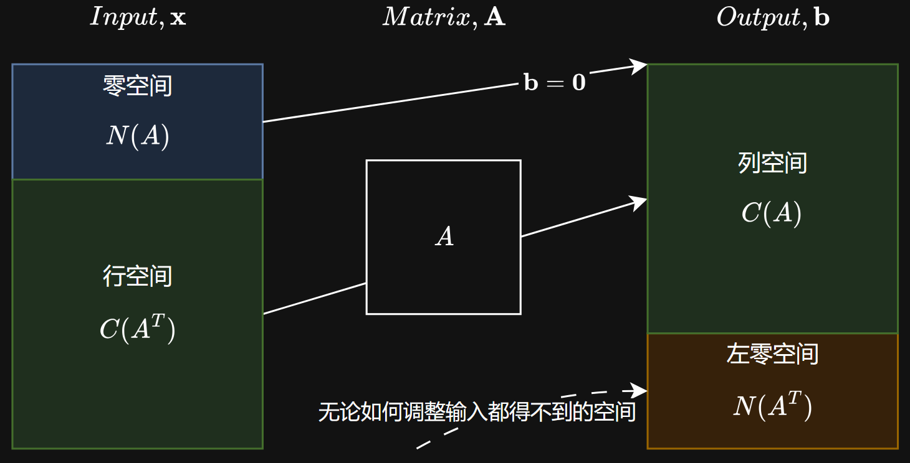

# 线性代数手册 · Linear Algebra for Data Scientists

> **一本写给数据科学与工程实践者的线性代数手册：不推公式，讲几何直觉；不背定理，用代码验证。**

这份手册假定你已经有 `import numpy as np` 的基础，但面对 `LinAlgError: Matrix is singular.`、共线性、PCA 结果解释不了的时候，感觉自己的"武器库"里缺了点什么。全书的目标不是把你训练成能笔算 5×5 逆矩阵的人，而是让你**用矩阵的几何直觉看懂数据**，并且能在 Jupyter Notebook 里立刻验证每一个结论。

- 📖 **正文**：[`Linear Algebra.md`](./Linear%20Algebra.md) —— 第 0 ~ 10 章，约 8300 行、32 万字符
- 🧪 **实操**：55 个 Jupyter Notebook，全部**已带运行输出**，在 GitHub 上可直接预览
- 🗺️ **插图**：`.pictures/` 中的几何示意图，以及 SVD 图像压缩实验用的真实图片
- 🐍 **环境**：`requirements.txt` 固定了可直接复现的解释器依赖
- ⚖️ **许可证**：[MIT](./LICENSE)

---

## 目录

- [这本书适合谁](#这本书适合谁)
- [它和普通教材有什么不同](#它和普通教材有什么不同)
- [仓库结构](#仓库结构)
- [章节目录](#章节目录)
- [快速开始](#快速开始)
- [点菜式阅读索引](#点菜式阅读索引)
- [配套 Notebook 说明](#配套-notebook-说明)
- [附录速查卡](#附录速查卡)
- [全书避坑总结](#全书避坑总结)
- [反馈与贡献](#反馈与贡献)

---

## 这本书适合谁

| 你是谁 | 你会得到什么 |
| :--- | :--- |
| 只会调 `np.linalg`、不懂背后几何意义的数据分析师 | 一套"矩阵即变换"的空间直觉，能把报错翻译成人话 |
| 被共线性、奇异矩阵、条件数折磨的建模工程师 | 从列空间/零空间/秩出发的诊断思路，以及该换哪个函数 |
| 想搞懂 PCA / SVD / 岭回归到底在做什么的人 | 从投影、特征值一路推到 SVD 的完整因果链，每步都有代码 |
| 需要一份"能查的工具书"而不是"要读完的教科书"的人 | 第 10 章速查卡 + 决策树，打印出来贴在显示器旁边 |

**不适合**：想系统刷数学证明、准备考研数学的读者——本书刻意省略了大量推导过程。

---

## 它和普通教材有什么不同

1. **几何直觉优先**。每个概念先回答"是什么、长什么样"，再给数学定义。向量是状态，矩阵是动词，零空间是"输入的黑洞"，左零空间是"永远打不到的靶区"。
2. **代码即验证**。全书每一个结论都配上可直接运行的 NumPy/SciPy 代码和**预期反馈**，你不需要相信作者，跑一遍就知道。
3. **拿真实数据说话**。Iris 数据集、手写数字、用户-物品评分矩阵、黑洞照片（Gargantua）都被拿来当作矩阵分析的素材，而不是清一色的 `[[1, 2], [3, 4]]`。
4. **敢说"没用的知识"**。比如第 5 章会直说：行列式没有你想的那么有用，工程里几乎不计算它——并解释为什么。
5. **专门的避坑章节**。`*` 与 `@` 的区别、`eig` 与 `eigh` 的选择、`V` 与 `Vt` 的混淆、`rcond=None` 的必要性……这些坑都在书里被点名过。

一张图感受本书的风格——四大基本子空间的相互关系（第 3.5 节）：



---

## 仓库结构

```
Linear_Algebra/
├── Linear Algebra.md          # 全书正文（含第 0 章卷首语、第 1~9 章、第 10 章附录速查卡）
├── homeworks/                 # 全部 55 个配套 Jupyter Notebook
│   ├── Chap1-1.ipynb          # 第 1 章配套实操 Notebook
│   ├── ...
│   └── Chap9-6.ipynb          # 第 9 章习题集
├── .pictures/                 # 正文插图 + SVD 图像压缩实验用图（gargantua-*.jpg）
├── requirements.txt           # 完整环境依赖（numpy / scipy / pandas / matplotlib / scikit-learn / manim ...）
├── LICENSE                    # MIT
└── .gitignore
```

- **`homeworks/ChapX-Y.ipynb`** 是第 X 章的配套实操，按正文行文顺序排列；**每一章最后一本笔记本是该章习题集**（开头为题目描述，随后是可以直接跑的解答）。
- 所有 Notebook 均**已保存执行输出**（含图表），在 GitHub 页面或 [nbviewer](https://nbviewer.org/) 上无需运行即可阅读。
- `homeworks/Chap1-3.ipynb` 额外包含用 **Manim** 制作"矩阵乘法四种解读"动画的单元（`%%manim` magic）。

---

## 章节目录

| 章 | 标题 | 配套 Notebook |
| :--- | :--- | :--- |
| 第 0 章 | 卷首语——你不是在推公式，你是在为数据"降维" | — |
| 第 1 章 | 向量与矩阵——数据的"原生语言" | `Chap1-1` ~ `Chap1-6` |
| 第 2 章 | 解线性方程组——求解就是"降噪" | `Chap2-1` ~ `Chap2-6` |
| 第 3 章 | 四大基本子空间——矩阵的"解剖学" | `Chap3-1` ~ `Chap3-3` |
| 第 4 章 | 正交性与投影——让数据"正"起来 | `Chap4-1` ~ `Chap4-7` |
| 第 5 章 | 行列式——它没有你想象的那么有用 | `Chap5-1` ~ `Chap5-6` |
| 第 6 章 | 特征值与特征向量——矩阵的"灵魂"与"指纹" | `Chap6-1` ~ `Chap6-6` |
| 第 7 章 | 奇异值分解 (SVD)——数据科学的"终极武器" | `Chap7-1` ~ `Chap7-7` |
| 第 8 章 | 线性变换——矩阵是动词，不是名词 | `Chap8-1` ~ `Chap8-8` |
| 第 9 章 | 线性代数在优化中的应用 | `Chap9-1` ~ `Chap9-6` |
| 第 10 章 | 附录——NumPy/SciPy 线性代数速查卡 | — |

各章的实战落点：第 1 章用矩阵视角分析数据集，第 2 章用 `lstsq` 拟合直线，第 3 章用四大子空间诊断回归问题，第 4 章用投影理解线性回归，第 5 章讲清何时不该用行列式，第 6 章用特征值判断系统稳定性，第 7 章用 SVD 做 PCA / 图像压缩 / 推荐系统补全，第 8 章把 PCA 看成基变换，第 9 章从二次型推到梯度下降与岭回归。

---

## 快速开始

```bash
git clone https://github.com/Freezing07/Linear_Algebra.git
cd Linear_Algebra
```

**方式一：直接读**（不需要环境）

- 在 GitHub 上打开 `Linear Algebra.md` 与任意 `*.ipynb`，公式与图表均已渲染。

**方式二：本地跑起来**

```bash
python -m venv .venv
# Windows
.venv\Scripts\activate
# macOS / Linux
source .venv/bin/activate

pip install -r requirements.txt
jupyter lab
```

> 💡 **国内网络提示**：部分包（如 `manim`、`scikit-image`）体积较大，若下载缓慢可临时换源：
> `pip install -r requirements.txt -i https://pypi.tuna.tsinghua.edu.cn/simple`

> ⚠️ Manim 动画单元（仅 `homeworks/Chap1-3.ipynb`）需要系统安装 FFmpeg 与 Pango/Cairo；只想读代码的话可以跳过它，其余 54 个 Notebook 只需要 NumPy/SciPy/Matplotlib 系依赖。

---

## 点菜式阅读索引

**不要把它当数学课本通读，把它当"线性代数降维词典"来查。** 遇到问题再来点菜：

| 你遇到的问题 | 翻到 |
| :--- | :--- |
| "这两个变量到底有没有关系？" | [第 1 章](./Linear%20Algebra.md) 建立向量直觉 → 第 4 章用投影（最小二乘）看相关性 |
| `LinAlgError: Matrix is singular.` | 第 3 章理解零空间与秩：原来是有列多余了，该做特征选择或正则化 |
| `np.linalg.solve` 无解 / 矩阵是长方形 | 第 2 章 → 换成 `np.linalg.lstsq(A, b, rcond=None)` |
| 模型系数一会儿正一会儿负 | 第 4 章共线性与投影 → 第 9 章岭回归 |
| 想降维可视化 | 第 7 章：用 SVD 做 PCA |
| 想判断迭代算法会不会发散 | 第 6 章：特征值会告诉你一切 |
| 想压缩图片 / 做矩阵补全推荐 | 第 7 章：低秩近似与 SVD |
| "这个矩阵有多病态？" | 第 2、7 章：`np.linalg.cond` 与 SVD 的数值稳定性 |

---

## 配套 Notebook 说明

- 共 **55 个** Notebook，覆盖从向量运算到约束优化的完整链路，全部已带输出。
- 每章最后一本是**习题集**（`Chap1-6`、`Chap2-6`、`Chap3-3`、`Chap4-7`、`Chap5-6`、`Chap6-6`、`Chap7-7`、`Chap8-8`、`Chap9-6`），建议先自己动手再对照答案。
- 依赖梯度大致如下（按使用频次）：

| 依赖 | 用途 |
| :--- | :--- |
| `numpy` | 全书 55 个 Notebook 的核心 |
| `matplotlib` | 几何可视化：向量、投影、变换、奇异值衰减 |
| `scipy` | `lu`、`null_space`、`solve_triangular` 等分解与子空间工具 |
| `scikit-learn` | Iris/手写数字数据集、PCA 对照实验、`make_blobs` 合成数据 |
| `pandas` | 把数据表当矩阵看 |
| `manim` | 仅 `Chap1-3`：矩阵乘法四种解读的动画 |
| `scikit-image` / `Pillow` | 仅第 7 章：SVD 图像压缩实验（含 `gargantua-*.jpg` 黑洞照片） |

---

## 附录速查卡

第 10 章是一页纸的"武功秘籍"，包含：

- 创建 / 运算 / 解方程 / 分解 / 子空间 / 行列式与迹六大类函数对照表
- "一句话记住每个函数"：如 `np.linalg.lstsq` = 万能解方程工具，`np.linalg.cond` = 告诉你矩阵有多"病态"
- **模型选择决策树（线性代数版）**：拿到一个矩阵问题，怎么选工具
- ⚠️ **最常见的 6 个坑**对照表

---

## 全书避坑总结

1. 解方程永远用 `solve` 或 `lstsq`，**不要用 `inv`**。
2. 矩阵乘法用 `@`，**不要用 `*`**。
3. 对称矩阵用 `eigh`，**不要用 `eig`**。
4. SVD 用 `full_matrices=False` 获取经济版。
5. `lstsq` 始终带上 `rcond=None`。
6. 奇异值是降序的，**特征值不是**（需要自己排序）。
7. 当你看到 `LinAlgError`，不是代码的错，是你的矩阵需要换一种方法处理。

---

## 反馈与贡献

- 发现公式渲染错误、代码不能复现、或者某一节讲得不清楚？欢迎开 [Issue](https://github.com/Freezing07/Linear_Algebra/issues) 指出，附上章节号和你运行的 Notebook 名字就足够了。
- 勘误与补充可直接提 Pull Request。新内容的风格请与现有章节保持一致：**先直觉、后定义、紧跟可运行代码与预期反馈**。
- 提交 Notebook 前请执行 `Kernel → Restart & Run All`，并保留单元格输出。

> 本项目采用 [MIT 许可证](./LICENSE) 开源，可自由使用、修改、分发，包括商业用途；转载与二次创作时保留原始版权声明即可。欢迎随意 fork、引用与用于教学。

---

*祝你在数据科学的路上一路顺利，矩阵不奇异，梯度不爆炸！*
